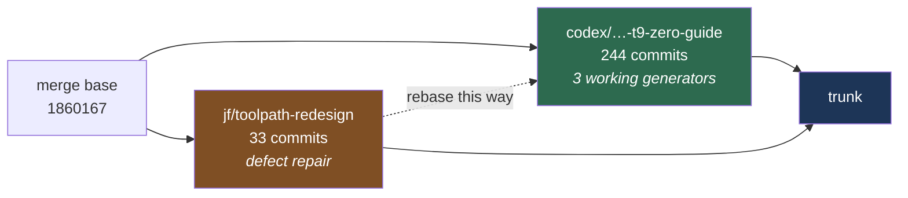

# Integrating `jf/toolpath-redesign` onto the codex line

`codex/exact-certified-adaptive-phase1-t9-zero-guide` should be the trunk, and this branch's 33
commits should land on top of it. Codex is 244 commits ahead with three toolpath generators that
machine whole pockets and a cap decided by an exact predicate — strictly stronger than Held &
Pfeiffer's float bisection to ε = 1e-3. This branch has no generator worth keeping; what it has is
33 commits of defect repair against code codex **still ships**, including a false certificate in the
engagement audit that codex's newer certifier does not supersede because it sits beside that path
rather than replacing it. Rebasing in the other direction, or leaving them apart, loses one side of
that. The conflict surface is two files.

---

## Why this direction

The branches diverged at `1860167` and are siblings, not a fast-forward in either direction: **33
commits here, 244 on codex**. Codex is nearly purely additive relative to the base, which is why the
conflict is concentrated rather than spread.

What each side uniquely holds:

| | `jf/toolpath-redesign` | codex |
| --- | --- | --- |
| Toolpath generator | legacy only, no engagement control | **three, all working end to end** |
| Cap decision | exact predicate | exact predicate, **plus** an exact event partition |
| Machines a pocket | — | **yes**, terminates by finishing the guide |
| Published figures | — | 8, drawn by the generators that run |
| Benchmark corpus | started | 7 corpora, gate metrics, external geometry |
| `mat_scale` gouge fixed | **yes** | no — `toolpath.cpp` untouched |
| Stock model seam sealed | **yes** | no |
| Engagement-audit certifier sound | **yes** | no — false certificate live |
| False-certificate witnesses | **yes**, committed | absent |

---

## The four findings that decide the integration

!!! warning "1 — codex still ships the unsound certifier, and it decides the audit"

    `_stock_2.certify_segment_tea` is still bound and still live on codex. It decides the toolpath
    **engagement audit** (`src/compas_cgal/engagement.py:389`) — the path exercised by
    `tests/test_engagement_audit.py`, all of `benchmarks/`, `scripts/engagement_baseline.py`, and
    `docs/exactness.md`. The adaptive generator never calls it.

    So the rib witness is a **live finding against codex's shipping audit**, and this branch's
    repairs are the only thing that fixes it. `continuous_tea_2` does not supersede that path; it
    sits beside it.

!!! note "2 — the rib does *not* falsify `continuous_tea_2`, and that is the good outcome"

    Its event partition closes the two-station blind spot **by construction, not by refinement**: it
    cuts the motion parameter at the exact algebraic roots of every polynomial whose sign governs the
    per-cell decision — including rim-to-support tangency (the birth of an engaged run) and
    squared-chord-equals-cap (the run crossing the threshold) — then decides each open cell at one
    rational station strictly inside it. The rib's engagement is born at a tangency root and crosses
    the cap at a cap-crossing root; both are cell boundaries, so no interior maximum can hide.

    On the concentric-rib witness the verdict is not merely "not certified" but `CAP_EXCEEDED`.
    Confidence: high on the structure, moderate-high overall.

    **Consequence for the integration:** the swept-annulus guard built here is a repair for the
    *audit* path, not a competitor to the event partition. Both should survive the rebase, serving
    different callers.

!!! warning "3 — `SWEPT_PREFIX_*` is not the swept-annulus bound"

    Despite the name, it is an unrelated and much narrower theorem: a clear start disk plus a
    self-consumed translation prefix implies the engaged rim lies in the forward semicircle, which
    forces the cap to be **exactly π**. It is the *sole* certifier for advancing cuts, and π is the
    loosest cap representable. Any other user cap makes the first zero-guide advance raise
    `UnresolvedMotionEventError`, which aborts generation. The whole adaptive fixture runs at π.

!!! warning "4 — three exactness defects on codex are already fixed here"

    All three are in files codex modified, so they will not be picked up by accident:

    - non-finite doubles cross the exact seam in **five** `Stock2` entry points — `subtract_disk(c, inf)`
      silently empties the stock model
    - a load-bearing one-root precondition guarded by `CGAL_assertion`, which this project compiles
      out in Release — so the check is absent from every shipped wheel
    - the disk-chain interval count is computed with no bound and an `int` cast that saturates, so
      ordinary finite input reaches a ~34 GB `reserve`

---

## Integration plan

**Clean — codex never touched these. Cherry-pick or rebase without thought:**

| path | this branch |
| --- | --- |
| `src/toolpath.cpp`, `src/toolpath.h` | `+181`, `+9` |
| `src/compas_cgal/toolpath.py` | `+72` |
| `src/compas_cgal/engagement.py` | `+43` |
| `tests/test_toolpath.py`, `tests/test_engagement_oracle.py` | `+381`, `+23` |
| `src/exact_boundary.h` *(new)* | `+69` |
| `tests/test_false_certificate.py`, `tests/test_growth_bound.py` *(new)* | `+928`, `+953` |
| `tests/test_environment.py`, `tests/benchmarks/*` *(new)* | — |

**Conflicting — both lines rewrote the same regions. Resolve by hand:**

| path | here | codex | nature |
| --- | --- | --- | --- |
| `src/engagement_2.{cpp,h}` | `+981 / +82` | `+129` | overlapping regions: the rim sub-arc span, `finish_engagement`, `certify_recursive`, and the same insertion point before `engagement_at` |
| `src/stock_2.{cpp,h}` | `+220 / +46` | `+1024` | overlapping methods |
| `src/compas_cgal/stock.py` | `+24` | `+191` | additive both sides |
| `tests/test_stock.py`, `tests/test_engagement_audit.py` | `+353`, `+48` | `+204`, `+178/−2` | additive both sides |

The changes are **semantically independent** — codex added instrumentation and depletion machinery
where this branch added guards and a replacement bound — but git will conflict. Budget real time for
`engagement_2.cpp` and `stock_2.cpp`; everything else is mechanical.

### What must not be lost

`tests/test_false_certificate.py` and `tests/test_growth_bound.py` are the only executable evidence
that the audit certifier was ever unsound. Codex's suite has **no independent falsifier for circle
certification** — segments have one (`test_segment_oracle.py:97-140`, an independent
`_stock_2.engagement_at` probe over 32 dyadic stations, five fixtures); circles verify only the
implementation's own output. These witnesses fill exactly that hole. They must arrive with the
rebase, not after it.

---

## The critical path to Held parity

On *how the cap is decided*, codex is already ahead of Held: an exact predicate on the exact
arrangement against float bisection to ε = 1e-3. On *what a machinist gets*, Held is ahead — a cap
that holds across the useful range, continuously, on a cleared pocket, in milliseconds. Four ordinary
engineering problems separate them, each with a named cause in the branch's own measurements.

**1 — Break the ~141.8° saturation.** *The item that decides whether this is engagement control or a
guardrail.* Asking for 20° yields the same measured maximum as asking for 140°, with 264 forced
advances at 20°. `docs/benchmarks.md` diagnoses it exactly: *"It regulates **advance** but not
**trochoid radius**, so once the radius is fixed by the medial-axis clearance no advance can reach a
tight cap. Held regulates spacing **and** takes smaller circles from the MAT."* `radius_regulated_toolpath`
was built to answer this and did not move it — it is inert at a 120° cap. The guide's station set is
the next suspect: if the MAT stations fix the achievable radii, no downstream regulator can beat them.

**2 — Helical or ramped entry.** Clears two of the six failing gate criteria on its own. **Every**
cap exceedance on all three gate pockets is a chain-entry cut — verified by set equality — as is the
329° engagement step. Entry into virgin stock is currently a full slot at 360°, warned about and
never hidden. Away from entries the worst motion measures 119.19° against a 120° cap, so the cap
already holds everywhere else.

**3 — Close the residue.** 0.28–0.80% of the tool-reachable region against the unregulated
generator's 0.152% — roughly **5× worse**, resolution-stable at 100/200/400 samples, and not
corner-confined (the farthest uncut sample sits 3.28 units from any vertex). The advance bound keeps
annuli overlapping, but coverage is not in the accept/reject rule, so nothing drives the frontier
where the predicate refuses. Cutting less is not the same as finishing.

**4 — Kill the degenerate and redundant motions.** 4–5 loops at ρ = 0.0215 against r = 1.0 — a plunge
wearing a circle's name — and 10 full-size loops whose sampled engagement is exactly zero, because
the guide revisits cleared stations. Both are exactly decidable and already measured.

**5 — Speed, last.** ~86× the unregulated generator, dominated by `engagement_at` (34% of a 12×8 run)
and depletion (22%). Held reports 3–100 ms per pocket — for one pocket, no hardware stated, no
instance table. Not a like-for-like target, and not the binding constraint until 1–4 land.

### Supporting work, cheap and worth doing with the rebase

- **Put the quotable numbers behind the gate.** `136.4` / `119.5` / `914.3` and the `224 ms` timing
  have **zero occurrences** across `src/`, `tests/`, `benchmarks/` — they exist only in
  `docs/engagement_controlled_toolpath.md`. The *comparisons* are tested; the figures are not pinned,
  and no timing harness measures the regulated generators at all. These are the strongest claims the
  project has; they should not be prose.
- **Give circle certification an independent falsifier**, using the witnesses this rebase carries.
- **Test holes on an engagement generator.** Accepted, passed through, never exercised.
- **One clause per figure caption.** The panels read *"engagement-controlled, 120° cap"*; a reader
  arriving from `docs/continuous_engagement.md` may take that for the exact-certified pipeline. It is
  not, and no caption says so.

---

## Sequencing the remaining remediation around the rebase

Fourteen of the original 26 tasks are complete. The rest re-sort by **one rule**: every further commit
to `src/engagement_2.cpp` or `src/stock_2.cpp` widens a merge that must be resolved by hand.
Everything else costs the same before or after.

### Finish before the rebase — they are already inside the conflict zone

| task | files | why now |
| --- | --- | --- |
| **8** (fix round 2) | `engagement_2.cpp` | in flight; the reporting slack constant is absolute where the error scales as `ulp(\|station\|)/r`. Small, and leaving it half-done is the worst option |
| **10** — adaptive arc certification | `engagement_2.{h,cpp}`, `engagement.py` | work is already uncommitted in the tree, **and its value rose**: codex has no independent falsifier for circle certification, and this task builds exactly that |

Then **stop touching those two files** until the rebase lands.

### Do after the rebase, on trunk — codex never touched these

| task | files | note |
| --- | --- | --- |
| **11** — three-valued verdict | `engagement.py` | **value rose sharply.** `docs/benchmarks.md` records that conflating `uncertified` with `truly_exceeding` once made a 2.4× improvement look like a regression. This task is that distinction, in the type system |
| **13, 14, 16, 17, 19** | `src/toolpath.cpp` | untouched on codex, and the legacy generator is *"the guide every other generator walks"* — not dead code. **14** (hole preconditions) matters most: it is the only generator with a holes test |
| **12** — Python floor + CI | `pyproject.toml`, CI | **worse on codex**: metadata says `>=3.9`, `adaptive/` imports `typing.Self` (3.11+) |
| **15** — isolines tests | new | still zero tests on codex |
| **18** — shared validator | `stock.py` | mild conflict (`+24` here vs `+191` there) |
| **20, 21** — docs | `docs/`, `mkdocs.yml` | both still needed; codex still carries all seven `.rst` devguide files and has no `stock`/`engagement` API pages |

### Re-scope

**23** — `docs/engagement_certificate.md` states the arc certifier is unrepaired, which task 10 fixes,
and it needs reconciling with codex's `docs/continuous_engagement.md`. An update pass, not a rewrite.

### New work the codex review generated, ranked above most of the originals

1. **Independent falsifier for circle certification** — uses the witnesses this rebase carries.
   Closes the one hole in an otherwise disciplined 1,022-test suite.
2. **Put the four quotable numbers behind the gate** — `136.4` / `119.5` / `914.3` / the timing.
   These are the project's strongest claims and they are prose.
3. **Test holes on an engagement generator** — accepted, passed through, never exercised.
4. **One clause per figure caption** — so *"engagement-controlled"* is not read as the certified pipeline.
5. **`adaptive/`'s producer–verifier divergence** — `replay_certificate()` ends in an unconditional
   `raise`, and its grammar rejects a `RetraceSegmentOperation` the generator emits by design. Lower
   priority than the above because nothing ships through it yet.

The Held-parity track above is separate work and should not be queued behind this hygiene.

---

## What this branch does *not* bring

No generator. `trochoidal_mat_toolpath_circular` here is the same legacy generator codex already
carries, plus a `mat_scale` bound and validated parameter contracts. Its value is the repairs and the
witnesses, not the toolpath.

Sources: `.superpowers/sdd/2026-08-19-eth-audit-remediation/` — `codex-functional-status.md`,
`codex-investigation.md`, `codex-review-exactness.md`, `codex-review-guarantees.md`,
`codex-review-tests.md`, `codex-review-architecture.md`.
