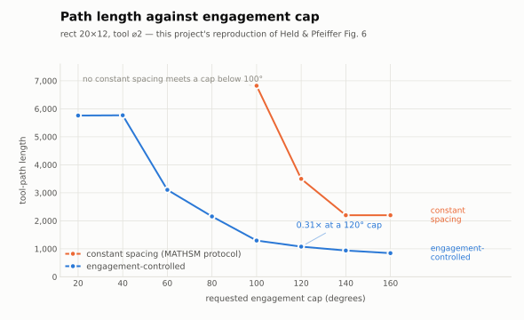
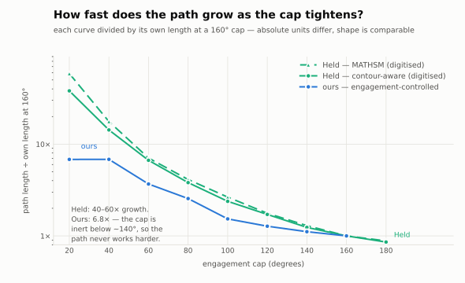

# Benchmark Corpus

Held & Pfeiffer report 3–100 ms per pocket, but for **one** pocket, with no hardware stated and no
instance table — a plausibility figure, not a reproducible target. This corpus exists so that
claims about this project's performance and engagement quality are measurements a reader can
re-run, and so that a sweep cannot quietly be written in a regime where it is unable to show the
effect it was built to measure.

## Running it

```bash
pixi run measured-run
pixi run python -m benchmarks.cli corpus --name all --out build/benchmarks
pixi run python -m benchmarks.cli corpus --name external --external-dir /path/to/profiles
```

`measured-run` requires a clean committed worktree and publishes one immutable corpus bundle under
`benchmarks/results/<UTC-date>-<commit-prefix>/`. Claim-specific measurements use the separate
`benchmarks/measurement_claim_results/` root, so the two payload grammars cannot be confused.
It rechecks full HEAD and worktree cleanliness after the child, immediately before publication;
operator edits or a concurrent commit invalidate the run rather than entering its evidence.
Every bundle stamps a full source commit and committed `pixi.lock` as its build identity, the
complete effective corpus configuration as its input identity, and SHA-256 digests of every exact
payload byte as its result identity. The consumer reconstructs all three identities before using
the report.

These bundles are authenticated **reporting evidence**, not geometric or continuous-engagement
certificates. Publication uses a hidden sibling stage followed by one rename. It assumes a
single writer: pre-existing non-empty destinations are preserved and ordinary failures expose no partial
result, but portable standard-library rename does not guarantee atomic no-replace against an
operator creating an empty destination in the final race window.

## The corpora

| Corpus | Axis isolated | Why it exists |
| --- | --- | --- |
| `analytic` | none — closed-form oracle | disk, rectangle, stadium, arc channel: clearance is derivable, so a disagreement is a bug and is attributable without a second implementation |
| `complexity` | boundary element count and kind | k-gon sweep at fixed area; arc-fraction sweep — every legacy benchmark pocket was straight-sided while the kernel runs on circle-segment traits |
| `necks` | neck severity | pinch sweep from just-traversable outward; this is the family that shows engagement control working |
| `precision` | coordinate magnitude and significant decimals | intended to measure exact-rational width; **its axis does not move cost — see below** |
| `topology` | island count | boolean complexity at fixed outer boundary |
| `degeneracy` | named degenerate cases | tangency, collinearity, exact half turn, pinch exactly the tool, duplicate vertex |
| `external` | real third-party geometry | the `unresolved` rate on geometry this project did not author; datasets are separately licensed and never vendored |

## Two numbers that are not the same, and were once conflated

`MeasurementRecord` carries **both**, and a report must never present one as the other:

- **`uncertified`** — operations whose cap **could not be certified**. An arc operation is marked
  uncertified whenever the growth guard cannot close at the station density, *before any
  measurement*. It says nothing about whether the cap was exceeded.
- **`truly_exceeding`** — operations where the exact predicate **actually fires** at one of
  `EXCEEDANCE_SAMPLES_PER_MOTION` positions. A sampled lower bound on true exceedance, never a
  certificate.

Conflating them once made a generator that had improved 2.4× look like a regression. Use
`truly_exceeding` for generator quality and `uncertified` for anything about certifiability.

## Invariants, not just timings

The `analytic` family carries conservation laws. A stadium pocket has constant clearance along its
medial axis, so congruent configurations must measure identically. `benchmarks/congruence.py`
tests this with rigid motions built from **Pythagorean triples** — cos and sin are then rational,
every rotated coordinate stays exactly representable, and the invariant is *exactly* checkable
rather than approximately. It exercises the CCW sort in `finish_engagement`, whose seam is the
horizontal line through the cutter centre and is therefore sensitive to precisely these motions.

## Findings this corpus produced

### Figure 6 reproduced

Held & Pfeiffer's Figure 6 plots path length against the engagement cap. It is the only directly
reproducible published result in the paper, and reproducing it turns a performance claim into a
comparison a reader can check.

{ width="100%" }

/// caption
Our reproduction on `rect_20x12`, tool ⌀2. The engagement-controlled generator's path is shorter
everywhere the comparison exists — **0.31× at a 120° cap**. Constant spacing has no compliant
result below a 100° cap, so those rows are marked rather than dropped.
///

### The shape diff against Held

Held's absolute lengths are in his own pocket's units, so overlaying them on ours would compare
nothing. Dividing each curve by its own length at a 160° cap removes the units and leaves the
comparable quantity: **how steeply the path has to grow as the cap tightens.**

{ width="100%" }

/// caption
Held's curves are **digitised by eye** from the paper's log-scale plot — no values are tabulated
there — so they are usable for shape, not for absolute length. His paths grow **40–60×** as the cap
tightens from 160° to 20°. Ours grows **6.8×**, and that flatness is not an advantage: it is the
saturation above, seen from a second direction. A generator that genuinely honoured a 20° cap would
have to work much harder, and its curve would climb like Held's.
///


!!! success "Engagement control shortens the path 2–5×"

    Figure 6 reproduction, `rect_20x12`, tool ⌀2: the engagement-controlled generator's path is
    **0.19–0.43×** the length of the best compliant constant-spacing path. Same direction and rough
    magnitude as Held's own claim against MATHSM.

!!! warning "Engagement control saturates near 141° and cannot deliver tighter caps"

    Asking for a 20° cap yields the same measured maximum as asking for 140°:

    | cap requested | 20 | 40 | 60 | 80 | 100 | 120 | 140 |
    | --- | ---: | ---: | ---: | ---: | ---: | ---: | ---: |
    | max TEA after entry (deg) | 141.8 | 141.8 | 141.8 | 141.8 | 140.7 | 141.8 | 142.3 |
    | forced minimum advances | 264 | 72 | 40 | 20 | 0 | 0 | 0 |

    Below ~100° the generator is forced past the cap on hundreds of circles — *"not even a
    one-station advance is admissible"*. It regulates **advance** but not **trochoid radius**, so
    once the radius is fixed by the medial-axis clearance no advance can reach a tight cap. Held
    regulates spacing *and* takes smaller circles from the MAT. Most of the useful machining range
    is therefore not yet reachable.

!!! note "The `precision` axis is a dyadic-or-not switch, not a bit-length dial"

    Coordinates enter the exact kernel as IEEE-754 doubles, and every double is a dyadic rational
    `p/2ⁿ`. A decimal that is not itself dyadic — `9.4` as much as `9.428571429` — lands on a full
    53-bit mantissa and carries full width however few digits it was written with. Measured: max
    rational width is 3 digits at `decimals=0` and **34 and flat** from 1 upward. The sweep starts
    at 0 because that is the only step where the axis does anything.

## What the report records

Generation and certification are timed **separately** — they are different businesses and a
combined number hides the fact that matters. Alongside them the report carries certifier stations
(the refinement-depth cost proxy), final arrangement size, and the longest exact rational after
depletion.

!!! warning "Coordinate-digit collection perturbs what it measures"

    Reading an exact rational calls `.exact()`, collapsing the lazy filter and inflating every
    later operation. The runner collects digits on a separate, untimed pass, and `--no-digits`
    disables it entirely.

## Writing a new family

Before committing a sweep, **check that its axis actually moves the number**. Several benchmarks
during this corpus's own development were written in a regime where they could not show the effect
they existed to measure: one compared overlapping cuts, so the arrangement never grew and a 7.7×
win read as 0.86×; another read a diagnostic off an undepleted stock, so the field was structurally
a constant. If an axis turns out not to move anything, document that as the finding — as
`precision` does — rather than shipping a sweep that looks informative and is not.
