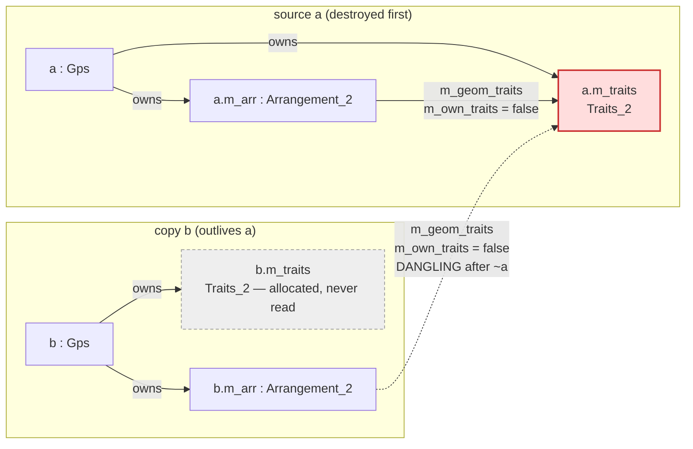

# Copying a `General_polygon_set_2` leaves the copy's arrangement pointing at the source's traits

!!! note "Status of this page"

    This is a **draft bug report to the CGAL project**, kept in the repository so
    the evidence stays with the code that found it. It has not been submitted.
    The local mitigation and the review rule derived from it live in
    [Exact-Kernel Discipline](../exactness.md#copying-a-gps-aliases-its-traits-object).

Copying a `CGAL::General_polygon_set_2` produces an object whose **arrangement reads
the source object's geometry-traits instance**, while the copy's own freshly allocated
traits is never used. Destroying the source therefore leaves the copy with a dangling
`m_geom_traits`, and the first point-location query that reads through it is a use of
freed memory. With `Gps_circle_segment_traits_2` over `Exact_predicates_exact_constructions_kernel`
and `Arr_trapezoid_ric_point_location`, the reproducer below crashes with
`EXC_BAD_ACCESS` in **30 of 30 runs**; with the bounded-planar default locator,
`Arr_walk_along_line_point_location`, the same freed pointer produces no fault and a
correct-looking answer. The copy constructor is reachable from ordinary,
correct-looking user code: `std::move` on a `General_polygon_set_2` silently performs a
copy, because the base class's `virtual` destructor suppresses the implicit move
constructor.

## Environment

| | |
|---|---|
| CGAL version | 6.0.1 (`CGAL_VERSION_NR 1060011000`, `CGAL_GIT_HASH 50cfbde3b84dbeae8338268db2d78fe4fcb522de`) |
| Mode | header-only (`CGAL_HEADER_ONLY`) |
| Kernel | `Exact_predicates_exact_constructions_kernel` |
| Traits | `Gps_circle_segment_traits_2<Kernel>` |
| Number types | `CGAL_DISABLE_GMP`, `CGAL_USE_BOOST_MP`, `CGAL_CORE_USE_BOOST_BACKEND=1` (vendored Boost 1.82) |
| Compiler | Apple clang 17.0.0 (`clang-1700.0.13.5`), `-std=c++20`, `-O1 -g` |
| Platform | macOS 15.3.2 (Darwin 24.3.0), arm64 |

!!! warning "Scope of what was measured"

    Everything below was observed in this configuration. The mechanism is in
    generic code (`Arrangement_on_surface_2::assign` and
    `Gps_on_surface_base_2`'s copy constructor) and does not depend on the
    kernel or traits, but whether the dangling read **faults** does depend on
    the traits object having heap state and on the point-location strategy
    dereferencing it. Other kernels, traits, and locators were not tested.

## Reproducer

Self-contained, no third-party code. Two arms: the structural checks are fully defined
behaviour and safe to run; `--uaf` additionally dereferences the freed traits and is the
crashing arm.

```cpp title="gps_traits_alias.cpp"
// Copying a General_polygon_set_2 leaves the copy's arrangement pointing at the
// SOURCE's geometry-traits object.
//
//   g++ -std=c++17 -O2 gps_traits_alias.cpp -o gps_traits_alias -lgmp -lmpfr
//   ./gps_traits_alias          # structural checks only, fully defined behaviour
//   ./gps_traits_alias --uaf    # additionally dereferences the freed traits (UB)

#include <CGAL/Exact_predicates_exact_constructions_kernel.h>
#include <CGAL/Gps_circle_segment_traits_2.h>
#include <CGAL/General_polygon_set_2.h>
#include <CGAL/Arr_trapezoid_ric_point_location.h>

#include <cstring>
#include <iostream>
#include <memory>
#include <utility>

using Kernel        = CGAL::Exact_predicates_exact_constructions_kernel;
using Traits        = CGAL::Gps_circle_segment_traits_2<Kernel>;
using Polygon_set_2 = CGAL::General_polygon_set_2<Traits>;
using Polygon_2     = Traits::Polygon_2;
using X_curve       = Traits::X_monotone_curve_2;
using KPoint        = Kernel::Point_2;
using Arrangement_2 = Polygon_set_2::Arrangement_2;
using Trap_RIC_pl   = CGAL::Arr_trapezoid_ric_point_location<Arrangement_2>;
using Walk_pl       = CGAL::Arr_walk_along_line_point_location<Arrangement_2>;

// An axis-aligned square as a linear circle-segment general polygon.
static Polygon_2 square(int size)
{
    const KPoint v[4] = {KPoint(0, 0), KPoint(size, 0), KPoint(size, size), KPoint(0, size)};
    Polygon_2 p;
    for (int i = 0; i < 4; ++i) p.push_back(X_curve(v[i], v[(i + 1) % 4]));
    return p;
}

static int failures = 0;

static void check(bool ok, const char* what)
{
    std::cout << (ok ? "  ok    " : "  FAIL  ") << what << '\n';
    if (!ok) ++failures;
}

int main(int argc, char** argv)
{
    const bool run_uaf = (argc > 1) && std::strcmp(argv[1], "--uaf") == 0;

    // ---------------------------------------------------------------- 1. copy
    std::cout << "1. copy construction\n";
    {
        Polygon_set_2 a(square(10));
        Polygon_set_2 b(a);

        std::cout << "     a.arrangement().geometry_traits() = " << a.arrangement().geometry_traits() << '\n'
                  << "     b.arrangement().geometry_traits() = " << b.arrangement().geometry_traits() << '\n';

        check(b.arrangement().geometry_traits() == a.arrangement().geometry_traits(),
              "the copy's arrangement reads the SOURCE's traits object");
    }

    // -------------------------------------------------------------- 2. "move"
    std::cout << "2. std::move (no move constructor exists: this is a copy)\n";
    {
        Polygon_set_2 a(square(10));
        const void* a_traits = a.arrangement().geometry_traits();
        Polygon_set_2 b(std::move(a));

        check(b.arrangement().geometry_traits() == a_traits,
              "the \"moved-to\" set's arrangement reads the moved-from object's traits");
    }

    // ------------------------------------------------------- 3. join on empty
    std::cout << "3. join() onto an empty set (Gps_on_surface_base_2::_join early return)\n";
    {
        Polygon_set_2 a(square(10));
        Polygon_set_2 b;                      // empty; owns its own traits
        const void* b_own = b.arrangement().geometry_traits();
        b.join(a);                            // *(b.m_arr) = *(a.m_arr) -> assign()

        check(b.arrangement().geometry_traits() == a.arrangement().geometry_traits() &&
              b.arrangement().geometry_traits() != b_own,
              "the empty set adopted the other operand's traits");
    }

    // ------------------------------------------------------------ 4. lifetime
    std::cout << "4. destroying the source leaves the copy dangling\n";
    std::unique_ptr<Polygon_set_2> orphan;
    const void* freed_traits = nullptr;
    {
        Polygon_set_2 a(square(10));
        orphan = std::make_unique<Polygon_set_2>(a);   // copy: borrows a's traits
        freed_traits = orphan->arrangement().geometry_traits();
    }                                                  // ~a deletes freed_traits
    std::cout << "     orphan.arrangement().geometry_traits() = "
              << orphan->arrangement().geometry_traits() << "  (freed)\n";
    check(orphan->arrangement().geometry_traits() == freed_traits,
          "the orphan still points at the freed traits object");

    if (!run_uaf) {
        std::cout << "\n(structural checks only; pass --uaf to dereference the freed traits)\n";
        return failures == 0 ? 0 : 1;
    }

    // ----------------------------------------------------- 5. the dereference
    std::cout << "5. reading through the freed pointer (undefined behaviour)\n";
    {
        // Arr_walk_along_line_point_location only STORES the pointer and reaches
        // the traits through stateless functor accessors: typically silent.
        Walk_pl walk(orphan->arrangement());
        walk.locate(Arrangement_2::Point_2(Kernel::FT(5), Kernel::FT(5)));
        std::cout << "     walk-along-line locate() returned\n";

        // Arr_trapezoid_ric_point_location's constructor copy-constructs a
        // Td_traits out of arr.geometry_traits(), which copies
        // Arr_circle_segment_traits_2::inter_map (a std::map) out of freed
        // memory: this is where it faults.
        std::cout << "     constructing Arr_trapezoid_ric_point_location ...\n" << std::flush;
        Trap_RIC_pl trap(orphan->arrangement());
        trap.locate(Arrangement_2::Point_2(Kernel::FT(5), Kernel::FT(5)));
        std::cout << "     trapezoid-RIC locate() returned (no fault this run)\n";
    }

    return failures == 0 ? 0 : 1;
}
```

### Observed output

Compiled and run as described in [Environment](#environment). We build CGAL without
GMP, so the exact line used was:

```bash
c++ -std=c++20 -O1 -g \
    -DCGAL_HEADER_ONLY -DCGAL_DISABLE_GMP -DCGAL_USE_BOOST_MP \
    -DCGAL_USE_CORE=1 -DCGAL_CORE_USE_BOOST_BACKEND=1 \
    -DBOOST_ALL_NO_LIB -DBOOST_ALL_DYN_LINK=0 \
    -I<cgal>/include -I<boost> \
    gps_traits_alias.cpp -o gps_traits_alias
```

A stock GMP-backed CGAL install should need only the header comment's
`g++ … -lgmp -lmpfr`; that variant was not built here.

Structural arm, exit code `0`, all four checks pass:

```text
1. copy construction
     a.arrangement().geometry_traits() = 0x123605ea0
     b.arrangement().geometry_traits() = 0x123605ea0
  ok    the copy's arrangement reads the SOURCE's traits object
2. std::move (no move constructor exists: this is a copy)
  ok    the "moved-to" set's arrangement reads the moved-from object's traits
3. join() onto an empty set (Gps_on_surface_base_2::_join early return)
  ok    the empty set adopted the other operand's traits
4. destroying the source leaves the copy dangling
     orphan.arrangement().geometry_traits() = 0x123605ea0  (freed)
  ok    the orphan still points at the freed traits object
```

Structural arm: **20 of 20 runs** exit `0`.

`--uaf` arm: **30 of 30 runs** exit `139` (SIGSEGV), and the crash is not an artefact of
the optimisation level — a `-O0` build faulted in 5 of 5 and a second `-O1` build
(without the unused Eigen include path) in 5 of 5. The walk-along-line query returns
normally through the freed pointer; the process dies inside the trapezoid-RIC
constructor, before its `locate` is ever called:

```text
5. reading through the freed pointer (undefined behaviour)
     walk-along-line locate() returned
     constructing Arr_trapezoid_ric_point_location ...
```

Under `lldb`:

```text
stop reason = EXC_BAD_ACCESS (code=1, address=0x20)
frame #0: std::__1::__tree<std::__1::__value_type<std::__1::pair<unsigned int, unsigned int>,
          std::__1::list<std::__1::pair<CGAL::_One_root_point_2<...>, unsigned int>>>,
          ..., CGAL::_X_monotone_circle_segment_2<CGAL::Epeck, true>::Less_id_pair, ...>
          ::__construct_node<...>
```

That `__tree` is `Arr_circle_segment_traits_2::inter_map`. A breakpoint on
`Trapezoidal_decomposition_2.h:1816` confirms the path directly — it is hit from
`Arr_trapezoid_ric_point_location`'s constructor, with
`Td_traits = CGAL::Td_traits<CGAL::Arr_traits_basic_adaptor_2<CGAL::Gps_circle_segment_traits_2<CGAL::Epeck>>, …>`,
i.e. a type whose copy constructor copies the `Arr_circle_segment_traits_2` base
subobject, `inter_map` included, out of the freed block.

### Corroboration

The defect was originally found downstream, through a different route and a different
reproducer, before the plain-CGAL one above was written. Independent reproducers agree,
which matters more here than any single rate: this is an intermittent fault whose
observed rate depends on what else the process has allocated.

| Reproducer | Written and measured by | N | Crashes |
|---|---|---|---|
| The plain-CGAL program above (`-O1`) | this page | 30 | 30 |
| Same program, `-O0` build | this page | 5 | 5 |
| A Python two-liner over the downstream binding — clone a set, drop the parent, call a containment query | a separate diagnosing agent, recorded in this repository's internal `segv-report.md` | 10 | 10 |
| A second, independently written two-line variant of the same | a second agent | 6 | 6 |
| The same Python two-liner with the parent object **kept alive** (control) | the diagnosing agent | 10 | 0 |

!!! note "The downstream fix is not a CGAL fix"

    Removing the aliasing downstream — by giving the object family one traits
    object whose lifetime outlives every arrangement that borrows it — removed
    the crash: 0 faults in 20 runs measured by the agent that applied it, and 0
    in 8 measured independently afterwards. That is confirmatory of the causal
    chain, not evidence about CGAL: **nothing in CGAL was changed**, and the
    aliasing described below is still present in 6.0.1 exactly as shown. The
    plain-CGAL reproducer above is unaffected by any downstream change and still
    crashes.

    Figures measured against this repository's own test suite (a shipped test
    observed at 5 of 8 and at 3 of 10 faulting) are not reproducers and are
    quoted here only to show the intermittency; they depend on test ordering and
    on allocator state and should not be read as a rate for the defect.

## Mechanism

All line numbers below were read from the vendored CGAL 6.0.1 tree named in
[Environment](#environment) and are relative to `include/CGAL/`.

### 1. The arrangement copy propagates a borrowed traits pointer

`Arrangement_on_surface_2`'s copy constructor delegates to `assign`
(`Arrangement_2/Arrangement_on_surface_2_impl.h:88-93`):

```cpp
Arrangement_on_surface_2(const Self& arr) :
  m_geom_traits(nullptr),
  m_own_traits(false)
{ assign(arr); }
```

and `assign` (`:156`) decides ownership at `:201-202`:

```cpp
m_geom_traits = (arr.m_own_traits) ? new Traits_adaptor_2 : arr.m_geom_traits;
m_own_traits = arr.m_own_traits;
```

Read on its own this is defensible: an arrangement constructed from a caller-supplied
traits (`:98-138`, which sets `m_own_traits = false` at `:137`) leaves the caller
responsible for keeping that traits alive, and propagating the borrow means a copy
inherits the same responsibility. That responsibility is nowhere stated in the header —
`Arrangement_on_surface_2.h:928-932` declares the copy constructor and the
traits constructor with no comment on lifetime — so the reading has to be inferred from
`m_own_traits`.

### 2. `Gps_on_surface_base_2` breaks that contract against itself

`Boolean_set_operations_2/Gps_on_surface_base_2.h` always builds its arrangement in
borrow mode, borrowing from a traits **it owns** (`:150-154`):

```cpp
Gps_on_surface_base_2() : m_traits(new Traits_2()),      // the Gps owns the traits
                          m_traits_adaptor(*m_traits),
                          m_traits_owner(true),
                          m_arr(new Aos_2(m_traits))     // the arrangement borrows them
{}
```

so `m_own_traits == false` inside every `Gps`, and the traits' lifetime is the `Gps`'s,
not the caller's. The copy constructor (`:165-170`) then allocates a fresh traits for
the copy and hands the arrangement copy the source's:

```cpp
Gps_on_surface_base_2(const Self& ps) :
  m_traits(new Traits_2(*(ps.m_traits))),   // the copy gets its own traits ...
  m_traits_adaptor(*m_traits),
  m_traits_owner(true),
  m_arr(new Aos_2(*(ps.m_arr)))             // ... which its arrangement never uses
{}
```

**This is the crux.** Allocating `new Traits_2(*(ps.m_traits))` states the intent that
the copy be self-contained. Building `m_arr` through the arrangement copy constructor
defeats it: by step 1 the new arrangement takes `ps`'s pointer. The copy ends up with a
**live traits it never reads** and a **dangling `m_arr->m_geom_traits`**, and
`~Gps_on_surface_base_2` (`:242-248`) deletes the source's traits while the copy is
still pointing at it. `operator=` (`:173-186`) has the identical shape.

The user-facing type reaches it implicitly: `General_polygon_set_2`
(`General_polygon_set_2.h:31`) declares no copy constructor and no destructor, so its
implicit copy constructor calls `General_polygon_set_on_surface_2(const Self& ps) : Base(ps) {}`
(`General_polygon_set_on_surface_2.h:79`), which calls the constructor above.



Two side effects of the same line worth noting: the `new Traits_2(*(ps.m_traits))` is
pure cost — every `General_polygon_set_2` copy deep-copies a traits object (`inter_map`
included) that is then never consulted — and the aliasing is *not* a leak, since the
copy's own traits is duly deleted by its own destructor.

### 3. Three ways in

| Path | Code | Why it does not look like a copy |
|---|---|---|
| Copy construction | `Gps_on_surface_base_2.h:165-170` | It is one. |
| `std::move` | `virtual ~Gps_on_surface_base_2()` at `:242` and `virtual ~General_polygon_set_on_surface_2()` (`General_polygon_set_on_surface_2.h:114`) suppress the implicit move constructors; no class in the chain declares one | The user believes ownership was transferred; the compiler silently binds to the copy constructor. |
| `join()` onto an empty set | `join(const Self&)` at `:366-369` → `_join(const Self&)` at `:1595`, empty branch at `:1609-1613`, assignment at **`:1611`**: `*(this->m_arr) = *(other.m_arr); return;` | A boolean operation, not a copy — but `Arrangement_on_surface_2::operator=` (`Arrangement_on_surface_2_impl.h:145-150`) calls `assign`, so the empty set adopts the other operand's traits. |

The reproducer exercises all three.

The third one is worth a second look, because the general case next to it is sound. When
neither operand is empty, `_join` falls through to `_join(const Aos_2& arr)`
(`:1542-1553`), which builds the result on the object's **own** traits at `:1544`:

```cpp
Aos_2* res_arr = new Aos_2(m_traits);   // the Gps's own live traits
Gps_join_functor<Aos_2> func;
overlay(*m_arr, arr, *res_arr, func);
delete m_arr;
m_arr = res_arr;
```

That is why boolean operations generally leave a healthy object behind, and why the
empty-set shortcut at `:1611` stands out: it is the one branch of `_join` that does not
rebuild on `m_traits`, and it reaches `assign` instead. The same holds for `_difference`
(`:1618-1629`, `new Aos_2(m_traits)` at `:1620`).

## Why the symptom depends on the point-location strategy

The same dangling pointer is a hard fault on one path and silent on another, decided
solely by what the locator does with it.

| Strategy | What it does with `arr.geometry_traits()` | Observed |
|---|---|---|
| `Arr_trapezoid_ric_point_location` | Constructor (`Arr_trapezoid_ric_point_location.h:144-158`) stores it at `:152` and calls `td.init_arrangement_and_traits(&arr)` at `:154`, which runs `traits = new Td_traits(*m_trts_adaptor)` (`Arr_point_location/Trapezoidal_decomposition_2.h:1808-1817`, allocation at `:1816`) — a genuine copy-construct out of the object, including `Arr_circle_segment_traits_2::inter_map` (`Arr_circle_segment_traits_2.h:70-72`) | `EXC_BAD_ACCESS`, 30 of 30 |
| `Arr_walk_along_line_point_location` — the bounded-planar **default** (`Arr_bounded_planar_topology_traits_2.h:248-249`), used by `Gps_on_surface_base_2::oriented_side` (`:482-496`, `Point_location pl(*m_arr)` at `:484`) | Only *stores* the pointer (member at `Arr_walk_along_line_point_location.h:71`, assigned at `:90-91`) and reaches the traits through accessors that are all `return Functor();` | No fault, plausible answer |

The split within `Arr_circle_segment_traits_2` is what makes the walk path quiet. Every
accessor the walk needs returns a default-constructed, stateless functor and never
touches `this`:

| Accessor | Body | Reads the object? |
|---|---|---|
| `compare_x_2_object` `:115`, `compare_xy_2_object` `:146`, `construct_min_vertex_2_object` `:166`, `construct_max_vertex_2_object` `:186`, `is_vertical_2_object` `:206`, `compare_y_at_x_2_object` `:233`, `compare_y_at_x_right_2_object` `:287`, `compare_y_at_x_left_2_object` `:342`, `equal_2_object` `:378`, `split_2_object` `:711`, `are_mergeable_2_object` `:760`, `compare_endpoints_xy_2_object` `:825`, `construct_opposite_2_object` `:845` | `return Functor();` | no |
| `make_x_monotone_2_object` `:683-684` | `return Make_x_monotone_2(m_use_cache);` | **yes** — loads `m_use_cache` |
| `intersect_2_object` `:740` | `return Intersect_2(inter_map);` | **yes** — binds a reference into `inter_map` |
| `approximate_2_object` `:558`, `merge_2_object` `:803`, `trim_2_object` `:897` | capture `*this` / `this` | only when the functor calls back through it |

The reading accessors are simply not reached through the borrowed pointer, because the
boolean operations rebuild on the `Gps`'s own live `m_traits`, as shown above for
`_join` and `_difference`. That is a property of the current call graph, not an
invariant.

!!! danger "A clean run is not evidence of a valid pointer"

    In a second instance of this defect in our codebase, on the walk-along-line
    path, the following arms were **all clean and byte-identical**: Guard Malloc
    (`libgmalloc.dylib`), five runs under `MallocScribble`/`MallocPreScribble`
    with the nano zone disabled, deliberate reclamation of the freed 32-byte
    block with three fill patterns, and a 130-test suite — while `lldb`
    simultaneously showed the traits object reading `0x55555555…` at the moment
    of the query. Positive controls confirmed the instrumentation does catch a
    plain read-after-free. Whether this defect faults is a property of the
    locator, not of the defect.

## Why it is easy to miss

- **The copy has a live traits object.** Inspecting a `General_polygon_set_2` in a
  debugger shows `m_traits` pointing at a valid, correctly copy-constructed traits.
  Nothing in the object looks wrong until you follow `m_arr->m_geom_traits` instead,
  one level deeper and behind a different ownership flag.
- **`std::move` does not help, and does not warn.** Because the base class has a
  `virtual` destructor and no move operations, `Polygon_set_2 b(std::move(a));`
  compiles, runs, and produces the aliasing. Code that reads as an ownership transfer
  is an aliasing copy.
- **`join()` onto an empty accumulator hits it without any copy in sight.** The
  accumulate-into-empty-set idiom is common and does not resemble a copy at the call
  site.
- **A fault-based test for it is flaky by construction.** As the admonition above
  records, the same defect can survive Guard Malloc, scribbling, and deliberate block
  reclamation while provably reading freed memory. Detection has to be structural:
  assert that the arrangement's traits pointer is the traits object the owner owns.

## Possible fixes

Offered as options; the trade-offs are the maintainers'.

| Option | Change | Notes |
|---|---|---|
| A. Make the copy use the traits it already allocates | In `Gps_on_surface_base_2(const Self& ps)`, build the arrangement on the copy's own `m_traits` instead of by arrangement copy — e.g. `m_arr = new Aos_2(m_traits)` followed by an assignment of contents, or an `Arrangement_on_surface_2` copy overload that takes the traits to borrow | Delivers what the constructor already states it wants, and makes the `new Traits_2(*(ps.m_traits))` earn its cost. Routing `operator=` and `_join`'s empty branch through the same helper closes all three entry points |
| B. Fix it at `assign` | Make `Arrangement_on_surface_2::assign` allocate unconditionally (`Arrangement_on_surface_2_impl.h:201`) | Smallest diff and closes every route at once, but it changes behaviour for arrangements deliberately sharing a caller-owned traits, and copies traits state that some users may expect to stay shared |
| C. Give `Gps_on_surface_base_2` move operations | Declare a move constructor and move assignment (the `virtual` destructor currently suppresses the implicit ones) | Does not fix the copy path, but removes the most surprising route into it and is a worthwhile change on its own |
| D. Document the borrowing contract | State explicitly that a copied arrangement borrows the source's traits when the source borrows, and that the source's traits owner must outlive every copy | Lowest risk; leaves `Gps_on_surface_base_2`'s self-contradiction in place, since there the traits owner *is* the source object |

Options A and D are complementary: even with A, the arrangement-level contract that
`assign` implements is worth stating.

## What was not tested

- Any CGAL version other than 6.0.1 at the git hash above; no claim is made about
  `master`.
- Any kernel or traits other than `Exact_predicates_exact_constructions_kernel` with
  `Gps_circle_segment_traits_2`. A stateless traits class would still produce the
  dangling pointer but would not necessarily fault when copied out of freed memory.
- Any locator other than the two named. `Arr_landmarks_point_location`,
  `Arr_naive_point_location` and the others were not examined.
- Linux or Windows; all runs were macOS/arm64.
