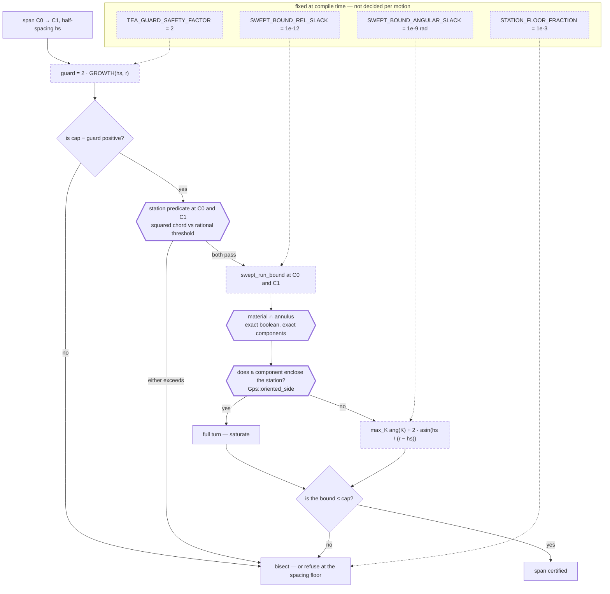

# The TEA Certificate

`certify_segment_tea` promises that **no** cutter centre on a motion exceeds
the caller's tool-engagement-angle cap. That promise was broken by
construction: over a thin annular **rib** whose centreline radius equals the
tool radius, the certifier returned `cap_certified = True` against a 90° cap
while the cutter is, part-way along the motion, immersed a **full turn**. The
analytic growth lemma the interior of a span rested on is not an upper bound —
under-estimating true growth by **24.09×** at the measured worst — and no
safety factor repairs it, because a rib
creates engagement that grows from nothing either station can see. The lemma
was replaced by an exact **swept-annulus** bound on what the region the cutter
sweeps is *capable of holding*, which needs no premise about how a measured run
grows. Every witness is committed as a test that was red before the repair and
is green after. The station verdicts were exact predicates before and remain
so; what changed is the single inequality that carried the interior of a span.

!!! warning "One path is still unrepaired"

    `_certify_arc_engagement` (`src/compas_cgal/engagement.py`) — the certifier
    for *circular* cut motions — never received the swept-annulus treatment. It
    still derives its guard from `tea_growth_bound` alone. Every witness on this
    page applies to a circular motion past a rib verbatim. See
    [Status](#status-confirmed-and-open).

## What the certificate claims

`certify_segment_tea(stock, x0, y0, x1, y1, r, cap)` returns
`(max_tea, cap_certified, stations)`. Its contract in `src/engagement_2.h` is
universal over the segment: `cap_certified` is true *iff* no cutter centre on
`(x0,y0) → (x1,y1)` can hold an engaged run exceeding `cap`.

It cannot test every centre, so it tests two and bridges the gap. The original
method:

1. measure both endpoint **stations** with `engagement_at`, whose cap verdict is
   an exact predicate — a squared-chord comparison against the rational
   surrogate `4·sin²(cap/2)`, never a comparison of reported doubles;
2. test them not against `cap` but against a **guarded** cap `cap − guard(hs)`,
   where `hs` is half the station spacing and
   `guard = TEA_GUARD_SAFETY_FACTOR · tea_growth_bound(hs, r)`;
3. conclude that two stations passing the guarded cap certify everything between
   them; otherwise bisect, and on reaching the spacing floor with the margin
   still open, report the motion uncertified.

Step 3 is the whole soundness argument, and it holds only if `tea_growth_bound`
is a genuine upper bound on how far the largest engaged run can grow over a
centre travel of `hs`.

## The proof that did not close

`tea_growth_bound(d, r) = 4·asin(d/2r) + 2·acos(1 − d/r)` is the sum of two
mechanisms that move an **existing** engaged run:

- **(a) endpoint drift** — each end of a run sits where the rim crosses a
  material boundary; translating the centre by `d` slides such a crossing along
  the rim by at most `2·asin(d/2r)`, and a run has two ends;
- **(b) newborn contact** — a feature absent at a station can first bite the rim
  in between, cutting a chord that spans `2·acos(1 − d/r)`.

### Where clause (a) breaks

Clause (a) is `≈ d/r` for small `d`. Near a **tangency** between the rim and a
boundary the crossing does not move linearly in `d` at all; it moves like
`√(2d/r)`. The ratio `√(2r/d)` is unbounded as `d → 0`: **14×** at `d = 10⁻²r`,
**1414×** at `d = 10⁻⁶r`.

On straight walls the composite survives anyway, because clause (b) contributes
its own `2·acos(1 − d/r) ≈ 2√(2d/r)` and absorbs the shortfall. On a **concave**
circular arc it does not — and a concave arc is what every `Stock2::subtract_*`
leaves behind.

### The concave closed form

For a void of radius `ρ > r`, with the cutter at internal tangency
(`s₀ = ρ − r`, engagement exactly zero) and travelling `δ` toward the material,
the emerged run's half-angle satisfies

```text
psi^2 = (2*delta*rho + delta^2) / (r * (rho - r + delta))
```

so the run grows like `2·√(2δρ / (r(ρ − r)))` while the lemma allows
`≈ 2·√(2δ/r)`. The true growth therefore exceeds the bound by

```text
sqrt(rho / (rho - r))
```

which is **above 1 for every `ρ > r`** and unbounded as `ρ → r⁺`. No void larger
than the tool was ever safe under the lemma, only less unsafe: 1.15× at
`ρ/r = 4`, 1.41× at `ρ/r = 2`, 10.05× at `ρ/r = 1.01`.

The singular limit `ρ = r` is not exotic — it is a **plunge followed by a
departure**, the most ordinary motion pair a toolpath contains.
`subtract_disk(c, r)` then a cut starting at `c` leaves the cutter internally
tangent to the hole it just made, so engagement is exactly 0; the emerged
half-angle obeys `cos ψ = −δ/(2r)`, so a run of just over `π` appears for *any*
positive travel. Growth is discontinuous at zero and no growth lemma can bound
it. At `r = 0.5`, `δ = 10⁻³`: true growth `3.143593` rad against a bound of
`0.130512` rad — **24.09×**.

### Not merely a loose lemma

A broken lemma with slack elsewhere can still leave the certificate sound. This
one does not. Of the falsification harness's reds, **18** are
*certificate-critical*: at each, the base station's engaged-arc list is empty,
so `finish_engagement` returns early, gap-closure pessimism is the identity, and
the inequality `certify_recursive` actually relies on —

```text
true_max_run(P) <= pess_max_run(S) + GROWTH(hs)
```

— is broken directly, with nothing standing between it and the verdict.

## The false certificate

Whether the *proof* is void and whether any *verdict* is wrong are different
questions. The second was answered by construction. The witnesses live in
`tests/test_false_certificate.py`; each pins **liveness** with the exact oracle
alone (there really is a cap violation on this motion) *before* it asserts
anything about the certifier, so a construction that degenerates fails by name
instead of reading as a repair.

| witness | what the certifier reported (pre-repair) | what is true there |
| --- | --- | --- |
| **annular rib**, centreline radius = `r`, thickness `0.008 r`, 0.025-long motion through its centre | `cap_certified` **True**, `max_tea` `0.32190`, `stations` **1** — a single station pair, no refinement at all | centre reads a full turn (`2π`); `cap_exceeded` exactly true for every centre within `0.002823` of the rib centre — 22.6% of the motion — and at **91 of 401** probed centres. Reported `max_tea` is **19.5× under** the truth |
| the same rib **machined by removal only** — a bore plus one circular contour pass with a cutter of the query's own radius | `cap_certified` **True** after a single station pair; stations read `0.32149` | the rib is the ordinary consequence of a step-over that overshoots — no constructor artefact |
| the rib opened into a **135° sector** | `max_tea` **0.0** — "the cutter never contacted material anywhere on this motion" — and `cap_certified` **True** | both stations read `total_tea` = 0; mid-motion the oracle reads `2.35619` rad = `3π/4`, the sector's own extent; **64 of 401** centres over the cap |
| **spiral rib** — centreline `ρ(θ) = r + 0.005·θ`, so the radius *sweeps through* `r` rather than matching it | `cap_certified` **True**, `max_tea` `0.462523`, `stations` **1** | stations `0.447584` / `0.462523`, both 19% under the guarded cap of `0.574493`; peak `1.910381` rad = 1.22× the cap; **44 of 401** centres over the cap |

The sector witness is the one that sizes the repair: **no guard subtracted from
the cap can repair a verdict drawn from two measurements that are both
identically zero.** The repair could not be a better bound; it had to change
*what is measured*.

The spiral witness is the one that generalises it. A constant-radius rib must
match the tool radius to within about `2.5·τ` (2% of `r` here) for any of this
to bite, which invites the reading that the failure is a codimension-1 accident.
A spiral necessarily contains a point where its local curvature radius equals
the cutter's, *whatever the cutter's radius is*. Measured: **12 of 33** probe
centres on a 3×11 grid falsely certified (12 soundly certified, 9 refused — an
honest fraction, not a window chosen to be red), and **6 of 6** motion
directions through the witness centre certified at `stations = 1`. A thin
leftover sliver along any spiral or ramped contour pass carries this failure.

!!! note "Refinement does not converge onto the violation"

    On a long oblique motion the certifier bisects to **35 stations** and stops
    at a leaf spacing of `0.046875` — the *coarsest* spacing at which a positive
    guarded cap exists. The violating window is `0.005646` wide, **8.3× smaller**,
    so it still sits entirely between two stations. Adaptivity converges on the
    spacing at which the guard first admits a verdict, not on the violation.
    Sliding the motion along its own direction through four whole leaf spacings
    leaves **24 of 33** offsets falsely certified, each after 31–39 stations of
    genuine refinement — so the red is not an alignment artefact either.

## Why single-void reasoning missed it

The certifier's original justification was an endpoint-attainment argument, and
it is correct — for **one** convex-complement void. It has two ingredients:

1. TEA is **monotone increasing** in the distance `s` from the void centre,
   because `cos φ = (s² + r² − ρ²)/(2sr)` increases on `[ρ−r, ρ+r]`;
2. `s` is **convex** along a straight segment.

Convexity puts the *maximum* of `s` at an endpoint and its *minimum* in the
interior. So ingredient 2 delivers endpoint attainment for TEA only while
ingredient 1 makes TEA increasing in `s`.

A rib reverses ingredient 1. Material sits on the **concave** side, so TEA
*decreases* with `s` — `2π` at `s = 0`, roughly `τ/s` beyond `s = τ/2`. The
maximum of TEA therefore sits at the **minimum** of `s`, the foot of the
perpendicular from the rib's centre of curvature onto the segment, which is
exactly where the certifier does not look. For a union of voids TEA is not a
function of one distance at all and neither ingredient survives.

Stated once: **a void is material on the convex side of a boundary and TEA grows
as the cutter withdraws; a rib, boss or island is material on the concave side
and TEA grows as the cutter approaches.** Every earlier search sat entirely in
the convex half — a 12,000-probe sweep on a depleted stock, a 15-configuration
audit sweep, and 1,010 configurations of three suggested families (straight
ridge, plunge-plus-wall, pinched waist), closest near-miss margin 0.132 rad. All
of them found nothing, and all of them were looking in the half of the space
where nothing is.

## Why the instruments were blind

The defect survived because every instrument that should have caught it was
structurally incapable of it. This is more useful to a maintainer than the fix.

- **The oracle asserted a copy of the formula.** Until `728b6c8`,
  `tests/test_engagement_oracle.py::test_growth_bound_sound` compared measured
  engagement differences against a *locally restated*
  `4*math.asin(...) + 2*math.acos(...)` rather than against the compiled
  `_stock_2.tea_growth_bound`. A copy verifies itself: it stays green through any
  change to the shipped guard. Two further blind spots sat inside the same test.
  It asserts on `total_tea` — the *sum* of the engaged arcs — while the lemma
  bounds a single run's extent and `certify_recursive` applies it to `max_run`.
  And it samples 200 random `(centre, displacement)` pairs on a capsule-cut
  stock, where the violating configuration — a probe at internal tangency to a
  concave feature — is a set of measure zero that random sampling does not land
  on. A plunge lands on it exactly.
- **The tightness pin was fixed at the one orientation where the artefact
  vanishes.** The half-plane pin used a wall at `y ≤ 0` and nothing else. When
  the first repair turned out to be frame-dependent (below), a single-orientation
  pin could not see it. `WALL_ORIENTATIONS` now sweeps 24 angles at 15°.
- **The suite had two motions certifying through this path, and neither was near
  the cap** — engagement `0.0` and `0.020` rad. A certifier can be arbitrarily
  over-conservative and still pass both. The certifier-level control
  `test_certifier_passes_a_wall_following_motion_at_every_orientation` now runs a
  pass at **120° of engagement against a 150° cap** — 80% of the permitted
  engagement — at eight orientations, with the exact oracle confirming that no
  centre on the motion violates.

## What replaced it: the swept annulus

Where the growth lemma asked *how an existing run moves between two
measurements*, `swept_run_bound(stock, cx, cy, r, hs)` asks what the region the
cutter actually sweeps is even capable of holding — so it has nothing to be
blind to. Three steps, each a bound in the safe direction:

1. **Containment.** For `|C′ − C| ≤ hs`, every point `x` of the rim `∂B(C′, r)`
   obeys `r − hs ≤ |x − C| ≤ r + hs` by the triangle inequality. The rim of
   *every* reachable centre therefore lies in the annulus
   `A(C, r − hs, r + hs)`.
2. **Connectivity.** A maximal engaged run of `C′` is a **connected** arc lying
   in material, hence a connected subset of `material ∩ A` — so it lies inside a
   single connected component `K`. This is what keeps ordinary cutting
   certifiable: the two banks of a slot are separate components and no run can
   span both.
3. **Angular transfer.** For `x` on the rim, the directions to `x` from `C′` and
   from `C` differ by the angle at `x` in triangle `(C, C′, x)`; with `hs < r/2`
   the opposite side is the strictly shortest, so that angle is at most
   `asin(hs/(r − hs))`. Applied at both ends of the run:

```text
max_run(C')  <=  max_K ang(K)  +  2 * asin(hs / (r - hs))
```

It catches the rib because a rib **wraps** the rim: its component in the annulus
is a ring around the station, reaching every direction from it, so no extent
below a full turn can be claimed and the certifier must refine or refuse. It
does not strangle ordinary cutting because in a normal pass material sits on one
side and the component subtends roughly the engagement itself.



Hexagons with a heavy stroke are **exact predicates on exact quantities** — a
decision. Dashed rectangles are **doubles**: refinement bounds, each inflated in
the direction that can only cost extra refinement. Dotted nodes are statically
fixed constants, not runtime choices.

Note what the diagram shows about the retired lemma: it **still runs**. The
guarded station test survives as a strictly conservative filter — it can only
*refuse*, never certify — and it is asked first, because a station is a local
zone query while the swept bound is a full boolean against the stock. The
interior bound alone is the proof.

## Where the exactness sits

This is the part worth carrying to another problem. The repair is trustworthy
where the previous one was not because the [deciding/reporting
split](exactness.md#the-central-rule) was held under pressure rather than
abandoned when it became inconvenient.

- **The verdicts stayed exact.** `engagement_at`'s `cap_exceeded` is an exact
  orientation-plus-squared-chord predicate against a rational threshold. Nothing
  in the repair moved a verdict onto a double.
- **The one topological fact stayed exact.** *Does a material component wrap the
  station?* is the question the whole rib family turns on, and it is answered by
  the same exact `Gps::oriented_side` that `Stock2::contains` uses. A component
  lies inside the annulus so it can never *contain* the station; the station can
  only be inside a component's outer boundary by sitting in one of its holes, so
  only a component that has a hole is queried at all. No numeric proxy, no
  angular-coverage heuristic.
- **The guard had to live in doubles, and that is admissible — under conditions.**
  `ang(K)` is assembled from `atan2` of station-relative coordinates. It is a
  *refinement* bound, the same category `tea_growth_bound` occupied, and it
  qualifies under [the analytic-bounds
  clause](exactness.md#analytic-bounds-are-not-precision-handling): every read-out
  is inflated (`SWEPT_BOUND_REL_SLACK` on lengths, `SWEPT_BOUND_ANGULAR_SLACK` on
  angles), four to six decades over the accumulated round-off, and the safe
  failure direction is stated once for the whole construction — every
  approximation *enlarges* the bound, and a bound too large costs refinement or a
  conservative refusal, never a false certificate.

The difference from the retired lemma is not that one uses doubles and the other
does not. Both do. The difference is that this bound is **load-bearing**, so its
inflation is not decoration: it is what makes "the computed number is an upper
bound on the exact one" true rather than approximately true. The station is
subtracted from every boundary coordinate *exactly* before any direction is read
out — the station is rational, so the `Sqrt_extension` same-root precondition
holds trivially — which keeps both operands `O(r)` however far from the origin
the stock sits.

!!! note "Two representations of the same cap now coexist, deliberately"

    The station predicate enforces the cap through its exact rational surrogate
    `4·sin²(cap/2)`; the interior bound is compared against `cap` in **radians**.
    The two thresholds differ by ~1e-16 rad and the bound carries 1e-9 rad of
    inflation, so the interior gate is the stricter of the two. Do **not**
    "harmonise" them by relaxing the radian comparison toward the surrogate. The
    safe direction is to tighten the bound, never the threshold.

## The bound that had to be got right twice

The first implementation of step (4) read `ang(K)` off an **axis-aligned
bounding box** of the component, in station-relative coordinates. That box
straddles the station in `x` iff the component's direction range covers 90° or
270°, and in `y` iff it covers 0° or 180° — so above 90° of span the answer
turned on where the feature happened to sit relative to the world X axis. The
physics is rotation-invariant; that bound was not.

Measured on the same wall at `h = 0.25`: bounded tightly at the four
axis-aligned orientations, **saturated to a full turn at 12 of 24**. At the
certifier level, a pass along a wall with *zero* centres over the cap certified
at 0°, 5°, 15° and 90° and was refused at 30°, 45° and 60°; at a 45° wall a
motion at 91° of engagement was refused against a **180° cap**.

The replacement reads exact direction spans off the component's outer boundary,
sub-curve by sub-curve, with the case split selected by an exact `FT` predicate
(segment / arc whose supporting circle contains the station / arc whose circle
excludes it), and takes `ang(K)` as a full turn minus the union's largest gap.
Nothing in it refers to a coordinate axis. Measured spread across 24
orientations afterwards: **≤ 7.1e-15 rad**, pure double round-off.

The box survives, but only for **grouping**: `polygons_with_holes` decomposes by
edge adjacency, so two material lobes meeting at a single point come back as two
polygons while a cutter rim can pass straight through the pinch and hold one run
spanning both. Bounding them separately would *under*-estimate — the one
direction this bound may never fail in — so components whose boxes come within a
margin are bounded together.

## Evidence

Every figure above, with where it can be re-derived. `asserted` means a committed
test fails if the number moves; `recorded` means the number is written into a
committed docstring but not asserted; `one-off` means it was measured during the
repair and is not reproducible by running the suite.

| Claim | Source | Kind |
| --- | --- | --- |
| clause (a) wrong by 14× at `d = 10⁻²r`, 1414× at `10⁻⁶r` | `√(2r/d)` at `d/r = 10⁻²`, `10⁻⁶` — arithmetic, derived above | derived |
| concave closed form `psi² = (2δρ+δ²)/(r(ρ−r+δ))`; excess `√(ρ/(ρ−r))` | `tests/test_growth_bound.py::test_bound_holds_against_a_concave_void_larger_than_the_tool` (docstring); measured to match the closed form within 2% at `d = 1e-4` | recorded |
| `ρ = r` singular limit, `cos ψ = −δ/(2r)`, run > π for any `δ > 0` | `tests/test_growth_bound.py::test_bound_holds_against_a_void_the_size_of_the_tool` — asserts `_max_run_tea(stock, 0, 0) == 0.0` and `_max_run_tea(stock, d, 0) > π` | asserted |
| **24.09×** at `r = 0.5`, `δ = 1e-3` | `3.143593 / 0.130512`; the denominator is `tea_growth_bound(1e-3, 0.5)`, still exported and byte-identical to its pre-repair form | derived |
| **18** certificate-critical reds, ratios up to **24×** | `tests/test_growth_bound.py` module docstring. The pre-repair harness that produced them is recoverable: `git show c3bdef8:tests/test_growth_bound.py` | recorded |
| annular rib: stations `0.32190`, guarded cap `0.574493`, centre `2π`, violating window half-width `0.002823`, **91 of 401** | `tests/test_false_certificate.py::test_certified_short_motion_has_no_cap_violating_centre` (docstring); the verdict `assert not certified` and `_pin_rib`'s full-turn pin are asserted | mixed |
| `stations == 1` on the two un-refined witnesses | recorded in both docstrings and **deliberately not asserted** — a sound certifier must refuse, and refusal is bisection to the floor, so pinning `stations == 1` would pin the defect (`e446d03`) | recorded |
| machined rib: stations `0.32149`, reachable by removal alone | `tests/test_false_certificate.py::test_machined_stock_certified_motion_has_no_cap_violating_centre` | mixed |
| sector rib: `max_tea = 0.0`, oracle `2.35619 = 3π/4`, **64 of 401** | `tests/test_false_certificate.py::test_certified_motion_whose_stations_report_no_contact_at_all_has_no_cap_violating_centre` — the zero-contact stations and the `peak == SECTOR_EXTENT` shape pin are asserted | mixed |
| spiral rib: stations `0.447584` / `0.462523`, peak `1.910381`, **44 of 401** | `tests/test_false_certificate.py::test_certified_spiral_rib_motion_has_no_cap_violating_centre` | mixed |
| spiral: **12 of 33** grid centres falsely certified, **6 of 6** directions at `stations = 1` | `tests/test_false_certificate.py::test_no_spiral_probe_centre_is_falsely_certified` — the liveness floor (`SPIRAL_SWEEP_LIVE_FLOOR = 15`) and `not falsely_certified` are asserted; the 12/12/9 split is recorded | mixed |
| long motion: **35 stations**, leaf spacing `0.046875`, window `0.005646` (8.3× smaller) | `tests/test_false_certificate.py::test_certified_long_motion_has_no_cap_violating_centre`; `assert stations > 1` is asserted | mixed |
| alignment sweep: **24 of 33** offsets falsely certified, 31–39 stations each | `tests/test_false_certificate.py::test_no_alignment_of_a_crossing_motion_is_falsely_certified` | recorded |
| third oracle agrees: `1.899093` vs `1.899052` rad; 0 of 20,011 rim points outside material at the rib centre | `tests/test_false_certificate.py` module docstring — dense `Stock.contains` rim sampling, which shares no code with the engagement harvest | recorded |
| the oracle asserted a copy of the formula | `git show 92cedda:tests/test_engagement_oracle.py` vs `728b6c8` — the local `4*math.asin(...)` becomes `_stock_2.tea_growth_bound` | visible in the diff |
| the oracle asserts on `total_tea`, not `max_run` | `tests/test_engagement_oracle.py::test_growth_bound_sound` binds `t0, _, _ = engagement_at(...)`; `engagement_at` returns `(total_tea, max_run_tea, cap_exceeded)` | visible in the source |
| axis-aligned box: **12 of 24** orientations saturated at `h = 0.25`; a 120° wall pass refused against a 150° cap at 30°/45°/60° | `WALL_ORIENTATIONS` comment in `tests/test_growth_bound.py` and the `Aabb` comment in `src/engagement_2.cpp`; the repair is `03866fc` | recorded |
| axis-aligned box: a 91°-engagement motion at a 45° wall refused against a **180° cap** — the refusal threshold was ~90° of engagement, independent of the cap | measured during the Task 7b review, over an exact scan of 2001 centres confirming 0 over the cap | one-off |
| rotation spread after the repair ≤ **7.1e-15** rad | `tests/test_growth_bound.py::test_bound_is_the_same_at_every_wall_orientation` — asserts spread ≤ `ROTATION_SPREAD_TOLERANCE = 1e-9` | asserted (bound), recorded (value) |
| the certifier passes a 120°-engagement pass against a 150° cap at 8 orientations | `tests/test_growth_bound.py::test_certifier_passes_a_wall_following_motion_at_every_orientation`, with a 200-probe exact-oracle liveness scan | asserted |
| the bound refuses the rib it can reach and passes the rib it cannot | `tests/test_growth_bound.py::test_bound_saturates_on_the_rib_that_retired_the_growth_lemma` and `::test_bound_does_not_refuse_a_rib_the_travel_cannot_reach` | asserted |
| tightest analytic margin **3.0e-9** rad, at `h = 0`, `d = 1e-6` (bound `3.141596657` vs truth `3.141596654`); 2156 falsification probes, 0 violations | measured during the Task 7b fix review, against the half-plane closed form over 480 checks | one-off |
| the lost-range motion returns its pre-repair verdict bit-identically (`max_tea 2.451013173235751`, `True`, `2215` stations) | re-run during the fix review against `e446d03`; ground truth 0 of 20,001 centres over the cap | one-off |
| earlier searches: 12,000-probe sweep, 15-configuration audit sweep, 1,010 configurations of three families, closest near-miss margin 0.132 rad | execution log of the remediation run; not a committed test | one-off |
| corridor-axis disk-vs-segment loss: bound `3.960677` / `3.272166` / `3.181989` at `hs = 3.1e-2` / `1e-3` / `1e-4`; true disk max `3.203603` / `3.143593` / `3.141793`; true segment max `0.010000` | measured during the fix review; identical at 0° and 41°, so not a frame effect | one-off |

## Status: confirmed and open

!!! note "Confirmed"

    - The certifier **refuses every committed witness**: `tests/test_false_certificate.py`
      is 7 witnesses plus 2 green controls, all passing. The controls matter as
      much as the reds — the certifier still says *yes* to a motion clear of the
      rib centre, so the repair is not a blanket refusal.
    - The bound **converges** rather than asymptoting. At the station that had
      cost the certifier a correct verdict, the residual over the true run went
      from 0.206 / 0.180 / 0.174 rad under the axis-aligned box — flat, because
      it was a property of the box rather than of `hs` — to 0.028 / 0.007 /
      0.0017 rad as the spacing halves. Against the half-plane, whose answer is a
      closed form, the tightest margin measured anywhere over 480 checks is
      3.0e-9 rad, and it never went negative.
    - The **previously lost-range motion returns its pre-repair verdict
      bit-identically**, station count included. That verdict was correct; the
      first repair had broken it.
    - The construction is **rotation-invariant**: spread ≤ 7.1e-15 rad over 24
      wall orientations, and 0 of 24 saturated where the earlier build saturated
      12 of 24.

!!! warning "Open"

    - **`_certify_arc_engagement` is still unsound.** The arc path
      (`src/compas_cgal/engagement.py`) never received the swept-annulus
      treatment; it derives `gamma_guard = _tea_guard(0.5 * spacing, r)` and has
      no interior bound at all. Every witness on this page applies to a circular
      motion past a rib verbatim, and nothing in the suite exercises one. A later
      task replaces it with a compiled adaptive certifier.
    - **The tightness margin is fixed, not relative.** 3.0e-9 rad is six decades
      over the measured ~2.7e-15 rad noise floor, which is the right ratio for
      the 1e-9 rad slack the code claims — but it is an absolute margin. A future
      change that widens the round-off in the direction assembly would consume it
      silently, with no test failing until a certificate is already false.
    - **A disk-versus-segment loss remains**, and it is structural to the
      derivation rather than to the implementation. Step (1) bounds the swept
      region by an annulus about a *station*, so the bound quantifies over a
      **disk** of centres of radius `hs`, while the reachable set on a segment is
      a half-segment. On a pass down the exact centreline of a corridor cut by
      the tool's own radius, the true maximum over the *segment* is 0.010000 rad
      while the true maximum over the *disk* is 3.143593 rad — already over the
      2.618 rad cap. The bound sits 1.3% above the disk maximum and converges to
      it, so no implementation of step (4), however tight, can certify that
      motion. The fix is to carry the motion direction into the interface so the
      reachable set is the half-segment it actually is.
    - **The pins for a separate kernel defect are now stale.** Surfaced while
      measuring engagement, `engagement_at` could report a `max_run_tea` **larger
      than a full turn** — geometrically impossible — where a boundary crossing
      lands within an ulp of the rim's `x`-extreme, the point `make_x_monotone_2`
      splits the cutter circle at. Its two exactly-distinct endpoints share a
      `to_double` heading, so the raw difference is `0.0` and the old
      `if (span <= 0) span += 2π` normalisation lifted a sub-ulp sliver to a full
      turn — additively, so a station harvesting two slivers reported `4π`. It
      was always a *reporting* defect: the cap decision runs on exact predicates
      over run endpoints, never on these doubles. It is repaired at `3db92d6`,
      which computes a span as the unsigned angle between the radius vectors,
      `atan2(|u × v|, u · v)`, whose codomain is `[0, π]` by construction, and
      adds the `span ≤ 2π` and `total ≤ 2π` invariant the reporting path lacked.
      That fix landed after the measurements on this page were taken, and
      `tests/test_growth_bound.py::test_reported_engagement_never_exceeds_a_full_turn`
      still carries a docstring describing the defect as live. Re-point it before
      trusting it as a regression pin.

## References

- [Exact-Kernel Discipline](exactness.md) — the deciding/reporting split, the
  boundary doctrine for transcendental intent, and the analytic-bounds clause
  this page applies.
- `src/engagement_2.h` — the certificate's contract and the two-part method,
  with `(ii)` explicitly marked as *not* part of the proof.
- `src/engagement_2.cpp` — the derivation of `swept_run_bound` (steps 1–4, the
  exactness statement, the safe failure direction) and, kept deliberately, the
  retired `tea_growth_bound` with the record of why it was retired.
- `tests/test_growth_bound.py` — the falsification harness, re-pointed at the
  bound that now carries the obligation, plus the anti-capitulation and
  rotation pins.
- `tests/test_false_certificate.py` — the witnesses and the two green controls.
- Commits: `ebb627d` (harness, red), `eee1c35` / `3c270cb` (witnesses),
  `c3bdef8` (liveness split), `2e2422b` (swept-annulus guard), `03866fc`
  (rotation-invariant extent), `e446d03` (station counts to history).
