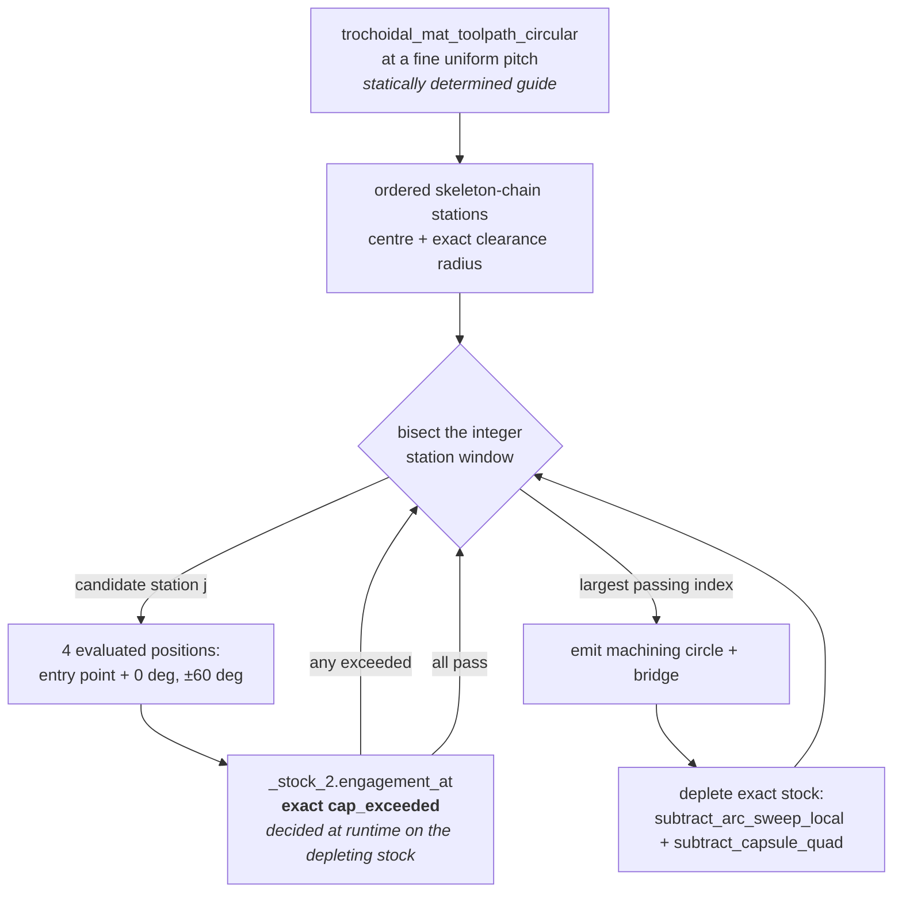

# Engagement-Controlled Trochoidal Toolpath

`compas_cgal.engagement_toolpath.engagement_controlled_toolpath` regulates the advance between
machining circles on the measured engagement instead of a dialled-in stepover, and on the pockets
measured so far it holds every machining circle except the unavoidable chain-entry loops at or below
the requested cap, while cutting **55% less travel** than the unregulated generator aimed at the same
cap. The price is generation time: **72 ms on a 12x8 pocket against 2.6 ms**, a factor of ~27 (it was
~1000x before full-turn depletion became exact and bridge depletion stopped being a disk chain).

The guarantee is narrow and stated exactly, because it is easy to overclaim here:

!!! warning "What is guaranteed, and what is not"

    Engagement `<= tea_cap_deg`, decided by an exact predicate, **at each evaluated tool position**.

    That is the whole claim. It is **not** a continuous guarantee between evaluated positions: the
    tool centre traverses a full circle and a bridge segment between one evaluated position and the
    next, and nothing in this path bounds what happens in between. **No certificate is produced or
    returned**, and no `MotionWitness` / `CapRefutation` object exists on this path. Coverage is not
    part of the accept/reject rule either — it follows from the advance bound and is *measured*, not
    proved.

## Why an exact predicate instead of a stepover

The stepover is a geometric proxy for engagement through the textbook radial-immersion relation
`TEA = 2*acos(1 - ae/r)`, which assumes the boundary between cut and uncut material is **straight**.
In a real trochoidal path it is the outer rim of the previous circle, so the proxy under-reads. Dialling
a 2 mm tool to `stepover = 0.5` — the value that relation says gives exactly 120 deg — produces machining
circles the audit measures at **136.4 deg**. The regulated generator, asked for the same 120 deg,
produces circles measured at **119.5 deg**. Same tool, same pocket, same cap; the difference is
measuring instead of assuming.

## How the advance is chosen



The guide is the existing C++ generator run at a fine pitch. Its emitted `Circle` cut operations
already are the ordered skeleton-chain stations with exact clearance-derived radii, so chain
extraction, chain ordering, and the gouge-free radius derivation stay in the one implementation that
owns them. The consequence that matters for exactness: **the advance grid is an integer count of
stations**, so the bisection terminates on an integer bracket collapse — there is no float tolerance
anywhere in the accept/reject path.

### Evidence table

| Claim | Value | Source |
| --- | --- | --- |
| Advance resolution | `D/40 = r/20`, worth `<= ~7 deg` of TEA | `GUIDE_STEP_TOOL_DIAMETERS`, derivation in the constant's comment |
| Advance bound | one tool diameter (engagement saturation **and** annulus overlap) | `MAX_ADVANCE_TOOL_DIAMETERS` |
| Evaluated positions per circle | K = 4 (entry point, 0 deg, ±60 deg from advance) | `LOOP_PROBE_ANGLES_DEG` |
| Regulated circles, 10x6, cap 120 deg | max 119.5 deg outside entry loops | `audit_toolpath_engagement` |
| Unregulated circles, same cap via `stepover=0.5` | 136.4 deg | `audit_toolpath_engagement` |
| Motions measured above cap, 12x8 | 5 regulated vs 14 unregulated | `audit_toolpath_engagement` |
| Cut travel, 12x8 | 411.6 vs 914.3 | sum of circle circumferences and bridge lengths |
| Generation, 12x8, 2 mm tool | 72.4 ms, vs 2.6 ms | `time.perf_counter` around each generator; was 0.226 s before the quad capsule and 2.70-3.43 s before exact-annulus depletion |
| Residual stock, 10x6 | 2.35% vs 2.57%, none further than 0.28 mm from a wall | 200x120 `Stock.contains` grid |

### Why those four probe positions

In the steady regime the material a new circle meets is a crescent at its outer rim whose radial
thickness varies like `a*cos(phi)`, with `phi` measured from the advance direction. Engagement peaks at
`phi = 0` — that is where the circle bites deepest — and the backward half lies inside the union of the
preceding circles' swept annuli. So:

- **0 deg** catches the peak.
- **±60 deg** sit on the half-depth contour (`cos 60 deg = 1/2`), far enough off-axis to catch the two
  regimes the idealisation misses — guide curvature rotating the crescent off the nominal advance
  direction, and clearance growing along the guide (corner spokes) lifting fresh material onto the
  flanks — while staying out of the provably-swept backward half.
- **The entry point** is the terminus of the bridge cut that precedes the circle, and it is evaluated
  *before* the bridge is removed, so that probe measures what the linking cut itself runs into.

Sampling sixteen or more positions per candidate would make generation cost dominate without probing a
materially different regime.

!!! note "Under verification: four probes versus twenty"

    `tests/test_engagement_toolpath.py::test_only_chain_entry_loops_are_measured_above_the_cap` pins
    the gap between the generator's four probes and the audit's twenty stations per circle: on a 6x4
    pocket the only motions the audit finds above the cap are the chain-entry loops the generator
    already refuses and reports. That is a **measurement on one pocket**, not a proof that four probes
    suffice in general.

## Depleting a full turn is exact, not sampled

Every machining circle is a full turn, and the region a tool of radius `r` sweeps about a circular
guide of radius `rho` is **exactly** the annulus between `rho - r` and `rho + r`. That region is
representable in `Gps_circle_segment_traits_2`: both radii are doubles, hence rationals, so their
squares are the rational squared radii the traits class needs. Two boundary circles — four
x-monotone arcs — describe it completely.

The generator previously under-approximated that sweep with a chain of tool disks spaced
`2*r*sqrt(CHAIN_SLACK_FRACTION)` apart, which is **1260 disks** for one turn at `r = 0.5`. The chain
was deliberately conservative: it under-covers, so the model retained more material than the tool had
actually removed and every later engagement query read high. Moving to the annulus is a
**correctness improvement, not a loosened tolerance** — the modelled region becomes the true region,
so there is no longer an approximation to compensate for.

`Stock2::subtract_annulus` is the new path, `subtract_arc_sweep` routes the full-turn case to it, and
the partial-arc and capsule chains are untouched. The two radii are formed in exact rational
arithmetic rather than in doubles: `subtract_annulus_exact` shares its region builder with
`exact_full_circle_sweep_oracle`, so the region the fast path removes and the region the depletion
certificates are proved to under-cover are the same construction by identity.

| Claim | Value | Source |
| --- | --- | --- |
| Arrangement vertices after one full turn | **8** via the annulus vs **2536** via the chain — 317x | `Stock.arrangement_stats`, `test_annulus_arrangement_is_orders_smaller_than_the_chain` |
| Depletion cost, 12x8, 2 mm tool | **2.5 ms/call** vs 57.4 ms/call, 49 calls | `time.perf_counter` around `Stock.subtract_*`, A/B on one machine |
| `engagement_at` cost, same run | **0.160 ms/call** vs 1.288 ms/call, 427 calls | same harness |
| Total generation, same run | **0.226 s** vs 3.411 s — 15x | same harness |
| Chain shortfall it removes | `r * CHAIN_SLACK_FRACTION` = 5.0e-5 mm at `r = 0.5` | sagitta `s^2/(4r)`, `test_annulus_removes_the_slivers_the_disk_chain_retains` |
| Toolpath produced | **unchanged**: 49 cuts / 441.8 length / 5 over cap (12x8), 112 / 595.3 / 7 (L-shape) | replay against `_stock_2.engagement_at`, 12 positions per loop |

!!! note "The disk chain is not a subset of the annulus, and that is the chain's doing"

    The chain's centres are `cx + guide_r*cos(a)` evaluated in double arithmetic, so they land up to
    **7.0e-16 mm off** the guide circle and the chain removes a sub-femtometre crescent *outside* the
    true swept region. Exact set inclusion of the annulus result in the chain result is therefore
    false — for a reason that belongs to the chain's sampling, not to the annulus. The inclusion
    **does** hold exactly against `subtract_exact_full_circle`, whose centres are exact rational
    points on the guide circle; that is the form the test asserts. The chain's meaningful error is
    its 5.0e-5 mm shortfall, eleven orders of magnitude larger.

The guide radius itself stays a double surrogate. `sqrt(rx^2 + ry^2)` is irrational in general, so
`(rho +- r)^2` is not a rational squared radius and the exact annulus about the *true* guide circle is
not representable at all. That surrogate is a pre-existing property of this double-valued API — the
chain samples the very same approximate circle — and it is injected exactly, with no snapping and no
correction constant.

## Depleting a bridge is six curves, not a chain

The bridge between two machining circles sweeps a **capsule**, and unlike the full turn's annulus the
capsule really is not representable in `Gps_circle_segment_traits_2`: its side lines stand off the
segment by `r/sqrt(dx^2 + dy^2) * (dy, -dx)`, and that offset is irrational while the traits class
holds lines as rational triples. So the bridge depletion stays an **under**-approximation. What
changed is the *shape* of that under-approximation:

```
region  =  disk(A, r)  U  disk(B, r)  U  rect(A, B, h)
```

The two end disks are exact and cover the capsule's semicircular caps exactly. The rectangle runs
along the segment at half-width `h`, a **rational** slightly under `r`, so it sits strictly inside the
capsule's straight part. Six curves per bridge — two circles and four segments — where the chain
needed `len / (2*r*sqrt(f))` disks, which is **601 disks** for a 6 mm bridge at `r = 0.5`.

The side lines never had to be *met*, only **under-cut**, and the chain was already paying
`CHAIN_SLACK_FRACTION * r` for exactly that. The quad spends the same budget in a better shape.

!!! note "The certificate is two exact comparisons, not a rounding argument"

    `h` is *chosen* in doubles — it is a construction parameter, the quad twin of the chain's
    spacing, aimed at the middle of the admissible band. It is then **checked**, exactly:
    `(1 - f)*r <= h <= r` as a comparison of squared rational lengths, plus an exact
    `CGAL::orientation` on the four corners. A failure throws `CapsuleQuadCertificateError` rather
    than removing a region the certificate does not cover. Nothing here compares a `to_double`, and
    no square root is taken.

    The band leaves `f/2 = 5e-5` of relative headroom on each side against a double rounding of
    `~2e-16` — eleven orders of magnitude — so the checks are structural guards, not a filter the
    construction is expected to trip.

Both halves of the contract are exact consequences of that band. A point of the rectangle is
`A + t*d + s*h_vec` with `|s| <= 1` and `h_vec` perpendicular to `d`, so its distance to the segment
is exactly `|s|*h <= r`: **nothing outside the true swept capsule is ever removed**. And anything
within `(1 - f)*r` of the segment is either inside a full-radius end disk or has its perpendicular
foot in the segment's interior at offset `<= h`: **the under-coverage stays inside the documented
budget**.

| Claim | Value | Source |
| --- | --- | --- |
| Arrangement vertices after one capsule | **10** via the quad vs 1206 via the chain at `r = 0.5` (120x); 10 vs 306 at `r = 2.0` (30x) | `test_capsule_quad_arrangement_stays_orders_below_the_chain` |
| Growth per bridge vs bridge length | **constant** (10 vertices for a 0.5 mm and an 8 mm bridge) | `test_capsule_quad_growth_is_independent_of_segment_length` |
| Bridge depletion, 12x8, 2 mm tool | **0.337 ms/call** vs 4.389 ms/call, 22 calls | wrapped `Stock.subtract_*`, A/B on one machine |
| `engagement_at`, same run | **0.061 ms/call** vs 0.158 ms/call, 427 calls | same harness — every later query walks a smaller arrangement |
| Full-turn depletion, same run | **0.356 ms/call** vs 1.078 ms/call, 27 calls | same harness, same reason |
| Total generation, 12x8 | **72.4 ms** vs 222.5 ms — 3.1x | same harness |
| Total generation, L shape | **173.7 ms** vs 743.4 ms — 4.3x | same harness |
| Toolpath produced | **bit-identical** operation stream on both pockets: 49 cuts / 441.8 / 5 over cap (12x8), 112 / 595.3 / 7 (L-shape) | float-exact signature comparison; exceedances by 12-position `engagement_at` replay, counted under *both* replay depletions |
| Under-coverage | **unchanged**: `r * CHAIN_SLACK_FRACTION`, 1e-4 mm at `r = 1.0` | the certified band, `test_capsule_quad_covers_the_documented_slack_band` |

!!! warning "Neither approximation contains the other, and the quad is not the exact capsule"

    The chain covers the full radius `r` at each disk centre and dips to `r*sqrt(1 - f)` midway
    between centres; the quad covers a flat `h` along the whole rectangle and the full `r` only at
    the caps. So the two removed regions are **incomparable as sets** — asserting inclusion either
    way would be false. What both satisfy, and what the tests assert, is the same pair of exact
    bounds: contained in the true capsule, containing the `(1 - f)*r` band.

    `subtract_capsule` is **not** removed. It stays the reference the quad is measured against, and
    `tests/test_stock_capsule_quad.py` decides both paths' properties against the same exact
    rational oracle.

!!! note "No local variant: the flood cannot start where it would have to"

    `subtract_disk_local` / `subtract_annulus_local` (see [Local Depletion](local_depletion.md)) do
    not extend to this region, for a reason distinct from the disk chain's. Recognising a *linear*
    boundary edge is mechanically possible — `_X_monotone_circle_segment_2::supporting_line()` gives
    the same rational-identity test that `supporting_circle()` gives for arcs. The blocker is the
    **seeds**: the local update inserts whole supporting curves and blocks the flood on every
    sub-curve of them, so the two end-cap lines and the rectangle's sides partition the region's
    interior into cells whose number and shape depend on the configuration (how the disks overlap,
    whether a corner falls inside the other disk). A seed set that is provably complete for every
    configuration is real work, and a missing seed leaves material silently marked present. Not
    attempted; the global path costs 0.337 ms/call, which is no longer the dominant term.

## Chain entries are over the cap by construction

The first machining circle of a chain meets virgin stock: it is a full slot whatever the advance, and
the audit measures it at a full turn. There is nothing to search — the circle is emitted, counted, and
reported through `UnavoidableEngagementWarning`, never emitted silently. On both rectangles measured,
the over-cap motions are **exactly** the chain-entry loops and nothing else.

A helical or ramped entry would remove them. That is not implemented here.

## Prior art

| System | Relationship | Evidence |
| --- | --- | --- |
| Held's trochoidal engagement control (float bisection to `eps = 1e-3`) | **stronger per evaluated position** — each verdict is an exact predicate on the exact arrangement, no tolerance in the accept/reject path | `_stock_2.engagement_at` returns `cap_exceeded` decided exactly; the surrogate crossing is `4*sin^2(theta/2)` at one declared boundary |
| Continuous partition of each motion (`compas_cgal.adaptive`) | **weaker** — a partition bounds every centre on the motion; this bounds only the positions it evaluated | this module deliberately does not import `compas_cgal.adaptive`, and returns no witness type |
| `trochoidal_mat_toolpath_circular` (stepover proxy) | **stronger on measured engagement, weaker on speed** | 119.5 deg vs 136.4 deg at a 120 deg target; 72.4 ms vs 2.6 ms on 12x8 |

## Known limitations

- **Between-position engagement is unbounded.** Stated above; this is the defining limitation.
- **Monotonicity is assumed, not proved.** The bisection assumes engagement is monotone
  non-decreasing in advance distance. Under that assumption it returns the largest admissible
  station; without it, it still returns an admissible one — every accepted station's evaluated
  positions passed the exact predicate regardless.
- **Generation is ~27x slower** than the unregulated generator (was ~78x before the quad capsule and
  ~1000x before full-turn depletion became exact). `engagement_at` is now the largest single term
  (34% of a 12x8 run) and depletion is 22%.
- **Guide tangency is G1 on straight guide segments only**, approximate through turns — the same
  model the existing generator uses.
- **Coverage is measured, not certified.** The advance bound keeps consecutive annuli overlapping;
  the consequence was checked on a `Stock.contains` grid.
