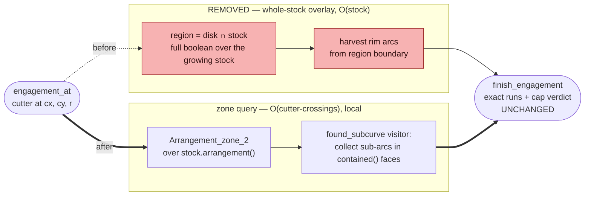

# Engagement Query: the Local Zone Query

`engagement_at` — the exact tool-engagement-angle (TEA) query at the heart of the
adaptive-clearing certifier — reads engagement **locally**, by zoning the cutter circle in the
stock's *own* arrangement, instead of overlaying the cutter disk against the **whole** stock on
every call. On a real pocket audit this is **4.8× faster end-to-end** (92 s → 19 s) and **12×
faster per query** on a deeply depleted stock, with the certificate **bit-for-bit identical**.
The former whole-stock overlay was ~90 % of the audit; with it removed, exact stock **depletion**
(`subtract_*`) is now the dominant cost — the next lever.

## The change

The old query built `region = disk ∩ stock` — a full `General_polygon_set_2::intersection`
over the entire, *growing* stock arrangement — then harvested the rim arcs from that overlay's
boundary. That is **O(stock)** per query, and an audit runs thousands of queries per pocket, so
the cost climbs as the stock accumulates cuts.

The new query drives the cutter circle through the stock's own
`General_polygon_set_2::arrangement()` (whose faces already carry `contained()` = material)
with a `CGAL::Arrangement_zone_2` + `found_subcurve` visitor that collects the rim sub-arcs
lying in material — **O(cutter-crossings)**, local. The exact run-assembly and pessimistic cap
decision (`finish_engagement`) are unchanged: only *how the rim arcs are found* changed, never
the decision.

## Measured: real pocket audit, overlay vs zone

A full audit of a 10×10 mm square pocket (tool ⌀2 mm, 119 toolpath ops, 120° engagement cap),
replayed op-by-op through `audit_toolpath_engagement`. Identical code path and inputs — only the
`engagement_at` implementation differs (the pre-swap overlay source checked out and rebuilt for
the "before" column). Each C++ binding was wall-timed directly.

| Metric | Overlay (before) | Zone (after) | Speedup |
| --- | --- | --- | --- |
| **Audit total** | **92.2 s** | **19.1 s** | **4.8×** |
| &nbsp;&nbsp;— engagement certification | 83.3 s (90 %) | 9.4 s (49 %) | 8.9× |
| &nbsp;&nbsp;— stock depletion (`subtract_*`) | 8.8 s (10 %) | 9.6 s (50 %) | ~1× (unchanged) |
| `engagement_at` per call | 18.5 ms | 1.5 ms | **12.4×** |
| `certify_segment_tea` per call | 1036 ms | 129 ms | 8.0× |
| worst TEA / cap violations (**the verdict**) | 360° / 64 | 360° / 64 | **identical** |

Per-query cost scales with stock-arrangement size, so the speedup **grows with depletion**: on a
lightly-cut synthetic stock (10–50 cuts) it is ~4–5×/query; on the fully-depleted 119-cut audit
stock it is 12×. The 12×/query yields "only" 4.8× **end-to-end** because the *unchanged* depletion
cost — formerly 10 % of the audit — is now half of it.

!!! success "CONFIRMED — measured 2026-07-24 (CGAL 6.0.1, one pocket, one machine)"
    A/B on the same commit's parent: pre-swap overlay source vs the landed zone query, both
    rebuilt and driven through the identical `audit_toolpath_engagement` replay; per-binding
    wall-times summed over the audit. Single pocket / single machine — treat the *ratios* as the
    result, not the absolute seconds. The verdict fields (worst TEA, cap violations) are identical
    between the two builds, so the speedup carries **no** change to what the certifier decides.

## What now dominates: exact depletion (SP2)

With the query collapsed, the audit's residual is **stock depletion** — `subtract_arc_sweep` and
`subtract_capsule` (~9.6 s, 50 %). This is *not* fundamental either: the exact swept region of an
arc cut has irrational offset boundaries not representable in the circle-segment traits, so each
cut is under-approximated by a **chain of many small disks**. Hundreds of cuts × many disks each
means the stock arrangement accrues thousands of tiny scallop arcs, so later subtractions touch a
larger arrangement. The principled fix — a compact exact swept-region (few primitives per cut) —
is scoped for SP2, and is now cleanly the top cost with the query side gone.

## Correctness: the certificate is exact; reporting is ulp-representational

The swap reproduces the exact certificate (`cap_exceeded` and the `certify_segment_tea` verdict)
**bit-for-bit** — 0 mismatches over 7 200 comparisons at the unit level, and identical worst-TEA /
violation counts on the full audit above. The two harvests find the *same* crossing geometry:
every crossing is exactly equal under CGAL's representation-invariant one-root `operator==`.

The one non-identical bit is a **reporting-only** artifact of ≤ 1e-15 rad in `total_tea` /
`max_run_tea`: the overlay (Gps boolean) and the zone (arrangement sweep) spell the same crossing
with different `Sqrt_extension` representations, and `to_double` evaluates the *representation*, so
algebraically-equal points round by ulps. Exact predicates on the one-root form are representation-
**invariant**, which is why the decision is bit-identical. This is the deciding/reporting split
(see [Exact-Kernel Discipline](exactness.md)) working as designed; bit-exact `to_double` reporting
across two different exact construction algorithms is unachievable and not required. Full analysis:
`docs/superpowers/state/engagement-zone-divergence.md`.
