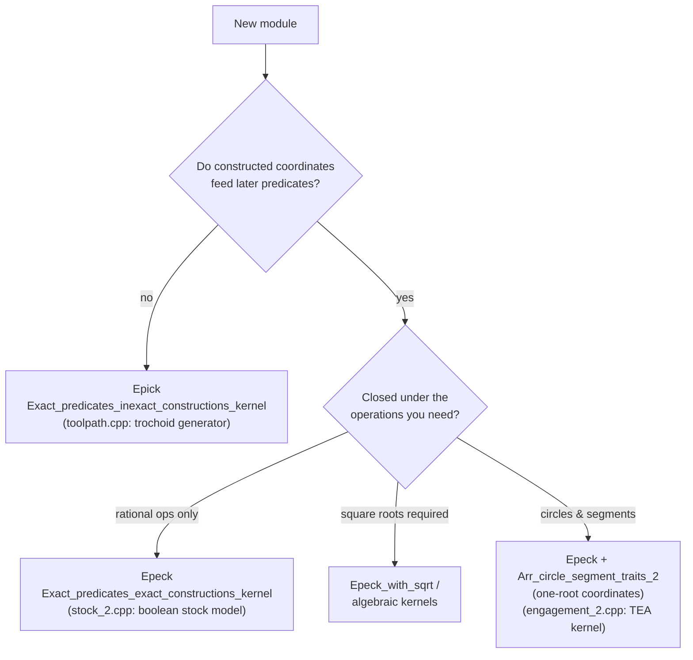
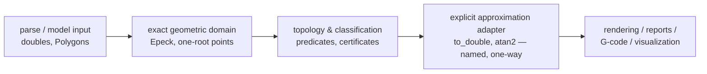

# Exact-Kernel Discipline

**Exactness is a property of the complete dataflow, not of the kernel
typedef.** You can instantiate `Exact_predicates_exact_constructions_kernel`
and still write fundamentally inexact code by converting one coordinate to
`double` before a branch; conversely, carefully written Epick code is fully
robust when no nontrivial construction ever feeds a later predicate. This
page is the discipline this repository holds itself to: geometric decisions
stay inside the kernel, approximation lives only at named system boundaries,
and every rule below is anchored to code that exists in this codebase.

This page governs **where** a decision may be made. Its companion,
[Number Types and Filtering](number_types.md), governs **what number type**
makes it and what that choice costs — the filter architecture behind each
kernel typedef, and the measured price of getting it wrong.

!!! warning "Why this page exists"

    During SP1 of the adaptive-clearing programme, a generated design placed
    a `CAP_BOUND_DEFLATION = 1.0 - 1e-12` fudge factor and a `1e-12`
    double-angle merge gap inside the engagement kernel's decision core —
    C-style floating-point precision handling inside an exact-constructions
    pipeline. The exact formulation existed all along (see the
    [case study](#case-study-the-deflation-constant-that-wasnt-needed)).
    Nothing in an exact kernel ever needs an epsilon to make a geometric
    decision; if you find yourself typing one, the design is wrong, not the
    arithmetic.

## The central rule

CGAL's robustness model rests on one distinction:

- **Predicates** decide: orientation, ordering, sidedness, incidence,
  intersection existence. They return discrete results
  (`Orientation`, `Comparison_result`, `Sign`, `bool`).
- **Constructions** produce: new coordinates, new geometric objects.

Exact code keeps control flow, topology, and combinatorics downstream of
predicates only. The Developer Manual's phrasing is blunt: imprecise
calculations cause "wrong or, much worse, mutually contradictory decisions."

This repository adds a project-level restatement, the
**deciding / reporting split**:

- A comparison that changes control flow, output topology, or a certificate
  is a *decision* — exact predicate territory, no exceptions.
- A number produced for humans — angles, lengths, areas in reports and
  statistics — is *reporting* — `CGAL::to_double` is fine there, and a
  reported value must never feed back into a decision.

```cpp
// DECIDING — exact, in-kernel (engagement kernel):
if (CGAL::compare_squared_distance(p, q, tolerance_sq) == CGAL::SMALLER) { ... }

// REPORTING — approximate, at the boundary (EngagementReport statistics):
const double tea = std::atan2(CGAL::to_double(sy), CGAL::to_double(sx));
```

## Choosing a kernel



The test is always the same question: **can an approximate constructed point
later change an orientation, ordering, equality, incidence, or
classification decision?** If yes, exact constructions must carry the whole
pipeline to that decision.

Both regimes coexist in this repository by design:

| Module | Kernel | Why it is sufficient |
| --- | --- | --- |
| `toolpath.cpp` (trochoid generator) | Epick | decisions are predicates on input-derived values; constructed tangent points are *outputs* (polylines, arcs) |
| `stock_2.cpp` (in-process stock) | Epeck + `Gps_circle_segment_traits_2` | boolean results are re-queried by later predicates — constructions feed decisions |
| `engagement_2.cpp` (TEA kernel) | same as stock | engagement intervals have one-root endpoints; the cap certificate is a predicate on constructed points |

!!! note "The package's traits contract is part of the type contract"

    `Gps_circle_segment_traits_2` requires *rational* circles (rational
    center, rational squared radius) and represents intersection points as
    one-root numbers. That contract is why tool-offset sweeps of arcs are
    not exactly representable here (their offset radii have irrational
    squares) — and why the stock model uses certified under-covering disk
    chains instead of pretending. Read the package documentation as
    normative, not as commentary.

## Input semantics: doubles are exact, decimals are not

`Epeck::FT(0.1)` represents the *binary double* `0.1` exactly — not the
mathematical decimal 1/10. Both facts are useful; confuse them and you have
a semantic bug no kernel can fix.

- **Measured or computed data** (everything crossing the nanobind boundary
  in this repo): exact injection of the double is precisely correct — the
  observation is preserved bit-for-bit, and there is *no snapping and no
  tolerance at the seam*.
- **Symbolic decimal geometry**: construct the intended rational explicitly.

```cpp
// Measured/computed input (our nanobind boundary) — exact injection:
Stock2::Stock2(Eigen::Ref<const compas::RowMatrixXd> boundary, ...)
// every double IS a rational; Epeck::FT(vertices(i, 0)) is exact.

// Symbolic decimal — say what you mean:
const FT one_tenth = FT(1) / FT(10);   // the mathematical 1/10
const FT not_this  = FT(0.1);          // the binary double 0.1
```

## The boundary doctrine for transcendental intent

Some user intent is inherently transcendental — an engagement-angle cap, for
instance. The discipline: **do not chase the transcendental with epsilons;
change the contract to an exact surrogate.**

The TEA kernel's cap crosses the API as a *chord ratio*:

```python
# Python boundary (compas_cgal.engagement): the ONLY conversion, documented.
cap_chord_ratio = 4.0 * math.sin(tea_cap / 2.0) ** 2   # dimensionless, (0, 4]
```

```cpp
// C++ core: T is an exact rational threshold. The certificate is an exact
// statement about T. No deflation factor exists anywhere downstream.
const Epeck::FT T = Epeck::FT(cap_chord_ratio) * FT(r) * FT(r);
```

The sub-ulp gap between the rational surrogate and the transcendental angle
the user typed is an *API semantic documented at the parameter* — not a
correction constant inside the decision core. After the boundary: exact
only.



Exact-to-approximate conversions are isolated in named adapters at the right
edge of that diagram. Interleaving `to_double` through the middle is how
Epeck code becomes inexact code with extra steps.

## Prefer predicates over coordinate arithmetic

Hand-rolled determinants can be exact over `Epeck::FT` — and are still the
wrong idiom. `CGAL::orientation(a, b, c)` states intent, engages the
filtered-predicate machinery, survives kernel changes, and forces the
degenerate case (`COLLINEAR`) into view instead of letting `> 0` silently
absorb it.

```cpp
switch (CGAL::orientation(a, b, c)) {
    case CGAL::LEFT_TURN:  ...; break;
    case CGAL::RIGHT_TURN: ...; break;
    case CGAL::COLLINEAR:  ...; break;   // degeneracy is an ordinary case
}
```

Reach for `CGAL::compare_x`, `compare_xy`, `compare_squared_distance`,
`has_smaller_distance_to_point`, `do_intersect`, `bounded_side_2` before
writing any coordinate arithmetic of your own. The repo's Epick module
already lives by this (see `toolpath.cpp`'s exact-predicate winding and
repositioning gates); the exact modules have no excuse at all.

## Numeric comparison is the exact-kernel idiom

Comparisons happen at the *number-type* level with CGAL's machinery:
`CGAL::sign`, `CGAL::compare`, `Comparison_result` — never `operator<` on
`to_double` values, never re-deriving what `Real_embeddable_traits`
provides.

Two questions that look similar and are not:

```cpp
if (CGAL::is_zero(value))          { ... }  // is the mathematical value zero?
if (CGAL::abs(value) <= tolerance) { ... }  // within an explicit DOMAIN tolerance?
```

A tolerance is a *domain decision* — machining tolerance, measurement
uncertainty, feature resolution — modelled as an exact `FT` and compared
exactly. It is never a patch for arithmetic you didn't trust.

### One-root numbers (`Sqrt_extension` / CoordNT)

The circle-segment traits represents point coordinates as
`a0 + a1·√root` (`CGAL::Sqrt_extension`). The closure rules are documented
preconditions, not folklore:

- **Arithmetic** (`+ − × /`) requires operands in the *same* extension —
  the precondition is `a.root()==0 or b.root()==0 or a.root()==b.root()`.
  Cross-root arithmetic is undefined behavior. Never write it.
- **Comparison** across roots *is* exact and supported for the traits'
  points (`==`, `compare_x`, `compare_xy`) — the sweep line depends on it.
  Adjacency of sub-curves is therefore decided by **exact endpoint
  equality** (abutting sub-arcs share the same arrangement vertex), never
  by double-angle gap thresholds.
- When a needed comparison is not a stock predicate, *decompose it into
  supported exact calls* rather than hand-rolling bignum arithmetic. The
  TEA kernel's mixed-radical sign — `sign(A + B√α + C√β + D√(αβ))` with
  rational coefficients, which both the chord-vs-threshold predicate and
  the >π orientation test reduce to — is
  `compas_cgal::exact::sign_mixed_radical` (`src/exact/one_root.cpp`), and it
  decomposes as:

```cpp
// FIRST, fold degenerate radicands away with exact RATIONAL compares, so that
// no extension is ever built over a zero root. These are not fast paths; the
// predicate is unsound without them. See the danger note below.
if (CGAL::is_zero(alpha) && CGAL::is_zero(beta)) return CGAL::sign(a);
if (CGAL::is_zero(beta))  return CGAL::sign(CoordNT(a, b, alpha));
if (CGAL::is_zero(alpha)) return CGAL::sign(CoordNT(a, c, beta));
if (alpha == beta)  // √(αβ) = α, so the whole form collapses into one extension
    return CGAL::sign(CoordNT(a + d * alpha, b + c, alpha));

// THEN the general case, with both roots now known positive and distinct.
// u = A + B√α and w = C + D√α are SAME-root values: legal arithmetic.
// sign(u + √β·w) from three supported exact calls:
const CGAL::Sign su = CGAL::sign(u);
const CGAL::Sign sw = CGAL::sign(w);
if (sw == CGAL::ZERO) return su;
if (su == CGAL::ZERO) return sw;
if (su == sw)         return su;
// opposite signs: the dominant magnitude wins
switch (CGAL::compare(u * u, w * w * CoordNT(beta))) {   // same-root products
    case CGAL::LARGER:  return su;
    case CGAL::SMALLER: return sw;
    case CGAL::EQUAL:   return CGAL::ZERO;
}
```

!!! danger "`CGAL::sign` is unsound on an extended value whose root is zero"

    `Sqrt_extension::sign_()`
    (`external/cgal/include/CGAL/Sqrt_extension/Sqrt_extension_type.h:295-313`)
    decides by repeated squaring, and opens with:

    ```cpp
    s0 = CGAL_NTS sign(a0_);
    s1 = CGAL_NTS sign(a1_);
    if (s0 == s1) return s0;
    if (s0 == CGAL::ZERO) return s1;   // the sign of a1·√root — only if root > 0
    ```

    Under `ACDE_TAG == Tag_true` — the arrangement's tag, hence `CoordNT`'s and
    `exact::OneRoot`'s — an **extended value whose `root()` is zero is
    representable**, and this repository constructs them. Such a value *is*
    `a0`, so when `a0 == 0` the answer is `ZERO`; `sign_()` returns `sign(a1_)`,
    which is not. One function up, `sign()` handles the non-extended case
    correctly (`:316-317`, `if (! is_extended_) return sign(a0())`), so the
    defect is reachable **only** through an extended zero-root value.

    Measured: an oracle that built `CoordNT(a, b, alpha)` unconditionally
    reported `NEGATIVE` for an expression whose value is exactly `0` on
    **1,315 of 83,850** probes, every one of them over a degenerate root. First
    witness `a=-1, b=-1, c=1, d=-1, α=0, β=1` (commit `e54caf77`).

    The shipped predicate is correct **only because it folds first**. Those four
    early returns read exactly like the fast paths a refactorer would collapse
    into the general case, and they are load-bearing: deleting the single
    `is_zero(alpha)` return reddens `sign_mixed_radical_gate` with **347
    disagreements**, the first being that same witness — predicate `NEGATIVE`,
    oracle `ZERO`. Do not collapse them.

    This is the sibling of the rule `exact_one_root_gate` already pins. An
    extended zero-root is not a rational operand for *arithmetic* — that raises
    `CrossRootExtensionError`, and the exemption is `!is_extended()`, never
    "the root is zero". It is not sign-safe either.

## Algebraic kernels: identify roots without minimal polynomials

CGAL's `Algebraic_kernel_d_1` model represents a real root with a square-free
polynomial plus an isolating interval. It deliberately does not require a
minimal polynomial: computing one is usually expensive and does not improve
the root operations the kernel needs.

The repository therefore uses this canonical identity for a real event root:

1. denominator-clear and primitive-normalize every source polynomial;
2. square-free-factorize it with the algebraic-kernel or polynomial-traits
   functor;
3. solve the factors and group equal roots with `Compare_1`;
4. for one equality group, fold
   `Polynomial_traits_d::Gcd_up_to_constant_factor` over its source factors;
5. primitive-normalize that nonconstant square-free GCD with positive leading
   coefficient;
6. solve the GCD and locate the equal root with `Compare_1`; its ordinal is
   among all ordered real roots of that GCD.

For a root seen through two different projections, the GCD removes
irrelevant factors shared by neither source. For a root supported by only one
reducible square-free projection, the complete projection remains the
representative. This is intentional: trial-dividing arbitrary-precision
coefficients in search of a minimal polynomial is neither part of the
identity contract nor an acceptable exact-arithmetic algorithm.

Multiplicity is evidence about a source projection, not the number of times
the same source evidence was submitted. The aggregate scalar therefore takes
the maximum multiplicity while the event incidences preserve the distinct
source projections.

An isolating interval is a witness for locating and verifying the root, not
the root's identity. Refinement may change the interval without changing the
ID, but every accepted interval must still isolate the represented root.

## Use CGAL concepts before number backends

Exact code should be written against the algebraic concepts that state the
operation:

- `CGAL::is_square`, dispatched through
  `Algebraic_structure_traits<NT>::Is_square`, for exact square tests;
- `Fraction_traits<NT>::Decompose` and `Compose` for rational
  numerator/denominator access, including the recursive polynomial
  specialization;
- `Polynomial_traits_d<P>::Canonicalize`,
  `Gcd_up_to_constant_factor`, and the square-free operations for polynomial
  normalization;
- algebraic-kernel `Solve_1`, `Compare_1`, `Sign_at_1`/`Sign_at_2`, and
  `Bound_between_1` for roots, signs, ordering, and separating witnesses.

In the pinned CGAL 6.0.1 algebraic kernel,
`Algebraic_real_1::is_rational()` means that a rational representation is
already known; it is not a rationality decision procedure. `Solve_1` can
therefore return an implicit quadratic representation even when that
quadratic has rational roots. For the bounded degree-two convenience path,
the implementation derives the finite candidates with `CGAL::is_square` and
accepts one only after exact `Compare_1` equality. The algebraic root remains
the certified value; the rational is only a proven convenience rendering.

Backend-specific representation access, handwritten GCD/LCM, manual Newton
square roots, backend bit scans, and rational-root trial division bypass
those contracts. Explicit backend construction is allowed at the declared
coefficient boundary, and representation access is allowed for canonical
byte serialization and build attestation.

!!! warning "Materialize multiprecision expressions before locals die"

    CORE and Boost multiprecision arithmetic uses lazy expression templates.
    An `auto`-deduced function or lambda return can therefore retain references
    to local operands instead of returning a number. The expression later
    dereferences dead storage, often crashing only in optimized arithmetic.
    Give such returns the concrete exact number type (`CORE::BigRat`,
    `CORE::Expr`, or the kernel `FT`) so materialization happens before the
    operands leave scope.

!!! warning "Zero-set normalization is not sign normalization"

    Multiplying by a negative unit preserves a polynomial's zero set while
    changing its sign. Replacing an even power \(q^{2k}\) by the square-free
    factor \(q\) also preserves the zero set but changes the sign across
    \(q=0\). Use the algebraic kernel's documented sign functor on the
    original polynomial. If an implementation pre-factors a polynomial,
    first return zero when any source factor vanishes; otherwise multiply the
    original unit/content sign by factor signs according to multiplicity
    parity. Never reuse a zero-set-only canonical form as a signed predicate.

## Avoid square roots; prefer squared quantities

Epeck's field type is rational: a generic square root leaves the field.
Compare `squared_distance` against squared thresholds; keep lengths squared
until the reporting adapter. If the algorithm genuinely needs `√` *inside
decisions*, that is a kernel-selection fact
(`Exact_predicates_exact_constructions_kernel_with_sqrt`, algebraic
kernels), not a license to `std::sqrt(to_double(...))`. "Exact" is not
"closed under every operation" — CGAL ships distinct kernels for sqrt, kth
roots, and algebraic numbers precisely because of this.

In this repository the rule has teeth in both directions:
`approx_length`/`approx_distance` in the Epick module are *constructions*
feeding outputs (allowed); the Epeck stock model never takes a square root
at all — the trochoid guide radius appears only as `guide_r²` (rational) or
as reporting doubles.

## Degeneracy is an ordinary input case

Exact arithmetic makes degeneracies *reliable*, not absent. Idiomatic code
enumerates every documented outcome — CGAL's intersection APIs return
optional variants because a segment-segment intersection *is* sometimes a
segment:

```cpp
const auto result = CGAL::intersection(segment, line);
if (!result) { /* empty */ }
else if (const auto* pt = std::get_if<K::Point_2>(&*result))   { /* point */ }
else if (const auto* seg = std::get_if<K::Segment_2>(&*result)) { /* overlap */ }
```

The engagement kernel's inventory of ordinary-not-exceptional cases: an
empty intersection region (rim fully clear), a crossing-free rim fully in
material (2π run), tangent touches (zero-measure arcs), the exact-π run
(collinear center/start/end), coincident stations, zero-radius guides.
Every one has a branch and a test.

!!! tip "Test on degenerate and nearly degenerate data"

    The property suites in `tests/test_stock.py` exist because exactness
    claims are cheap and degenerate inputs are not. A hypothesis strategy
    plus a handful of constructed degeneracies (bit-identical endpoints,
    antipodal runs, tangent circles) is the difference between "uses Epeck"
    and "is exact."

## Analytic bounds are not precision handling

One clause separates legitimate double arithmetic from smuggled epsilons. A
*mathematical lemma bound* — e.g. the TEA growth bound that closes a
certificate between exact stations — may be evaluated in doubles **only**
when all three hold:

1. its constants carry proof-level slack (integer safety factors stated in
   the derivation comment) that dwarfs floating-point evaluation error by
   orders of magnitude;
2. the safe failure direction is stated (more refinement / flag violation —
   never a false certificate);
3. it drives *refinement*, never geometric truth — membership, adjacency,
   thresholds remain predicate territory.

In the certifier this shows up as *threshold selection*: the guard shrinks
the cap that the exact station predicate then tests. The lemma picks which
exact question to ask; it never answers one.

## Exact topology, approximate metric policy

For CAD/CAM the last separation is the one that keeps the system honest. An
exact kernel answers: does this intersection exist, which side, exactly
incident, exact ordering, topologically valid boolean. It cannot answer:
should these measured surfaces be treated as coincident, is a 3 µm gap
acceptable, is this sliver manufacturable. Those belong to an explicit
policy object with exact-`FT` fields:

```cpp
struct Manufacturing_policy {          // SP2 direction of travel
    Epeck::FT linear_tolerance;        // domain decisions, exactly modelled
    Epeck::FT angular_surrogate;       // e.g. a chord ratio, not an angle
    Epeck::FT minimum_feature_size;
};
```

Exact arithmetic makes the policy *deterministic*; it does not replace it.
`radial_clearance` and the TEA cap are early instances — deliberate domain
margins, exactly represented, never numerical repair.

### Exact arithmetic does not discharge topology preconditions

An exact locator or predicate is correct only on the topology its algorithm
supports. Arrangement faces may have multiple outer CCBs; a point locator that
assumes one outer boundary can return the wrong face, and a walk locator whose
progress guard exists only as an assertion can loop forever when `NDEBUG`
removes that guard. Neither failure involves rounding, an epsilon, or an
inexact construction. Numeric exactness review alone therefore cannot exclude
it.

Every deciding point-location path must use a locator whose documented
preconditions cover the arrangement actually produced, including
multi-outer-CCB faces. Release behavior must not depend on a debug assertion for
correctness or progress. Consumer-boundary tests must exercise both the returned
classification and bounded termination on a fixed multi-outer-CCB fixture; a
certificate that returns quickly but names the wrong face is more dangerous
than an overt failure.

## Copying a `Gps` aliases its traits object

Copying a `General_polygon_set_2` — or an arrangement, or any type holding
one — produces an object whose arrangement points at the **source's**
geometry-traits object, not at its own. The copy allocates a traits it never
uses; the pointer its arrangement actually reads is owned by the source and
freed when the source dies. Three properties make this trap hard to see and
harder to test for: the aliasing lives in vendored CGAL, `std::move` does not
avoid it (it silently degrades to a copy), and whether the dangling pointer
faults depends entirely on which point-location strategy reads it. The
consequence for review is the actionable part: **the check must be structural
— assert traits-pointer identity — because a fault-based test for this passes
whenever the allocator happens to be kind.**

!!! danger "A clean run is not evidence here"

    For one confirmed instance of this defect, the following were all
    collected on code that lldb *simultaneously* showed reading traits bytes
    scribbled to `0x55555555…`: Guard Malloc (`libgmalloc.dylib`), five runs
    under `MallocScribble`/`MallocPreScribble` with the nano zone disabled,
    deliberate reclamation of the freed 32-byte block with three fill
    patterns, and 130 tests. Every arm was clean and byte-identical, and
    positive controls proved the instrumentation did detect a plain
    read-after-free. Absence of a fault says nothing about whether the
    pointer is valid.

### 1. The copy borrows

`Arrangement_on_surface_2::assign`, which the arrangement copy constructor
delegates to
(`external/cgal/include/CGAL/Arrangement_2/Arrangement_on_surface_2_impl.h:201`):

```cpp
m_geom_traits = (arr.m_own_traits) ? new Traits_adaptor_2 : arr.m_geom_traits;
m_own_traits  = arr.m_own_traits;
```

Allocating a fresh traits only when the source **owns** one is defensible in
isolation. What breaks it is that `Gps_on_surface_base_2` always builds its
arrangement in borrow mode — the `Gps` owns the traits, the arrangement points
at it (`Gps_on_surface_base_2.h:158-162`, `165-170`):

```cpp
Gps_on_surface_base_2(const Self& ps) :
    m_traits(new Traits_2(*(ps.m_traits))),  // the copy gets its own traits ...
    m_traits_owner(true),
    m_arr(new Aos_2(*(ps.m_arr)))            // ... which its arrangement never uses
{}
```

`m_own_traits` is therefore `false` all the way down a copy chain, so after
`Gps b(a);` the object graph is `b.m_arr->m_geom_traits == a.m_traits`, and
`~a` deletes it. The two CGAL components are individually reasonable and
jointly wrong, and the combination is reachable from **any** `Gps` copy.

### 2. `std::move` on a `Gps` is a copy

`Gps_on_surface_base_2` declares `virtual ~Gps_on_surface_base_2()`
(`Gps_on_surface_base_2.h:242`). A user-declared destructor suppresses the
implicit move constructor, and `General_polygon_set_2` declares none of its
own, so a `Gps` has **no move constructor at all** — every apparent move binds
to the copy constructor and hits the aliasing above.

This is not hypothetical. `ExactRegion2::build` (`src/exact_region_2.cpp:149`)
takes its set by value and adopts it:

```cpp
ExactRegion2 ExactRegion2::build(ReachSet set, ExactRegionRole2 role, std::string recipe_record)
{
    return ExactRegion2(std::make_shared<const ReachSet>(std::move(set)), role, std::move(recipe_record));
}
```

It reads as a clean ownership transfer. It is a copy that borrows the
by-value parameter's traits, plus the destruction of that parameter on
return — so the stored set's arrangement holds a freed traits pointer the
instant `build()` returns, for every region, whatever the caller passed.

### 3. Whether it crashes is a property of the locator

The same dangling pointer is a hard fault on one path and silent
undefined behavior on another, decided solely by which point-location
strategy touches it:

| Strategy | What it does with the traits pointer | Result |
|---|---|---|
| `Arr_trapezoid_ric_point_location` | Constructor runs `td.init_arrangement_and_traits(&arr)` → `new Td_traits(*m_trts_adaptor)` (`Trapezoidal_decomposition_2.h:1816`) — a genuine copy-construct out of the object, including `Arr_circle_segment_traits_2::inter_map` | SIGSEGV/SIGBUS, `KERN_INVALID_ADDRESS`; crashed `Stock2::contains` in 5 of 8 runs of the shipped test and 10 of 10 in a bare reproducer |
| `Arr_walk_along_line_point_location` (the bounded-planar **default**, `Arr_bounded_planar_topology_traits_2.h:249`; used by `Gps_on_surface_base_2::oriented_side`, `:484`) | Only *stores* the pointer (`Arr_walk_along_line_point_location.h:71,90`) and reaches the traits through accessors that are all `return Functor();` | No fault, correct answers, byte-identical output — and still UB |

The two `Arr_circle_segment_traits_2` accessors that do load the object's
bytes — `intersect_2_object()` (captures `inter_map`) and
`make_x_monotone_2_object()` (reads `m_use_cache`),
`Arr_circle_segment_traits_2.h:684,740` — are simply never reached through the
borrowed pointer on the walk path, because every boolean operation builds its
result arrangement from the `Gps`'s own live `m_traits`. That is an accident
of the current call graph, not an invariant. One locator choice separates
silence from the crash: `80ddaa11 "fix: support multi-ccb point location"` is
exactly the commit that gave `Stock2` a trapezoid-RIC locator and turned this
aliasing into a SIGSEGV.

### Detection is structural, not fault-based

Do not write a test that allocates, drops the parent, churns the heap and
hopes for a signal. That test is flaky by construction and reports green on
broken code, as the evidence above shows. Assert the ownership invariant
directly: **the arrangement an object reads must use the traits object that
object owns.**

```cpp
// audit accessor, in the spirit of ExactRegion2::shares_storage_with_for_audit
bool arrangement_uses_owned_traits() const
{
    return set_->arrangement().geometry_traits() == owned_traits_pointer();
}
```

Measured on a plain region today, those two are `0x12ee0f450` (freed,
`malloc_size == 0`) and `0x12ee15800` (live, never used) — the assertion is
`false` before any fix and `true` after one, deterministically, with no
dependence on allocator behaviour.

### The safe shape

One traits object whose lifetime outlives every arrangement in the family.
Two forms, both sound:

- **Share the traits.** Hold a `std::shared_ptr<const Traits>` member declared
  *before* the arrangement member — declaration order is load-bearing, since
  members are destroyed in reverse order and the arrangement must die first —
  and root the set with the borrowing `Gps_on_surface_base_2(const Traits_2&)`
  overload (`Gps_on_surface_base_2.h:158`), which sets `m_traits_owner = false`
  and leaves the `shared_ptr` sole owner. Every copy carries the same share.
- **Adopt the set instead of copying it.** Take `std::shared_ptr<const Set>`
  rather than a by-value set: the stored set *is* the caller's root, owning its
  own traits, and the borrowed pointer never comes into existence. Sites that
  derive one object from another without an intervening boolean operation must
  additionally carry the parent's share as a keep-alive.

Rejected for this codebase: rebuilding a copy from its
`polygons_with_holes` (re-runs a sweep and can perturb the arrangement that
certificates hash); patching vendored CGAL at
`Arrangement_on_surface_2_impl.h:201` (correct, but diverges the vendored tree
— it belongs upstream, and an upstream report against
`Gps_on_surface_base_2`'s copy constructor is worth filing regardless); a
process-lifetime `static` traits (global mutable cache state shared across
unrelated objects).

### Status in this repository

| Site | Reader | Maturity |
|---|---|---|
| `Stock2` (`src/stock_2.h`, `src/stock_2.cpp`) | `Arr_trapezoid_ric_point_location` in `contains` | **Fixed**, `57482731` — `std::shared_ptr<const GpsTraits> traits_` declared before `set_`. Confirmed: two independent reproducers crashed 10/10 and 6/6 before, and 0 of 20 and 0 of 8 after; the shipped intermittent test faulted 3/10 and 5/8 before, passing 15/15 and 8/8 after; all digests byte-identical |
| `ExactRegion2` (`src/exact_region_2.cpp`) | `Arr_walk_along_line_point_location` via `oriented_side` | **Fixed**, `df6fb020` — `build` adopts a `shared_ptr<const ReachSet>` instead of copying, and resolves the traits owner at construction, raising `ExactRegionTraitsUnownedError` when no candidate owns them. The `Stock2` shape did not transfer: `build` adopts sets from 13 call sites across 5 translation units, so it cannot know which traits an incoming set is rooted on. Confirmed structurally, not by faulting: `arrangement_traits_are_owned_for_audit()` was false for **all 17** producers before and true after; digest snapshot byte-identical |
| `ReachableMaterialPredicateStorage2` (`src/reachable_material_predicate_2.cpp:198`) | Two `Arr_trapezoid_ric_point_location` — the crashing strategy | **Fixed**, `df6fb020`, under the same adoption shape. Before it, this was the sharpest instance in the tree: its members copied by-value `ReachSet` parameters and both locators read the borrowed traits, so it was correct *only* because member-initialiser order built the locators while those parameters were still alive. One member reorder, or one lazily-built locator, and it would have been the `Stock2` fault |

## Case study: the deflation constant that wasn't needed

The incident that produced this page, in three acts:

1. **The defect.** The engagement kernel's first design compared *reported*
   double angles against `cap · (1.0 − 1e-12)` and merged runs whose double
   angular gap was below `1e-12`. Two decisions — a certificate and output
   topology — depended on floating point, inside an Epeck pipeline.
2. **The observation** (review, one sentence): *it's an exact kernel.*
   Both decisions had exact formulations already latent in the data: run
   adjacency is endpoint identity in the arrangement (exact `==` on
   one-root points), and the cap comparison is a chord-length predicate
   against a rational threshold once the cap crosses the boundary as
   `4·sin²(cap/2)`.
3. **The lesson.** Neither fix required new mathematics — only refusing the
   reflex of "handle precision" and asking instead *what is the exact
   question here, and which supported predicate answers it?* That question
   is this page.

## Review checklist

Run every exact-kernel change through these eighteen questions:

1. Is the kernel appropriate for every construction whose result is reused?
2. Does any `to_double()` result affect control flow or topology?
3. Are decimal inputs represented according to their actual semantics?
4. Are kernel predicates used instead of hand-coded determinants and
   epsilons?
5. Are squared quantities used instead of unnecessary roots?
6. Does the selected number type support every required algebraic
   operation?
7. Are all degeneracies and variant intersection results handled?
8. Are tolerance decisions explicit domain policy rather than numerical
   repair?
9. Are exact-to-approximate conversions isolated at named boundaries?
10. Does the code use kernel and traits abstractions (`K::FT`, not
    `CGAL::Gmpq`; no un-profiled `.exact()`) rather than backend types?
11. Does it satisfy the specific CGAL package's traits requirements?
12. Has it been tested on degenerate and nearly degenerate data?
13. Are algebraic roots represented by square-free polynomial plus isolation,
    without minimal-polynomial factoring?
14. Does every normalization used by a sign predicate preserve the original
    polynomial's sign, not merely its zero set?
15. Do all point-location and traversal algorithms support every face topology
    the producer can emit, including multiple outer CCBs?
16. Does release-mode correctness and progress survive with every debug
    assertion removed, with bounded termination and classification both tested?
17. Does every `Sqrt_extension` a predicate builds have a root that is provably
    nonzero, or is a zero radicand folded away with rational compares *before*
    the extension is constructed?
18. Does every copy of a `Gps`, an arrangement, or a type containing one — a
    `std::move` of such a type included, since it is a copy — keep the traits
    object its arrangement borrows alive for at least as long as the copy, and
    is that asserted by traits-pointer identity rather than by observing that
    tests pass?

## References

- [CGAL Developer Manual — Robustness][cgal-robustness] — exact computation
  and "use kernel primitives whenever possible."
- [CGAL Algebraic Kernel manual][cgal-ak] — square-free polynomial,
  isolating-interval representation and why minimal polynomials are avoided.
- [CGAL Polynomial traits][cgal-polynomial-traits] and
  [Algebraic foundations][cgal-algebra] — canonicalization, GCD, square-free
  factorization, fraction decomposition, and algebraic structure concepts.
- [CGAL `Sqrt_extension` documentation][cgal-sqrt-extension] — accessor API
  and same-extension arithmetic preconditions.
- 2D Arrangements & 2D Regularized Boolean Set-Operations — the
  circle-segment traits contract this repository's stock model lives under.
- Repo enforcement: the distilled rules in `CLAUDE.md` (binding for every
  change) and the SP1 design documents under `docs/plans/`.

[cgal-robustness]: https://doc.cgal.org/6.0.1/Manual/devman_robustness.html
[cgal-ak]: https://doc.cgal.org/6.0.1/Algebraic_kernel_d/index.html
[cgal-polynomial-traits]: https://doc.cgal.org/6.0.1/Polynomial/classPolynomialTraits__d.html
[cgal-algebra]: https://doc.cgal.org/6.0.1/Algebraic_foundations/index.html
[cgal-sqrt-extension]: https://doc.cgal.org/6.0.1/Number_types/classCGAL_1_1Sqrt__extension.html
