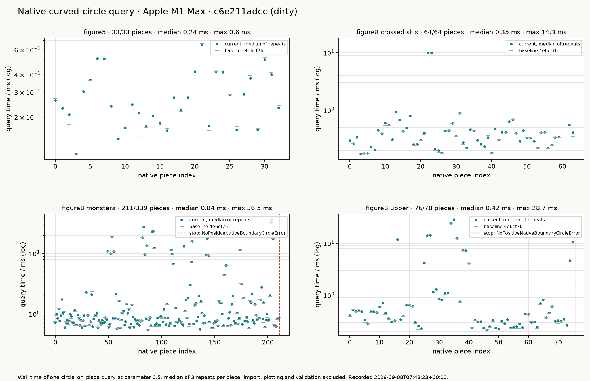

# Held Curved-Circle Performance

The native curved-circle query, `NativeBoundary2.circle_on_piece`, answers in
well under a millisecond for the median piece of every prepared Held pocket,
and a pytest gate now fails when it gets slower than the recorded baseline or
when a pocket stops at a different piece than it did. On 2026-09-07 the first
Figure 5 query was killed after 337 s; the two mechanisms behind that, and the
measurements that found them, are in
[Held motion coverage](held_motion_coverage.md#deciding-only-what-is-generically-nonzero).
This page is the reproducible record and its gate.

| case | pieces | median | p95 | max | stop |
| --- | ---: | ---: | ---: | ---: | --- |
| Figure 5 | 33 / 33 | 0.25 ms | 0.53 ms | 0.66 ms | none |
| Figure 8 upper | 76 / 78 | 0.41 ms | 13.8 ms | 28.2 ms | clearance below tool at piece 76 |
| Figure 8 crossed skis | 64 / 64 | 0.35 ms | 9.4 ms | 13.6 ms | none |
| Figure 8 Monstera | 211 / 339 | 0.82 ms | 15.7 ms | 36.3 ms | clearance below tool at piece 211 |

Baseline recorded 2026-09-08 on an Apple M1 Max at commit `4e6cf761`, median
of three repeats per piece, parameter 0.5, import and plotting excluded. The
record is `benchmarks/results/held_curved_circle_baseline.json`.



## Protocol

`benchmarks/held_curved_circle_benchmark.py` imports each prepared pocket once,
queries every native x-monotone piece at parameter 0.5 three times, and keeps
the per-piece median. A named geometry stop, a clearance below the tool or an
inadmissible one-sided normal, ends the case and is recorded with its piece
index and type; any other exception propagates. The record carries the
machine (`platform.machine()`, system, CPU brand, Python), the build (commit,
dirty flag, package version, timestamp), the repeat count and the parameter.

```bash
pixi run held-curved-circle-benchmark   # current run into build/held-curved-circle/current.json
pixi run held-curved-circle-figures     # four construction figures, the record, and the figure above
pixi run held-curved-circle-baseline    # deliberately re-record the committed baseline
```

The construction figures themselves, one per pocket, live on the coverage
page: [Figure 5](held_motion_coverage.md#deciding-only-what-is-generically-nonzero)
and the three Figure 8 pockets follow the case table there.

## Regression gate

`tests/benchmarks/test_held_curved_circle_performance.py` measures all four
cases in-process and compares against the baseline with the policy in
`held_curved_circle_benchmark.compare`:

| check | bound | rationale |
| --- | --- | --- |
| completed queries and stop event | identical | a pocket that stops earlier, later or for another reason changed behaviour; re-record deliberately if intended |
| slowest query, any machine | 0.25 s | the corpus witness budget |
| case median, any machine | 20 ms | fifty times the recorded medians, above any CI runner slowdown seen |
| case median, same hardware | 3× baseline | run-to-run spread on one quiet machine measured under 1.5× |
| slowest query, same hardware | 5× baseline | tail pieces vary more than medians |
| median and slowest, other hardware | 10× baseline | only order of magnitude is comparable across machines |

"Same hardware" means the same machine architecture, system and CPU brand as
the record; the failure message names the regime and the bound. CI runs this
gate on ubuntu runners, so there it applies the cross-machine factors and the
absolute ceilings; the same-hardware factors bind on the recording machine.
The four slowest pieces measured before the fixes, Monstera 159, 85 and 160
and upper 75, keep their separate 0.25 s witness in
`tests/benchmarks/test_held_native_curved_circle_budget.py`.

!!! note "What the gate does not claim"
    It measures one query in isolation. Adaptive placement, the transition
    consumer and the coverage replay are not timed here, and nothing on this
    page is a comparison with Held's published timings, which were taken on
    other hardware with a complete traversal.
