# Held motion coverage

Coverage is an acceptance condition for every generated machining workload.
An engagement bound and retained guide-run families do not establish that the
cutter reaches all material. A shorter path with unqualified coverage is a draft,
not a qualified improvement.

The source [paper is committed locally](assets/papers/held-pfeiffer-2025.pdf),
including [Figure 8](assets/papers/held-pfeiffer-2025.pdf#page=16).
The authoritative work remains Task 8 of the Held reproduction plan.

## How Held establishes coverage

The source is Held and Pfeiffer, *Trochoidal Tool Paths for Pocket Machining
with Full Control of the Tool Engagement Angle* (2025), Sections 2.1–2.4 and
3.1. The following diagrams are rendered directly from the committed PDF.

### First define the machinable target

Section 2.1, printed pages 734–735 ([PDF pages 4–5](assets/papers/held-pfeiffer-2025.pdf#page=4)),
defines machinable material as the union of contained radius-r tool disks.
It describes an inward offset followed by an outward offset and adjusts the
input geometry and Voronoi diagram accordingly. The subsequent algorithm
assumes this machinable pocket. Its implementation additionally regularizes
convex arcs with an offset slightly larger than the cutter radius; this is a
reported paper choice, not authorization for an unnamed tolerance here.

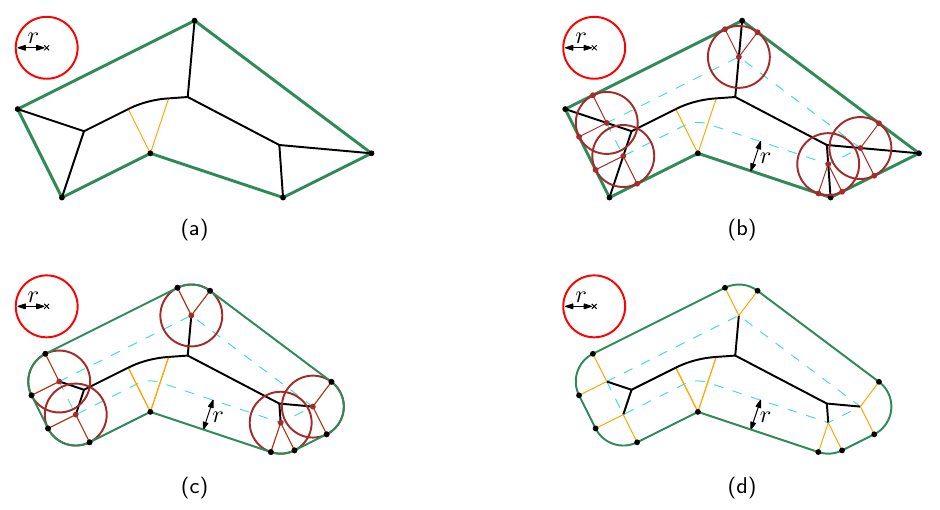

**Paper Figure 2, printed page 735:** (a) original geometry and medial axis;
(b) cutter-offset construction; (c–d) modified geometry. This is the appropriate
distinction for the native-unreachable Figure 5 boundary witness below. It does
not excuse reachable interior gaps.

### Preserve the circle construction and overlap

Section 2.2, printed page 736 ([PDF page 6](assets/papers/held-pfeiffer-2025.pdf#page=6)),
places the machining center c halfway between the offset contact q and the
associated medial-axis point m. The segment qm is a diameter of the machining
circle. Its surrounding clearance disk stays inside the pocket; transitions
follow the inward offset in boundary order.

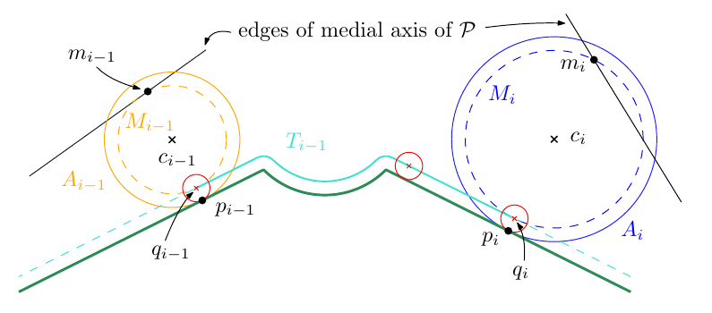

**Paper Figure 3:** the spacing pictured is deliberately too large for machining;
it illustrates the construction. Equation 4 supplies the spacing condition
`distance(c_i, c_previous) + rho_i - rho_previous <= 2r`. Given an already cleared
previous clearance disk, it keeps that disk intersecting the cutter throughout
the next circle and prevents disconnected or holed incremental removal. This
condition is not, by itself, a whole-pocket proof for arbitrary circle locations.

Section 2.4, printed page 739 ([PDF page 9](assets/papers/held-pfeiffer-2025.pdf#page=9)),
advances paired positions along the boundary and medial axis, solving for the
next engagement-limited circle. Section 3.1, printed page 740
([PDF page 10](assets/papers/held-pfeiffer-2025.pdf#page=10)), explicitly attributes
complete coverage to the overlap across the medial edge: the machining circle
passes through m, so its outer clearance disk extends to both sides of that
edge. Tracking already machined material then allows wider adaptive spacing.
It does not propose retaining all circles from a dense source or globally
reducing spacing in response to a local gap. Cleared-prefix and entry assumptions
must be established separately; a full-circle sweep alone is generally an annulus.

### Where the current draft diverges

| Paper invariant | Current figure-draft behavior |
| --- | --- |
| Machinable target established first | The full-design gate currently targets the original projected polygon, mixing unreachable boundary remnants with reachable gaps. |
| True medial-axis point m paired with boundary contact | `build_held_reference_raw_guide` calls `_guide_chains`, whose source is explicitly the straight skeleton. |
| Circle retains qm as diameter | `_circle` translates its center during contact projection; `_circle_with_side_normal` then changes its direction/radius without recomputing the associated medial point. |
| Ordered traversal preserves the necessary boundary/medial intervals | Compact selection checks successor engagement and last source-run representatives; this is not a proof of complete paired traversal or cross-medial overlap. |

These are verified code divergences, not a claim that every observed gap has
the same cause. Monstera additionally has a measured loss of source coverage
during thinning. The paper's coverage argument cannot simply be applied to the
current drafts. **Next: audit and restore true medial incidence, the qm diameter
relation, and ordered traversal at the gap before designing a generic local
repair layer.** Keep compact spacing and independently validate reachable
cutter-swept coverage on every machining workload.

The existing native `SegmentSiteMedialAxis.build` is not yet a generic substitute:
its current construction delegates to `canonical_l_shape_mat_graph`, which
requires one specific six-vertex L-shaped fixture. The adaptive traversal is a
policy-ordered graph walk, not Held's oriented boundary/site-side traversal.
Generic native construction and paired traversal are therefore required work;
the presence of a MAT API name does not establish support for Figures 5 and 8.
The attempted Figure 5 guide-comparison run was stopped after this source-level
restriction was identified; no native figure MAT or comparison plot was produced.

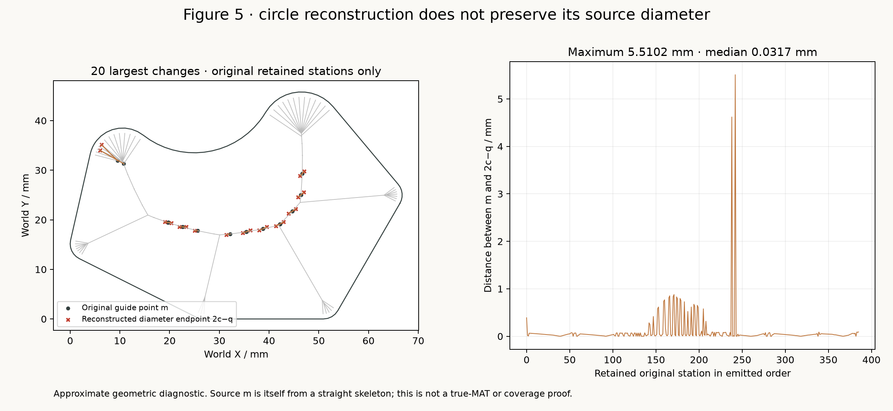

**Measured reconstruction drift:** the 386 retained original Figure 5 stations
have a maximum distance of 5.5102 mm between their original guide point m and
the reconstructed diameter endpoint `2c-q`; median 0.0317 mm. Inserted refinement
circles are excluded. The left panel shows the twenty largest changes, and the
right panel retains their emitted ordering. These are approximate reports;
the source itself is a straight skeleton, so this is evidence of changed source
incidence, not a true-MAT comparison or coverage proof.
[Measured values](assets/images/held_figure5_source_incidence_drift.json).

The first implemented native correction follows a boundary point's
inward normal to its first equidistant competing boundary feature, then constructs
the q–m diameter circle directly. This queries the actual medial contact without
building a new graph framework. Native exact geometry owns event selection and
construction. Boundary-feature transitions, machinable-target handling, and
complete adaptive traversal remain required subsequent integration work.

### Native boundary-to-medial circle construction

`_circle_geometry_2.BoundaryNormalCircle2` owns one validated simple polygon.
`query(segment_index, parameter, tool_radius)` handles strict segment interiors;
`query_vertex(vertex_index, inward_direction, tool_radius)` separately handles
reflex point-site sectors, including their endpoints. Both polygon windings are
accepted, and indices retain input order. Convex vertex directions and segment
endpoint parameters fail explicitly; holes are outside this owner's current
input contract.

The common native constructor tests exact point and open-segment competitors
along the normal, validates the supporting-line foot lies within its segment,
and selects the first positive competing contact. A global exact nearest-feature
scan then checks that the medial disk crosses no boundary. It constructs q and
the midpoint c directly and checks the diameter and clearance relationships
before returning the native proposal. The outer cutter disk is contained in the
medial disk because `distance(m,c) + rho + r = clearance(m)`.

All deciding geometry uses CGAL's exact-constructions kernel with square roots.
The proposal retains native exact geometry; its `*_mm` properties are approximate
reports, not permission to reconstruct a certified downstream path from doubles.
Python consumes the native geometry and its reporting views.

**Verification:** 27 new tests plus seven existing circle-geometry tests pass.
Cases cover rectangular and oblique competitors, concave vertex competitors,
reflex normal sectors, both sector endpoints, winding, binary scale changes,
and named input/domain failures. Ruff and strict mypy pass for the new interface
and tests. These qualify the construction seam, not full traversal or machining.

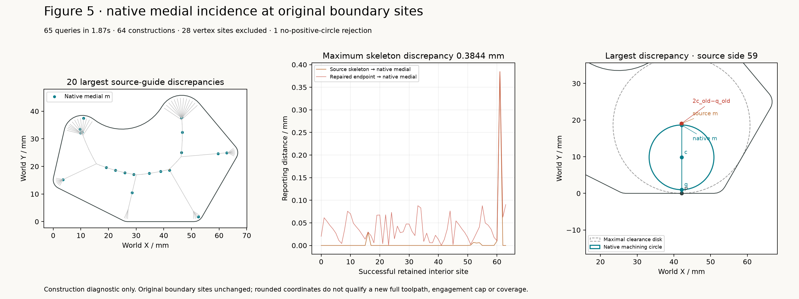

**Actual Figure 5 probe:** 65 selected segment-interior queries take 1.87 seconds;
64 construct positive-radius circles and one fails explicitly because medial
clearance does not exceed the tool radius. Twenty-eight vertex sites are excluded
from this particular segment diagnostic. The maximum sampled skeleton-to-native
medial discrepancy is 0.38436 mm. The earlier 5.51 mm reconstruction-drift station
is included in the query selection but has no positive circle under the native
construction; it is not silently discarded as a successful comparison.
[Full probe report](assets/images/held_figure5_native_medial_incidence.json).

The downstream bridge `_coverage_2.boundary_circle_contact(proposal)` returns
the existing opaque `WorldXYBoundaryPointMm` directly from the native exact q.
`ReachableBoundaryCycle2.ccw_transition` consumes that contact without a double
round trip. Four new boundary-consumer tests and four existing transition tests
pass, including irrational reflex-circle contacts, clockwise arc splits,
line/arc sector joins, and rejection of foreign geometry. This connects the
circle construction to exact transition geometry; adaptive placement and
complete workload coverage are still open.

## Exact gate

`benchmarks.held_exact_motion_coverage` replays complete circle paths through
native `remaining_material`, starting from `ExactRegion2.from_polygon`.
It maintains only the final residual and reuses the existing exact sweep
primitives. `Coverage2.from_uncut` supports consumers that also require
incremental history. The seeded coverage constructor remains available to
consumers with an explicitly established precleared disk; the figure gate does
not invent one.

Each stored guide radius enters CGAL separately from its center. Full-circle
sweeps use phase vector `(radius, 0)`, avoiding a different radius reconstructed
from rounded contact coordinates. Connectors contribute every emitted straight
segment. Their endpoints must match their adjacent circle contacts. Native
CGAL constructs exact annuli and capsules and decides whether the target-minus-
sweeps residual is empty. Grid spacing never controls this decision.

The declared design polygon is the current target. Unreachable corner material
is not silently excused. A future reachable-material qualification must report
that target explicitly alongside full-design residuals. Coverage also does not
establish contour containment, entry safety, or engagement compliance.

The reporting consumer writes exact emptiness and residual component count to
JSON, with a quarter-tool-radius residual PNG for inspection. Even when the grid
shows no red points, a nonempty exact residual fails with
`IncompleteMotionCoverageError`.

For thinning, `draft_residual.is_subset_of(baseline_residual)` is an additional
exact regression check. It cannot replace absolute emptiness: both paths can
share the same uncut island.

## Workload scope

| Figure workload | Required coverage evidence |
| --- | --- |
| Figure 5 complete paths | Every emitted initial/refined/contour-bound path |
| Figure 8 upper, crossed skis, Monstera | Every emitted placement variant |
| Figure 6 computed measurements | Each generated cap/spacing workload before accepting its metric |
| Figure 7 engagement maps | Reuse coverage of the corresponding complete emitted motion |
| Construction diagrams, source overlays, stock prefixes | Explicit intermediate scope; no complete-pocket claim |

The Figure 5 progress, reference-corpus, and contour-bound CLIs now invoke the
full-motion gate automatically. The contour comparison writes both baseline and
draft reports before rejecting incomplete coverage. Its optional sampled check
remains a diagnostic only.

Figure 6's repository comparison, controlled-cap measurements, and
constant-spacing trials also require exact coverage before accepting metrics.
`benchmarks.toolpath_coverage` classifies actual operations, includes actual
plunge disks, and excludes clearance travel and retracts. It handles planar
segments and full circles. Partial arcs and nonplanar cutting motions raise
`UnsupportedCoverageMotionError`; they are not discretized into a passing proof.

Run the dedicated expensive standard/contour-bound/coverage-preserving matrix:

```bash
pixi run held-coverage-corpus
```

It contains four pockets by three algorithms plus a three-scale thinning
regression, keeps the variants for a case on one worker, and bounds execution
to two workers. Reports live under
`build/held-coverage-corpus/`. There are no skipped or expected-failure rows.
This initial execution matrix does not yet exhaust the other emitted variants
or Figure 6. Their consumer gates are connected, but their complete workload
runs remain explicit acceptance work, not passing omissions.

## Rejected dense-source preservation experiment

**September 7 visual feedback:** Figure 8 upper grew from 738 to 3,065 circles
and from 13,874.3 to 36,238.5 mm (+161.2%). This is an unacceptable response to
localized coverage deficits. The invariant below preserves every dense-source
sweep rather than repairing only uncovered reachable material. It is retained
as an experimental comparison, not the selected algorithm. Remaining dense
Monstera and crossed-skis runs were stopped.

The next iteration starts from each compact baseline, localizes residuals,
separately reports native-unreachable boundary remnants, and adds only motion
needed for reachable gaps. Whole-path coverage and engagement must still be
validated. No coordinate-specific repair or arbitrary gap tolerance is accepted.

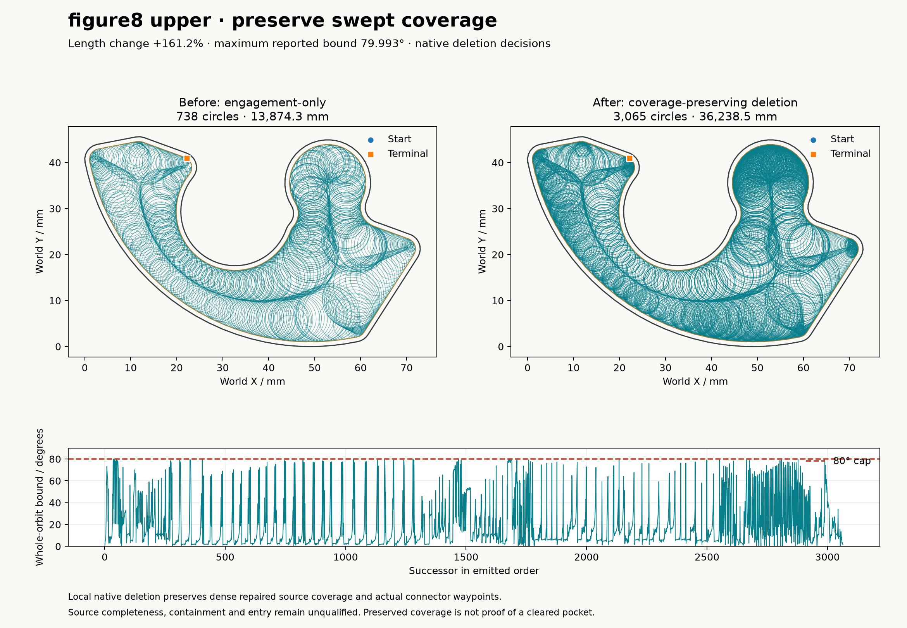

**Why rejected:** the localized coverage problem does not justify the global
density increase visible on the right. The reported engagement bound stays below
80 degrees, but that does not justify a 161.2% path-length increase. Conservative
stock remains nonempty even though the 0.25 mm display grid finds no residual
points. [Measured comparison](assets/images/held_figure8_upper_coverage_preserving.json).

`build_coverage_preserving_path` repairs and engagement-refines every source
circle before thinning. `thin_covered_contour_path` then deletes circles without
moving retained circles or reconstructing their connector route. Each deletion
keeps the original connector waypoints, including detours and complete wraps.

Native `Stock2.can_remove_circle` intersects conservative remaining material with
the candidate's exact annulus, then subtracts its retained neighbors' annuli and
the preserved connector chain's under-cover capsule quads. Only an empty local
residual authorizes deletion. The conservative direction can retain unnecessary
circles; it cannot authorize loss of required material. Permanently emitted
motion updates remaining stock. This establishes preservation relative to the
dense repaired source, not absolute source completeness.

Distinct source parameters can resolve to identical stored contact coordinates.
The connector producer retains two equal endpoints for this stationary motion;
strict replay validation remains unchanged. A regression reproduces the previous
singleton-connector rejection, and all 15 focused connector/thinning tests pass.

Reproduce the rejected experimental variant, publishing its plot before replay:

```bash
pixi run held-contour-bound-toolpaths --case figure8_monstera --qualify-contacts --corner-approaches --coverage-preserving
```

The new algorithm passes the required-circle regression at three scales and
preserves a deliberately detouring connector chain exactly. The older
engagement-only algorithm remains independently testable and its failure below
has not been hidden.

Figure 5 currently retains 1,558 of 1,619 dense circles. Its path is 23,822.7 mm
versus the old 13,086.7 mm (+82%); maximum reported bound is 79.992 degrees.
Generation took 68.74 seconds. This preserves dense-source coverage but incurs
an unacceptable length cost; it is not an accepted toolpath improvement.

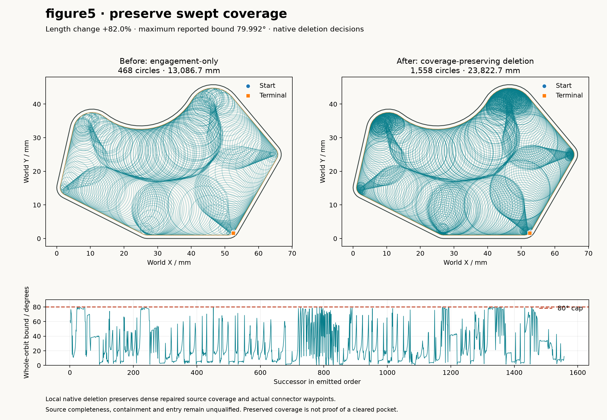

**Experimental comparison:** compact path left; dense-source preservation
right. The +82% length cost is retained as negative evidence, not a selected
repair. [Measured comparison](assets/images/held_figure5_coverage_preserving.json).

Conservative replay leaves one quarter-radius grid sample at
`(47.25024912893663, 45.75)` mm. Native `ReachableMaterialPredicate2` confirms it
is inside the design but unreachable by any contained radius-1 mm cutter. The
nearest emitted connector is approximately 2.04 micrometres beyond tool reach.
This classifies that witness only; whole-pocket reachable coverage remains open.
The full-design coverage requirement has not been silently relaxed.

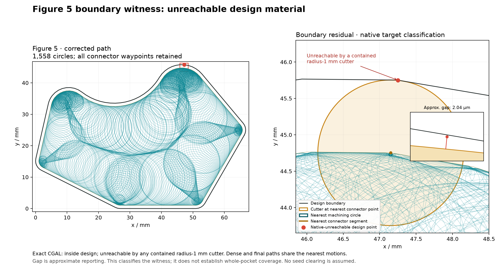

**Boundary diagnosis:** the full path locates the witness; the close-up shows
the actual nearest cutter position and magnifies the approximately 2 µm gap.
The native-unreachable classification explains this witness without claiming
that every remaining component has been classified.

Path and residual plots must be rendered and shown at generation milestones,
including partial and failed outcomes, before prolonged validation runs. The
visual feedback loop is part of Task 8 execution.

## Evidence and remaining work

Native tests cover truly uncut initialization, central islands, complete removal,
exact oblique connector coverage, polygon holes, invalid state/input, and actual
plunge disks. Motion tests include an island smaller than the inspection grid
at three scales, connector contribution, complete removal, and an identical
incomplete baseline. These validate the checker; they do not establish corpus
coverage or repair the generator.

**The shared thinning regression is currently red at all three scales.**
Three source circles have centers `(2, 1)`, `(2.2, 1)`, `(2.4, 1)` mm,
guide radius 1 mm, and tool radius 1 mm. Engagement-only selection discards
the middle circle. Native stock predicates show that `(2.2, 2.995)` mm is
cleared by the dense source but remains after thinning; bottom-boundary
connectors cannot reach that height. The same counterexample fails at scales
0.125, 1, and 8. No reference geometry or coordinate-specific repair was added.

Seven Figure 6 adapter/integration tests pass. One existing test assumes the
repository measurement can bypass coverage using opaque mock objects; that test
now fails against the mandatory contract and remains unchanged. This is not a
green full suite.

The September 6 Monstera diagnostic replay found the same two residual grid
points in standard and contour-bound paths, out of 92,963 interior samples at
0.25 mm pitch. One point is interior, near `(34, 71.5004)` mm; the other is near
`(60.75, 6.5004)` mm. This replay used exact annuli and conservative connector
capsules. It establishes sampled residual candidates and no sampled thinning
loss, not full coverage. An independent approximate distance probe places the
interior witness 1.0282 mm from the nearest motion for a 1 mm tool radius.

The dense qualified Monstera source covers that interior witness with two
circles. After the shared side-normal reconstruction, four source circles
cover it. Both selectors omit the strongest remaining source circle (run 0,
station 46). These are approximate diagnostic distances with a wide margin:
0.33094 mm to that repaired source orbit versus 1.02824 mm to either emitted
path. Reconstruction also changes individual circle footprints, so the general
repair must establish dense repaired-source coverage before preserving it
through thinning and changed connectors.

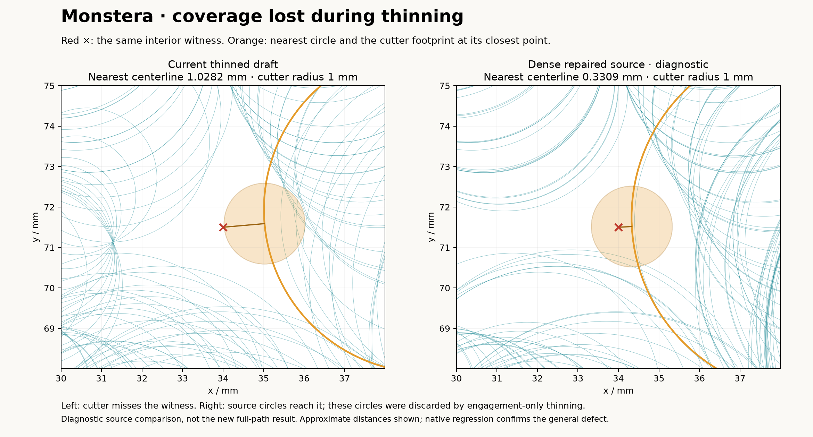

**Local cause:** the compact path misses the red point; a discarded source
circle reaches it. The cutter disk makes the distinction between a tool-center
line and swept coverage visible. This motivates a local repair, not global
densification.

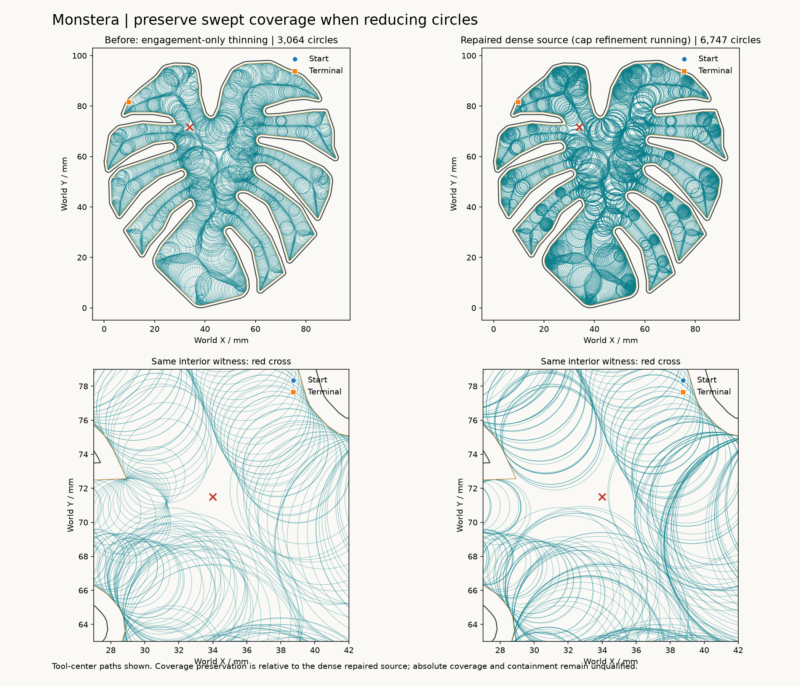

**Source diagnostic:** 6,747 repaired source circles, before engagement-bound
refinement. This intermediate establishes where useful candidate motion exists;
it is not an accepted machining path.

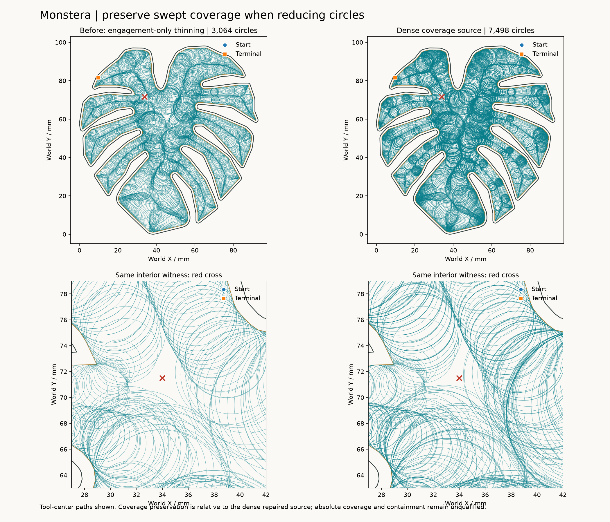

**Stopped experiment:** refinement produced 7,498 circles in 231.922 seconds.
The later global-preservation thinning run was stopped after the upper-pocket
comparison exposed the unacceptable length cost. No final Monstera path or full
coverage result was produced by that run.

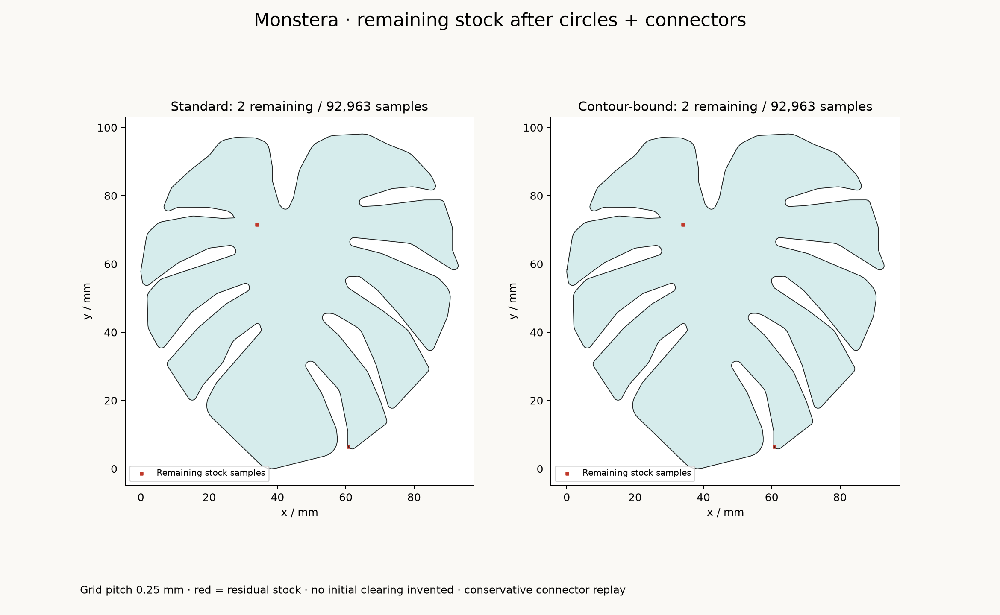

[Machine-readable diagnostic](assets/images/held_figure8_monstera_residual.json).

Full-corpus exact acceptance and shared generator repairs remain open. The first
468-circle exact Figure 5 replay was stopped after 9 minutes 16 seconds without
a result. The existing coverage engine maintains both accumulated sweeps and
the residual at every step. A residual-only consumer using the same native sweep
primitives was added and passes exact-equality regression cases. Its isolated
native replay was also stopped after 6 minutes 30 seconds without a result.
No runtime improvement or full-workload success is claimed. This remains an
execution-cost blocker to the broad corpus run; it does not prevent the small
native counterexample from establishing the thinning defect.
Do not interpret checker unit tests,
sampled parity, or figure inventory completeness as machining acceptance.
