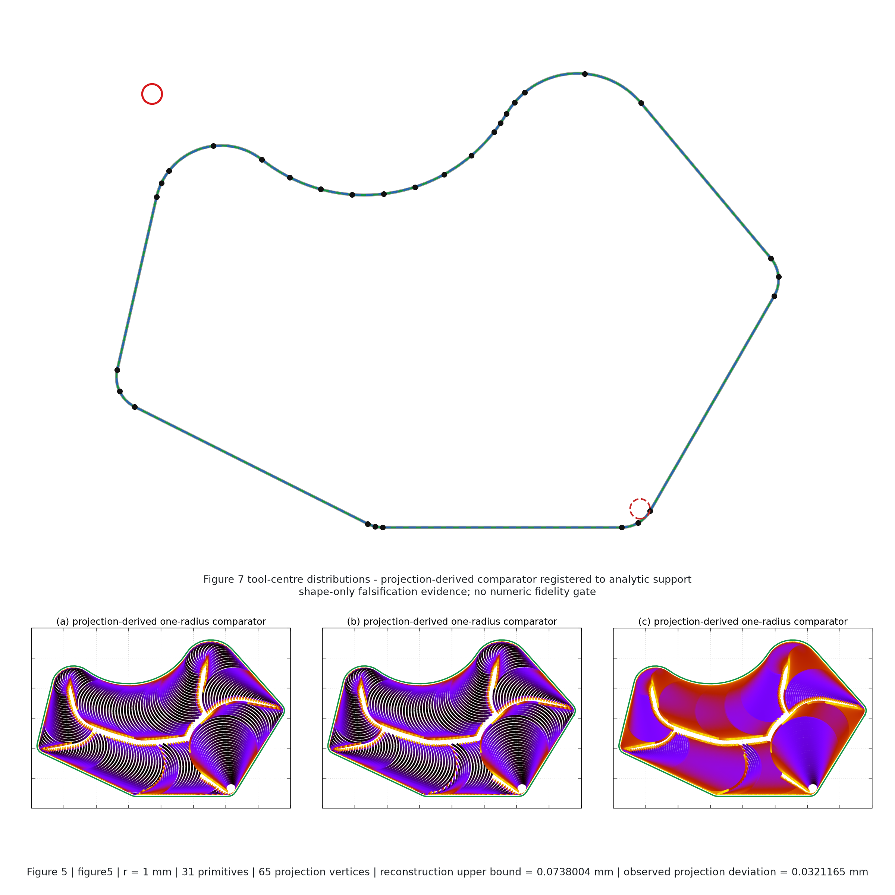
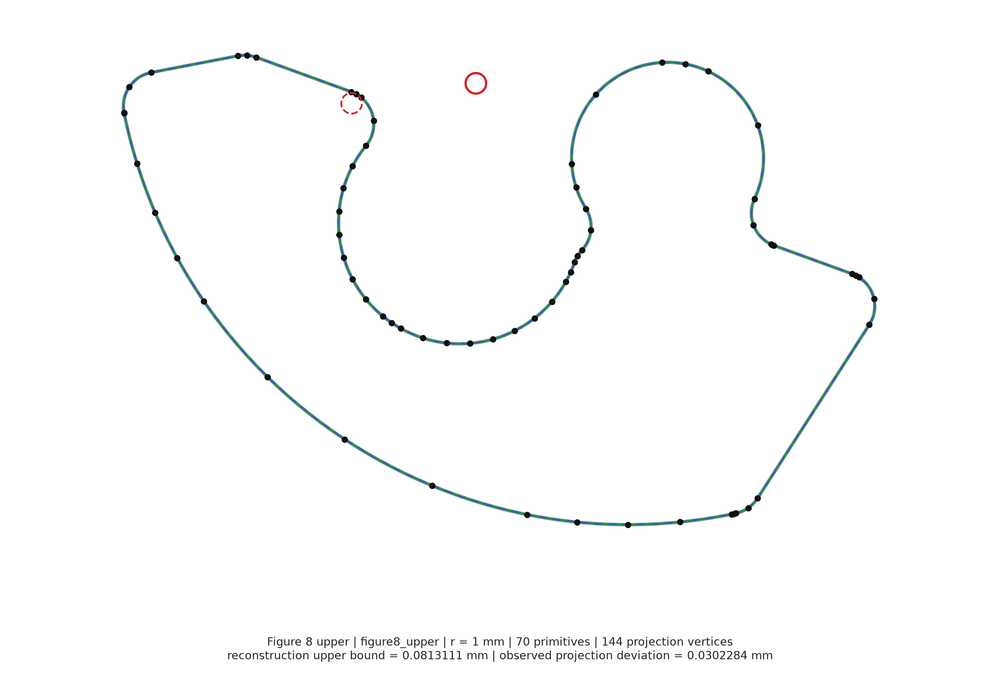
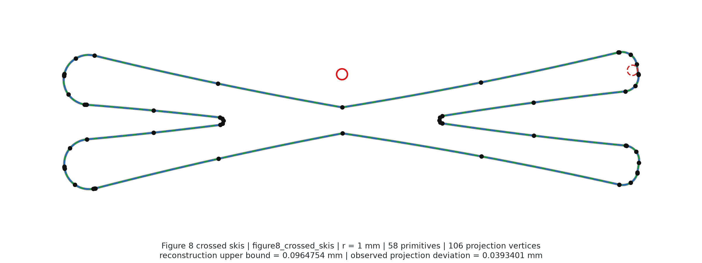
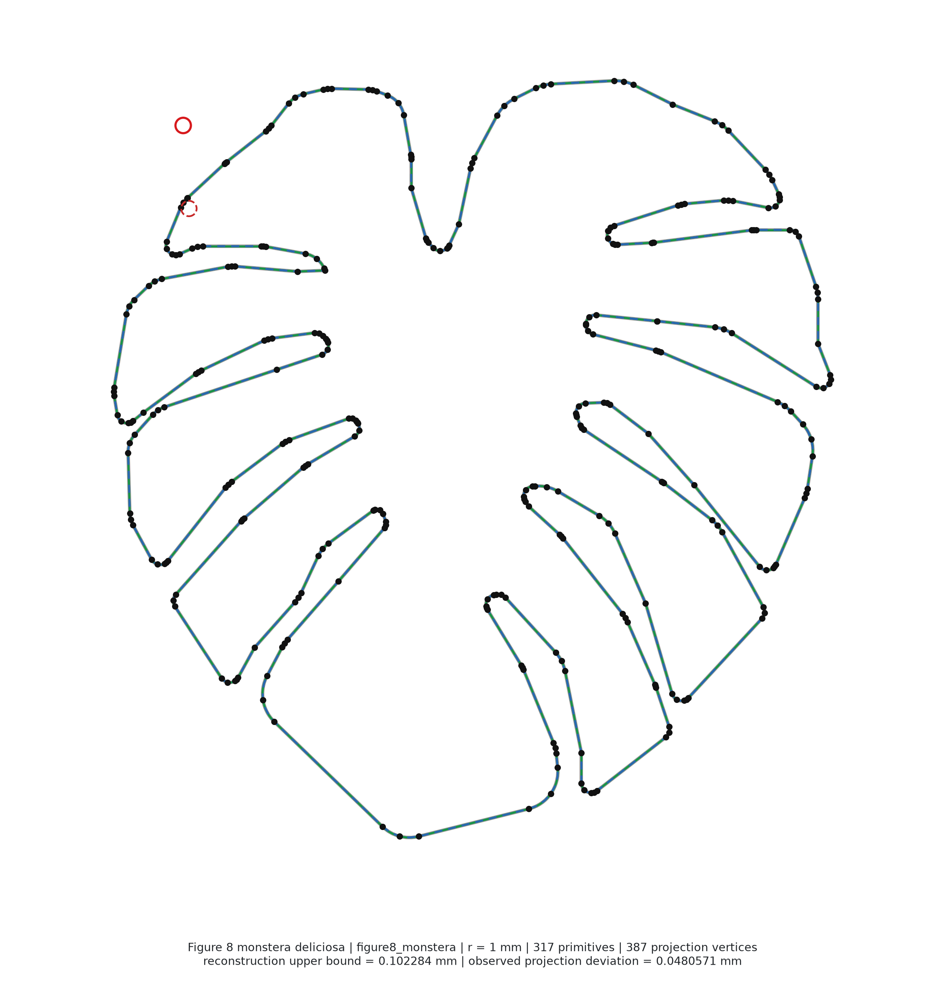

# Held–Pfeiffer reference pockets

The committed corpus reconstructs four outer pocket boundaries from Martin Held
and Josef Pfeiffer, *Trochoidal Tool Paths for Pocket Machining with Full Control
of the Tool Engagement Angle* (2025),
[doi:10.14733/cadaps.2025.731-747](https://doi.org/10.14733/cadaps.2025.731-747):
Figure 5 and the upper, crossed-skis, and Monstera pockets in Figure 8. Figure 7
is not a fifth pocket. Its three colour panels are reused as shape-only evidence
inside the Figure 5 overlay.

The [publisher paper is stored in the repository](assets/papers/held-pfeiffer-2025.pdf).
This unmodified 17-page PDF was downloaded from the
[publisher](https://www.cad-journal.net/files/vol_22/CAD_22%285%29_2025_731-747.pdf)
on September 6, 2026. Use this local copy for reproduction and source inspection.
Direct PDF page links: [Figure 5](assets/papers/held-pfeiffer-2025.pdf#page=12),
[Figure 8](assets/papers/held-pfeiffer-2025.pdf#page=16), and
[contour-aware construction, Section 3.1](assets/papers/held-pfeiffer-2025.pdf#page=10).

## What was reconstructed

Publisher vector lines remain lines. Publisher cubics are reconstructed
circle-first and then, where needed, by recursively subdividing into certified
G1 arc pairs. Every stored coordinate is treated as its exact binary64 value and
the retained primitive carries an upper bound on its deviation from the source
curve. The resulting analytic boundary is the reconstruction authority. A
separately bounded polygon projection is the input consumed by `PocketSpec` and
the existing generator.

The depicted tool circle declares only a normalized comparison scale: all four
cases use a **1 mm tool radius**. It does not recover the paper's physical part
dimensions. In Figure 7, analytic inward-support bounds register the publisher
colour panels; the green one-radius comparator is the CGAL inward offset of the
certified polygon projection, not a direct analytic line/arc offset.

## Inspectable overlays

Each overlay shows the publisher centreline, reconstructed analytic primitives,
primitive joins, polygon projection, and published marker evidence.

{ width="100%" }

{ width="100%" }

{ width="100%" }

{ width="100%" }

## Current generator qualification

`pixi run held-reference-qualify` sends exactly these four polygon projections,
serially, through the existing generator. The current run passed all four:

| case | analytic primitives | projection vertices | generated operations |
| --- | ---: | ---: | ---: |
| Figure 5 | 31 | 65 | 2,289 |
| Figure 8 upper | 70 | 144 | 4,517 |
| Figure 8 crossed skis | 58 | 106 | 2,500 |
| Figure 8 Monstera | 317 | 387 | 9,612 |

The generated [qualification report](benchmarks/held_reference_qualification.md)
records per-case generation time and preserves only the command's closed set of
named product failures. Any unexpected exception aborts the run.

Figure 6 now obtains its pocket through the reconstructed Figure 5 input seam
and rebuilds only the requested engagement cap. Existing generator parameters,
measurement, curve selection, and report semantics are unchanged.

## Claim boundary

These records are reconstructed publication references, not the authors'
original CAD. They establish neither physical scale nor G-code output. A
non-empty generated path is not evidence of cycle-time superiority, complete
engagement certification, or parity with Held and Pfeiffer's implementation.
