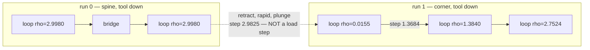

# When a Machining Metric Measures Nothing

Three criteria in the machining-quality gate were compared against physical
anchors. **One was measuring a quantity the cutter never experiences, one was
correct and proves two other criteria contradictory, and one produced a
confident, wrong "correction" that would have doubled every load number on the
page.** The rule that survives all three: **a comparison is a machining metric
only if you can name the physical event it corresponds to — and only if you have
measured which quantity your inputs actually carry.** The second half of that
sentence is not decoration. It is where the near-miss below came from.

| claim | anchor used | outcome |
| --- | --- | --- |
| loop-radius step over the flat radius list | does the cutter pass through this step under load? | **defect** — the step happens in the air |
| entry loop peaks at full immersion | closed form for the engaged arc | **correct**, and it makes two criteria contradictory |
| `a_e = r(1 - cos(theta/2))` is off by 3x | textbook milling relation | **the anchor was right, the variable was wrong** |

!!! success "Confirmed"

    All three findings are reproduced by tests in
    `tests/benchmarks/test_quality.py`, including a test that measures the
    kernel's angle convention directly so the third cannot recur.

## Case 1 — the near-miss: right physics, wrong variable

`CutQuality.mean_radial_depth` computes the radial width of cut as
`a_e = r (1 - cos(theta / 2))`. Against the standard mechanistic relation
`a_e = r (1 - cos theta)` that halved angle looks indefensible, and anchoring it
at the two angles every machining text agrees on appears to convict it outright:
half immersion should be `a_e = r` at 90 degrees, a slot should be `a_e = D` at
180 degrees, and the halved form delivers `0.293 r` and `r`.

**Every step of that reasoning is correct except the first.** `theta` here is not
the textbook milling angle. It is the ENGAGED ARC OF THE CUTTER RIM, which is
what the exact kernel's `max_run_tea` returns, and the two differ by a factor of
two.

### The measurement that settles it

Feeding `_stock_2.engagement_at` a half-plane at known radial depths, tool
radius 1, and reading the rim arc back:

| radial depth `a_e` | rim arc the kernel reports | textbook angle |
| ---: | ---: | ---: |
| 0.0 | 0 deg | 0 deg |
| 0.5 | 120 deg | 60 deg |
| 1.0 (`= r`, half immersion) | **180 deg** | 90 deg |
| 1.5 | 240 deg | 120 deg |
| 2.0 (`= D`, surrounded) | **360 deg** | 180 deg |

`r (1 - cos(theta_rim / 2))` reproduces every row exactly. The original formula
was right the whole time; equating it with the textbook relation gives
`theta_tb = theta_rim / 2`, which is the conversion `textbook_engagement_deg`
now performs explicitly at the one place the two meet.

### Why the wrong reading is so persuasive

A rim arc reaches a full turn when the cutter is surrounded — which is why a
plunge measures 360 degrees here, a fact visible in the engagement histogram's
seventh band and in `max_engagement_deg` reading `360.00`. It is entirely
possible to hold that fact and *simultaneously* reason that a slot must be 180
degrees, because in a slot the cutter does leave an open channel behind it. Both
sentences appear sound; they are inconsistent, and the inconsistency hides in
plain sight until someone runs the kernel.

Applying the "correction" would have set `radial_immersion(360) = 0`, reporting
a **plunge as zero immersion**, and doubled every load figure below that.

!!! warning "This is pinned deliberately"

    `test_the_kernel_anchors_the_rim_arc_to_radial_depth_relation` asserts the
    table above against the live kernel. Its purpose is not coverage — it exists
    so the halved angle cannot be "corrected" back on algebra alone, because it
    already was once.

### What the correct treatment adds

Nothing about the formula changed; what changed is that the conversion is now
named rather than implied. `textbook_engagement_deg` converts once,
`radial_immersion` and `chip_thickness_ratio_from_rim` are stated in rim arc
because that is what every metric on the page measures, and
`chip_thickness_ratio` keeps the textbook angle it was always written in. A
caller can no longer feed one to the other by accident.

The remaining honesty is in the derivation's own limit, recorded in the
docstring: the equality is exact for a straight wall and approximate for the
curved, partly-cleared material a trochoid actually meets. That is the standard
one-sided assumption of every mechanistic chip model — an assumption, not a
measurement.

## Case 2 — a load step the cutter performs in the air

`CutQuality.max_loop_radius_step` is meant to catch a guide radius that jumps
between one machining circle and the next. Its sibling `_max_engagement_step`
draws the distinction correctly and documents it:

> Consecutive means ADJACENT IN THE TOOLPATH. A plunge, a retract, or a link
> between two cut motions shows up as a gap in the operation indices, and it is
> also the tool leaving the material — so the load picked up afterwards is an
> entry, not a step.

The radius version did not. `_loop_radii` filtered the motions down to closed
loops and **discarded the operation index**, after which consecutive entries of
that flat list were compared pairwise. Two loops separated by a retract to
clearance height, a rapid traverse and a plunge into a different chain were
therefore treated as back to back.

On every pocket in the corpus, the reported worst step was exactly that: the
spine's last loop against a corner chain's first, with the cutter at clearance
height for the entire change.

| pocket | reported | scoped to a run | criterion `<= 2.0` |
| --- | ---: | ---: | --- |
| `rect_12x8` | 2.982 | **1.368** | passes |
| `rect_20x12` | 4.976 | **1.376** | passes |
| `L_shape` | 1.976 | **1.376** | passes |

The criterion had never been failed by a real defect.

### Why adjacency is the wrong repair

Reusing `_max_engagement_step`'s `index + 1` test does not work here. Loops
within one chain are separated by the bridge motions between them, so two loops
are *never* index-adjacent and the metric would report zero on every path. The
correct notion is the **run**, and it ends at either of two boundaries.

**A rapid**, because the cutter is at clearance height for the change. **A change
of `path_index`**, which is the generator's own chain identity — its operations
are emitted grouped by it, one group per skeleton chain. Two loops on different
chains lie on different *guides*, and "the guide radius should vary smoothly" is
a statement about one guide; the radius did not jump along a guide, the generator
moved elsewhere on the skeleton.

### Neither boundary implies the other

The rapid rule alone was itself incomplete, and a later generator exposed it. A
chain-ordering generator sequences its chains so the tool never lifts — that is
the entire point, and it takes `material_entries` from 5 to 1 — so it links
chains at cutting depth and there is no rapid anywhere to mark a boundary. The
whole path collapsed into ONE run:

| pocket | rapid boundary only | rapid **or** chain | chains |
| --- | ---: | ---: | ---: |
| `rect_12x8` | 1 run, 1.965 | 5 runs, **0.772** | 5 |
| `rect_20x12` | 1 run, **3.988** | 5 runs, **1.024** | 5 |
| `L_shape` | 2 runs, 0.988 | 8 runs, **0.600** | 8 |

`rect_20x12` failed the criterion at 3.988 for a corner chain's tip loop against
the *next* chain's spine-end loop, separated by a long low-load transit — a real
cut, and not the abrupt load change the criterion is aimed at. Conversely a
retract can occur inside a single chain, so the chain rule alone is not
sufficient either. Both are tested, and the existing generators are unaffected
because for them the two boundaries coincide.



### What the runs actually contain

`engagement_controlled` on `rect_12x8` emits five runs:

| run | loops | guide radii | worst step within the run |
| --- | ---: | --- | ---: |
| spine | 11 | `2.9980` throughout | **0.0000** |
| corner, x4 | 4 | `0.0155, 1.3840, 2.7524, 2.9980` | **1.3684** |

The spine is *perfectly* constant across eleven loops — the guide was never
lumpy. The whole of the reported 2.982 was the cross-chain pair
`2.9980 -> 0.0155`, occurring four times with identical values, which is the
signature of an artefact rather than a defect. What remains after the repair,
1.3684, is the step off each corner's degenerate tip loop, and that tip is a
real defect counted separately by `degenerate_loops`.

## Case 3 — the metric was right, and the path cannot satisfy the gate

The same anchoring question applied to `max_engagement_step` gives the opposite
answer. On `rect_12x8` it reports 329.49 degrees, from a chain's entry loop at
full immersion to the motion immediately after it. The two are genuinely
index-adjacent and the tool genuinely stays down, so the cutter really does
absorb that load shock. The number is real.

What the anchor exposes instead is that the criterion cannot be met alongside
`degenerate_loops == 0`.

### The closed form

A chain plunges at a point `P` that lies **on** the guide circle, not at its
centre. The tool centre then orbits the guide centre at radius `rho`, and its
distance from the plunge hole at loop angle `theta` is `2 rho sin(theta / 2)`,
maximal at `2 rho` on the far side.

The plunge cleared a disk of radius `r` about `P`. The tool rim lying inside
that disk subtends `2 alpha` at the tool centre, where
`r^2 = d^2 + r^2 - 2 d r cos alpha` gives `cos alpha = d / (2r)`. At the far
point `d = 2 rho`, so `alpha = arccos(rho / r)` and

```
engaged arc at the far point  =  360 deg - 2 arccos(rho / r)      for rho <= r
                              =  360 deg                          for rho >= r
```

| `rho / r` | closed form | measured |
| --- | ---: | ---: |
| 0.500 | 240.00 deg | 240.00 deg |
| 0.900 | 308.32 deg | 308.32 deg |
| 0.990 | 343.78 deg | 343.78 deg |
| 1.000 | 360.00 deg | 360.00 deg |
| 1.100 | 360.00 deg | 360.00 deg |
| 2.998 | 360.00 deg | 360.00 deg |

Agreement to the hundredth of a degree at every sample.

### The contradiction

The crossover sits exactly at the degeneracy boundary. A loop escapes full
immersion only while its far point stays inside the plunge hole — `2 rho < 2r`,
which is `rho < r`, which is `DEGENERATE_LOOP_RATIO`. Therefore:

> **Every non-degenerate entry loop is a full-immersion bore at its far point.**

A path with no degenerate loops has entry loops peaking at 360 degrees; the
motion after each one respects the cap; so `max_engagement_step >= 360 - cap`,
which is 240 degrees at the corpus cap of 120. Requiring `degenerate_loops == 0`
and `max_engagement_step <= 120` at once asks for two incompatible things.

!!! warning "The resolution is the entry, not the metric"

    Excluding the entry loop from `_max_engagement_step` would make the gate
    pass by deleting its most physically real number. The gate already names the
    real fix, in `cap_exceedances`' own docstring: the entry cut is *"a full slot
    for any generator entering solid stock **without a helical or pre-drilled
    entry**"*. A straight plunge is the defect. Helical ramp entry is under
    construction; until it lands, this criterion is expected to fail and the
    reason is recorded here rather than suppressed.

## The rule

Every one of these came from asking the same question, and none from reading
code:

1. **Name the physical event.** `a_e` at a slot is the diameter. A load step is
   something the cutter passes through with the tool down. If no event can be
   named, the comparison is arithmetic, not a metric.
2. **Then measure which quantity actually carries it.** Naming the event is half
   the work and the easier half. Case 1 named the right event — radial depth at
   half immersion — and still reached a wrong verdict, because the angle the
   kernel reports is not the angle the textbook relation is written in. A
   physical anchor applied to the wrong variable is more dangerous than no
   anchor, because it arrives with a derivation attached.
3. **Suspect a unit or convention before suspecting the formula.** A factor of
   exactly two, or exactly a half, between what a formula does and what theory
   says is far more often a convention mismatch than an error. Both readings of
   Case 1 were internally consistent; only the kernel could adjudicate.
4. **A relative tolerance around a quantity that can approach zero reports its
   own denominator.** An earlier form of `immersion_steady_fraction` set its band
   at 10% *of the observed median*; on a path that barely cuts, the median is near
   zero, the band is near zero, and the metric returned `0.0002` — a figure that
   measured the median's smallness and nothing about the cut. Scaling the band by
   the commissioned load fixes it, and is also what makes two generators
   comparable at all.
5. **An unpinned metric is an unverified claim.** Neither the loop-radius step
   nor the angle convention had a single test. Both now do — the first pinning
   the geometry that produced the artefact, the second pinning the kernel's
   convention against the kernel itself, so a later reader cannot re-derive the
   wrong correction from theory.

!!! note "Under verification"

    The gate presently runs at one cap, `GATE_CAP_DEG = 120`, at which the
    `engagement_controlled` and `radius_regulated` generators emit byte-identical
    paths — the radius ladder never fires. Three pockets across two generators is
    the smallest product in which a defect can be attributed to one or the other,
    and that attribution is void while both cells hold the same path. A second
    cap in the range 40-100, where the two demonstrably diverge, is the pending
    repair.
