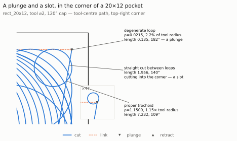
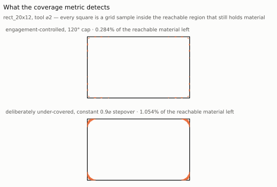
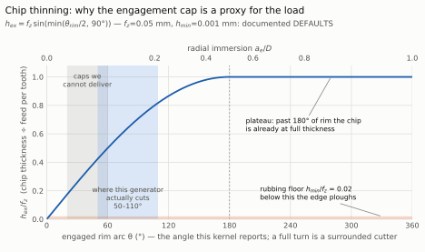
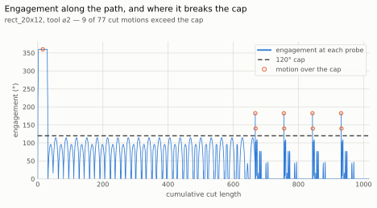
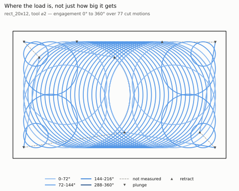
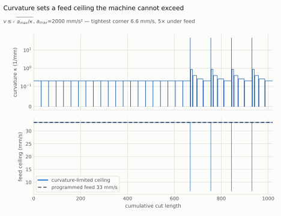
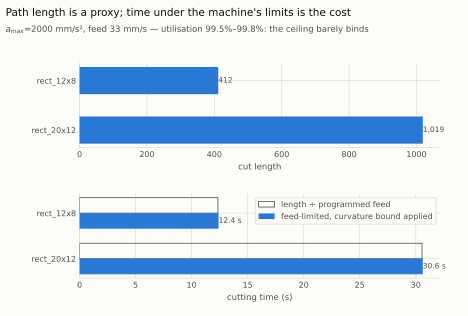
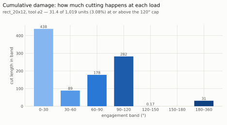
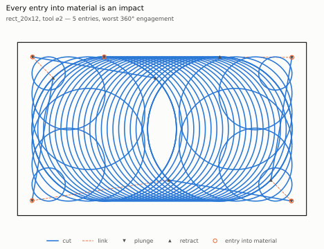

# Machining Quality

**Both of this project's headline claims rest on proxies, and neither proxy is the
quantity that matters.** The engagement cap is a proxy for tool load — the load
that breaks an edge is the maximum undeformed chip thickness `h_ex`, and below a
material-dependent floor `h_min` the edge *rubs* instead of cutting, which wears
it faster than a heavier cut does. Path length is a proxy for cycle time — feed
through a curve is bounded by `v ≤ sqrt(a_max / κ)`, so a shorter path with
sharper curvature can be *slower*. This page measures both proxies and both
quantities, separates what we computed from what we assumed, and reports that
neither generator currently produces a toolpath worth running.

The gate in `tests/benchmarks/test_quality.py` is **red on purpose**: twelve
cells, crossing three pockets and two generators at the default 120° cap and
the attribution 40° cap. The approved 40–100° sweep found 40° was the sole cap
where every pocket's generator pair diverged; from 50° through 100° the L-shape
remained saturated, including identical 453/453-operation streams at the
original 60° stop. The six-cell 120° snapshot below fails six or seven criteria
per pocket. It is a specification of the target, not a description of the code.
A quality gate that passed on the current generator would be worthless, because
the current generator emits machining "circles" a fiftieth of the tool radius,
ten operations per path that remove nothing, and motions at 360° of engagement
under a 120° cap.

## The four groups

`benchmarks/quality.py` splits the question four ways, because a validity defect
and a tool-life cost should never be averaged together.

**Geometry-derived** (marked ▣) is computable from the toolpath plus the exact
stock: ours, reproducible from this repository. **Model-derived** (marked ◈)
depends on a workpiece material or a machine's dynamics and is only as good as
its calibration. A model-derived metric takes its model as an argument and raises
a named error when it is absent — `MissingMaterialModelError`,
`MissingMachineModelError` — so a guessed coefficient is never substituted.

| Group | Metric | Captures | Source |
| :--- | :--- | :--- | :--- |
| **elementary** | `uncut_fraction` | residue in the tool-**reachable** region | ▣ |
| | `gouge_free`, `gouging_motions` | cutter centre outside the legal domain | ▣ |
| | `rapid_safety`, `unsafe_rapids` | a rapid travelling in XY on the cutting plane | ▣ |
| | `continuity_breaks` | one cut not ending where the next begins | ▣ |
| | `zero_length_motions` | operations of no length | ▣ |
| | `degenerate_loops` | `ρ ≤ r`: a disk sweep, not a trochoid | ▣ |
| | `marginal_loops` | `r < ρ ≤ 1.5 r`: a hole too small to use | ▣ |
| | `redundant_operations` | motions leaving the stock exactly unchanged | ▣ |
| | `recut_fraction` | swept area meeting no fresh material | ▣ |
| **quality** | `max_engagement_deg`, `engagement_p95_deg`, `engagement_variance_deg2` | load level and steadiness | ▣ |
| | `cap_exceedances` | motions the exact cap predicate fired on | ▣ |
| | `max_chip_thickness_ratio`, `low_chip_thickness_ratio` | `h_ex / f_z` at the heavy and light ends | ▣ |
| | `max_engagement_gradient_deg_per_length` | load **shock** within a motion | ▣ |
| | `max_engagement_step_deg` | load shock across a junction | ▣ |
| | `slotting_motions` | straight transfers that are really cutting | ▣ |
| | `immersion_steady_fraction`, `immersion_at_design_fraction`, `immersion_excursions` | whether the cut holds its commissioned bite | ▣ |
| | `mean_radial_depth`, `radial_depth_variance` | removal rate per unit travel | ▣ |
| | `wall_scallop_height` | deepest residue against a wall | ▣ |
| | `loop_radius_cv`, `max_loop_radius_step` | smoothness of the machining-circle centre locus | ▣ |
| | `max_chip_thickness_mm`, `low_chip_thickness_mm` | the same chip, as a length | ◈ material |
| | `rubbing_length`, `rubbing_fraction` | cut spent under `h_min`, ploughing | ◈ material |
| **speed** | `cutting_length`, `air_length`, `air_fraction` | where the path spends itself | ▣ |
| | `max_curvature` | where the feed ceiling is tightest | ▣ |
| | `tangent_breaks`, `curvature_breaks` | G1 and G2 discontinuities | ▣ |
| | `direction_reversals` | the tool turning back on itself | ▣ |
| | `retract_count`, `reentry_count` | clearance moves and plunges | ▣ |
| | `cutting_seconds`, `air_seconds`, `total_seconds` | feed-limited cycle time | ◈ machine |
| | `mean_cutting_feed_mm_per_s`, `feed_utilisation` | feed actually achieved against programmed | ◈ machine |
| **longevity** | `material_entries` | impacts — the leading cause of edge chipping | ▣ |
| | `engagement_length_histogram` | cumulative damage, not just the peak | ▣ |
| | `cut_air_alternations`, `alternations_per_length` | thermal cycling | ▣ |
| | `cutting_speed_m_per_min`, `taylor_life_minutes`, `life_fraction_consumed` | Taylor life `V·Tⁿ = C` | ◈ both |

!!! warning "Two angles, differing by a factor of two"

    The exact kernel reports the **engaged arc of the cutter rim**, which reaches
    a full turn when the tool is surrounded — which is why a plunge measures
    360° here. The textbook milling angle is measured entry-to-exit and tops out
    at 180° for a slot. They are related by `θ_textbook = θ_rim / 2`, derived
    from `a_e = r(1 − cos(θ_rim/2))` and **measured against the kernel**: on a
    half-plane at tool radius 1, radial depths of 0, 0.5, 1.0, 1.5 and 2.0 give
    rim arcs of 0, 120, 180, 240 and 360°, which that relation reproduces
    exactly. `test_the_kernel_anchors_the_rim_arc_to_radial_depth_relation` pins
    the table so the conversion cannot be "corrected" back on algebra alone —
    using the textbook form directly reports a **plunge as zero immersion**.

## Measured

This table is the 120° snapshot; it does not report the 40° attribution cells.
Tool ⌀2.0, cap 120°, 45 probes per motion, 200-sample coverage grid. The two
generators return **identical motion streams** on every pocket, so their columns
are identical in pairs — see the note below. Every number here is reproduced by
the gate test, which prints the whole four-group measurement when it fails:
`pixi run pytest tests/benchmarks/test_quality.py -k worth_running`.

| group | metric | required | rect_12x8<br>eng-ctrl | rect_12x8<br>radius-reg | rect_20x12<br>eng-ctrl | rect_20x12<br>radius-reg | L_shape<br>eng-ctrl | L_shape<br>radius-reg |
| :--- | :--- | :--- | ---: | ---: | ---: | ---: | ---: | ---: |
| elementary | `uncut_fraction` | 0 | 0.008041 | 0.008041 | 0.002843 | 0.002843 | 0.006930 | 0.006930 |
| elementary | `gouge_free` | true | True | True | True | True | True | True |
| elementary | `rapid_safety` | true | True | True | True | True | True | True |
| elementary | `continuity_breaks` | 0 | 0 | 0 | 0 | 0 | 0 | 0 |
| elementary | `zero_length_motions` | 0 | 0 | 0 | 0 | 0 | 0 | 0 |
| elementary | `degenerate_loops` | 0 | 4 | 4 | 4 | 4 | 5 | 5 |
| elementary | `marginal_loops` | reported | 4 | 4 | 4 | 4 | 5 | 5 |
| elementary | `redundant_operations` | 0 | 10 | 10 | 10 | 10 | 10 | 10 |
| elementary | `recut_fraction` | reported | 0.8974 | 0.8974 | 0.8905 | 0.8905 | 0.9274 | 0.9274 |
| cut | `max_engagement_deg` | reported | 360.0 | 360.0 | 360.0 | 360.0 | 360.0 | 360.0 |
| cut | `cap_exceedances` | 0 | 5 | 5 | 9 | 9 | 6 | 6 |
| cut | `engagement_p95_deg` | reported | 119.2 | 119.2 | 114.2 | 114.2 | 115.6 | 115.6 |
| cut | `engagement_variance_deg2` | reported | 5822 | 5822 | 4660 | 4660 | 3785 | 3785 |
| cut | `max_chip_thickness_ratio` | reported | 1.000 | 1.000 | 1.000 | 1.000 | 1.000 | 1.000 |
| cut | `low_chip_thickness_ratio` | reported | 0.067 | 0.067 | 0.142 | 0.142 | 0.033 | 0.033 |
| cut | `max_engagement_gradient_deg_per_length` | reported | 82994 | 82994 | 59936 | 59936 | 57894 | 57894 |
| cut | `max_engagement_step_deg` | <= cap | 329.5 | 329.5 | 337.5 | 337.5 | 325.4 | 325.4 |
| cut | `slotting_motions` | 0 | 0 | 0 | 4 | 4 | 0 | 0 |
| cut | `immersion_steady_fraction` | reported | 0.5576 | 0.5576 | 0.0828 | 0.0828 | 0.6285 | 0.6285 |
| cut | `immersion_at_design_fraction` | reported | 0.0713 | 0.0713 | 0.0411 | 0.0411 | 0.0677 | 0.0677 |
| cut | `immersion_excursions` | reported | 37 | 37 | 99 | 99 | 51 | 51 |
| cut | `mean_radial_depth` | reported | 0.1953 | 0.1953 | 0.2096 | 0.2096 | 0.1461 | 0.1461 |
| cut | `radial_depth_variance` | reported | 0.1648 | 0.1648 | 0.1221 | 0.1221 | 0.0931 | 0.0931 |
| cut | `wall_scallop_height` | reported | 0.2105 | 0.2105 | 0.2500 | 0.2500 | 0.2700 | 0.2700 |
| cut | `loop_radius_cv` | reported | 0.4799 | 0.4799 | 0.4655 | 0.4655 | 0.3516 | 0.3516 |
| cut | `max_loop_radius_step` | <= 2.0 | 1.368 | 1.368 | 1.376 | 1.376 | 1.376 | 1.376 |
| speed | `cutting_length` | reported | 411.6 | 411.6 | 1018.7 | 1018.7 | 565.3 | 565.3 |
| speed | `air_length` | reported | 30.4 | 30.4 | 38.6 | 38.6 | 53.6 | 53.6 |
| speed | `air_fraction` | reported | 0.0658 | 0.0658 | 0.0359 | 0.0359 | 0.0823 | 0.0823 |
| speed | `max_curvature` | reported | 64.33 | 64.33 | 46.45 | 46.45 | 46.45 | 46.45 |
| speed | `tangent_breaks` | 0 | 24 | 24 | 32 | 32 | 22 | 22 |
| speed | `curvature_breaks` | reported | 20 | 20 | 40 | 40 | 60 | 60 |
| speed | `direction_reversals` | reported | 0 | 0 | 0 | 0 | 0 | 0 |
| speed | `retract_count` | reported | 5 | 5 | 5 | 5 | 8 | 8 |
| speed | `reentry_count` | reported | 5 | 5 | 5 | 5 | 8 | 8 |
| longevity | `material_entries` | reported | 5 | 5 | 5 | 5 | 8 | 8 |
| longevity | `cut_air_alternations` | reported | 21 | 21 | 21 | 21 | 23 | 23 |
| longevity | `alternations_per_length` | reported | 0.04546 | 0.04546 | 0.01949 | 0.01949 | 0.03534 | 0.03534 |

## The gate, and what fails

| | rect_12x8 | rect_20x12 | L_shape |
| :--- | :--- | :--- | :--- |
| criteria failed | 6 | **7** | 6 |
| `uncut_fraction` ≤ 0 | 0.008041 | 0.002843 | 0.006930 |
| `degenerate_loops` = 0 | 4 | 4 | 5 |
| `redundant_operations` = 0 | 10 | 10 | 10 |
| `cap_exceedances` = 0 | 5 | 9 | 6 |
| `max_engagement_step_deg` ≤ 120 | 329.5 | 337.5 | 325.4 |
| `tangent_breaks` = 0 | 24 | 32 | 22 |
| `slotting_motions` = 0 | 0 | **4** | 0 |

Reading the failures matters more than counting them.

**Three are independent, genuine path defects.** The degenerate loops are
plunges wearing a circle's name — ρ = 0.0215 against a tool radius of 1.0, at
182° of engagement. The ten redundant operations are full-size loops
(ρ = 2.998, 2.370, 1.998) whose sampled engagement is exactly zero: the guide
revisits stations it has already cleared. The residue is resolution-stable —
0.904%, 0.804% and 0.865% at grids of 100, 200 and 400 on `rect_12x8` — and it
is not corner-confined: the farthest uncut sample sits 3.28 units from any
polygon vertex. For comparison, the **unregulated** constant-spacing generator
leaves 0.152% on the same pocket at the same grid, a fifth as much.

**Two are the entry strategy, arriving twice.** Every cap-exceeding motion is an
entry cut — checked by operation index, the set difference is empty on all three
pockets — and the 329° engagement step is the drop from the 360° entry cut to
the 30.5° bridge after it. Away from the entry both generators honour the cap:
the worst non-entry motion measures 119.19° on `rect_12x8` and 116.36° on
`L_shape`, against a 120° cap. A helical or pre-drilled entry would clear two of
the six criteria on its own. `cap_exceedances` also agrees exactly — 5, 9, 6 —
with `benchmarks.exceedance.count_truly_exceeding`, separately written code
sampling at 12 positions rather than 45.

**One fires on exactly one pocket, which is the point of adding it.**
`slotting_motions` is 4 on `rect_20x12` and 0 on both other pockets: the corner
defect the user first found by eye is real, is a corner phenomenon, and the
12×8 rectangle — which has corners too — does not reproduce it at this tool and
cap.

!!! note "The two-cap gate separates saturation from attribution"

    At 120°, `radius_regulated_toolpath` and `engagement_controlled_toolpath`
    emit structurally identical complete operation streams on all three pockets;
    the radius ladder never leaves its top rung. At 40°, the complete streams
    diverge on all three. The executable witness preserves defining Line/Circle
    binary64 geometry, operation metadata, tangents, order, and duplicates.
    This establishes attribution at the tighter cap; it does not make either
    generator's quality cells green.

## Elementary

<figure markdown>
  
  <figcaption>The defect a machinist sees first. Between two ordinary trochoids
  the generator emits a loop of radius 0.0215 — 2.2% of the tool radius, 0.135
  long, at 182° of engagement. That is a plunge, not a trochoid: below ρ = r the
  swept region is a filled disk with no uncut core, so the cutter never
  disengages. The straight cut leaving it runs 1.956 into the corner at 140°,
  which is a slot. Contrary to the first report of this defect, the four
  degenerate loops are <em>not</em> redundant — removing them raises residue from
  0.284% to 0.351% — so they cut, badly, rather than cutting nothing.</figcaption>
</figure>

<figure markdown>
  
  <figcaption>Residue is measured against the tool-<em>reachable</em> region, never
  the pocket: a sharp corner a round cutter can never enter is not residue, and
  counting it would put a floor under every path. The deliberately under-covered
  path beside it shows what the metric detects when a stepover is genuinely too
  coarse.</figcaption>
</figure>

## Quality

<figure markdown>
  
  <figcaption>Why the cap is a proxy. The chip is <code>h(φ) = f_z sin φ</code>,
  so <code>h_ex/f_z = sin(min(θ_rim/2, 90°))</code> — it rises as a sine and then
  <em>plateaus</em>, never falling. Two consequences. Below the plateau the same
  feed produces a thinner and thinner chip, so holding a tighter cap without
  compensating <code>f_z</code> silently reduces the load until the edge stops
  cutting and starts rubbing; this is why a <em>lower</em> bound on engagement
  matters and why nothing else in this suite expressed one. Above it, engagement
  can be tightened with no effect on the load at all. This generator operates
  entirely on the rising limb — 50–110° of rim arc — so chip thinning bites
  across its whole working range, and the caps we cannot yet deliver (20–60°)
  sit deeper into it still. The rubbing floor uses documented <em>defaults</em>,
  stated on the figure, not a measurement of any real material.</figcaption>
</figure>

<figure markdown>
  
  <figcaption>The cap is honoured almost everywhere and violated in the same
  place every time. What the peak alone hides is the gradient: engagement changes
  by up to 83,000° per unit of travel within a single motion, and load shock
  damages an edge more than a high steady load does.</figcaption>
</figure>

<figure markdown>
  
  <figcaption>The same measurement placed back on the pocket, so a peak can be
  attributed to a location rather than to an operation index.</figcaption>
</figure>

## Speed

<figure markdown>
  
  <figcaption>Curvature along the path, and the feed it permits under
  <code>v ≤ sqrt(a_max/κ)</code>. The tightest corner drops the achievable feed
  from 33 to 6.6 mm/s. Honestly, though: integrated over the whole path the
  ceiling costs only about 0.5% of the cycle time at this machine model, because
  the sharp features are short. The thesis that length is a proxy for time is
  correct in principle and small in magnitude here.</figcaption>
</figure>

<figure markdown>
  
  <figcaption>Length and time side by side under a stated machine model. Time is
  a lower bound: it holds each motion to its curvature ceiling but charges
  nothing for the acceleration ramps or for the 24 tangent breaks the same path
  carries.</figcaption>
</figure>

## Longevity

<figure markdown>
  
  <figcaption>Cumulative damage, which a peak cannot describe. Most of the cut
  length sits below 30°, which is the light end where chip thinning applies — and
  18.5 units of it sit above 180°, which is the entry cuts.</figcaption>
</figure>

<figure markdown>
  
  <figcaption>Every entry is an impact, and impacts chip edges. Five on the
  rectangles, eight on the L — one per skeleton chain, because the generator has
  no entry strategy other than plunging.</figcaption>
</figure>

## Where the thresholds come from

Cited concepts, and — separately — the places where a number is our judgement.

| Threshold | Basis |
| :--- | :--- |
| `degenerate_loops`: `ρ ≤ r` | **Physics.** The swept annulus is `[ρ−r, ρ+r]`; at `ρ ≤ r` it has no hole, the tool passes over its own loop centre, and there is no trochoidal relief. A qualitative boundary, tested exactly. |
| `max_loop_radius_step` ≤ 2 r | **Derived.** Clearance along a skeleton chain is 1-Lipschitz, so the radius change between consecutive stations cannot exceed the advance, which is capped at 1 tool diameter. A larger step did not come from advancing. |
| chip thinning, `h_min` | **Literature.** `h_ex = f_z sin φ`; `h_min` is commonly cited at 5–30% of the cutting-edge radius, and a sharp carbide edge at ~5 µm gives `h_min` ≈ 1–2 µm. |
| Taylor life | **Literature.** `V·Tⁿ = C`, carbide `n ≈ 0.2–0.4`. |
| feed ceiling | **Literature.** Curvature- and jerk-limited feed scheduling, `v ≤ sqrt(a_max/κ)`. |
| `uncut_fraction` = 0 | **Judgement**, and a mild one: a roughing pass must clear what the tool can reach. Measured on a grid, so it demands that not one reachable sample survives. |
| `marginal_loops`: `ρ ≤ 1.5 r` | **Judgement.** At 1.5 r the uncut core is half a tool radius across. Deliberately a separate field from the physics boundary. |
| `SLOT_ENGAGEMENT_FRACTION` = 0.5 | **Judgement.** No literature fixes where a link stops linking and starts cutting. At half a 120° cap a transfer takes about a quarter of the regulated radial bite. |
| `max_engagement_step_deg` ≤ cap | **Judgement.** The load may not swing by more than the entire commissioned load between two motions run back to back. |
| `tangent_breaks` = 0 | **Project goal**, not an external standard: this repository already treats tangent continuity as a design objective. |

Deliberately **not** gated: `air_fraction` (depends on the machine's rapid rate,
not on the path); `recut_fraction` (a trochoidal path scores ~0.9 by
construction, since consecutive loops are meant to overlap); `material_entries`
(one per chain is unavoidable without a helical entry, and the cap gate already
counts it); `curvature_breaks`; and `loop_radius_cv` — on a rectangle the medial
axis carries a spine of constant clearance and four branches on which clearance
falls to zero at the corners, so a coefficient of variation near 0.5 is
*intrinsic* to placing centres on the skeleton at all. The number that would make
a threshold defensible is the one a middle-curve implementation produces, and it
does not exist yet.

!!! note "Two tool-diameter channels are machined as 68 plunges"

    A loop centred on the spine of a channel of width `W` has radius at most
    `W/2 − r`, so a trochoid needs `W > 4r` — an arm strictly wider than two tool
    diameters. Asked to machine a channel of exactly two, both generators emit 68
    circles at radius 0.998 against a tool radius of 1.0: every one a disk sweep.
    The honest response to `W ≤ 4r` is to decline or to switch strategy, not to
    emit 68 plunges. Recorded as a finding; not gated, because the gate corpus
    deliberately avoids the degenerate width.

## Regenerating

Every figure on this page is produced by committed code, never a one-off script:

```bash
pixi run python -m benchmarks.cli figures
```

`benchmarks/figures.py::regenerate_every_figure` redraws the tool-path comparison
and all nine quality figures, in both themes, byte-reproducibly.
