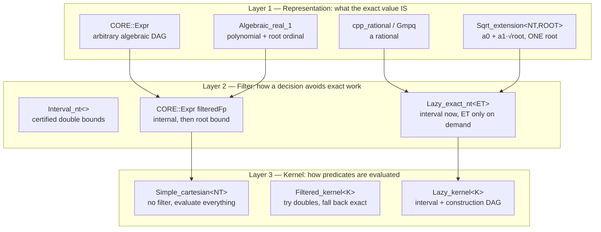
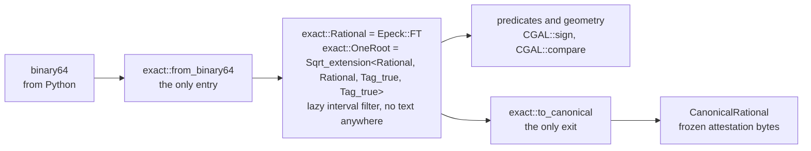

# Number Types: Choosing, Filtering, and Paying for Exactness

A CGAL kernel typedef is not a statement about *accuracy*. Every exact kernel
gives the same answers. A kernel typedef is a statement about **filter
architecture** — and the filter is where all of the performance lives.

This repository runs six number lanes. Three carry a CGAL-level interval
filter; three do not. Every measured 4–5 order-of-magnitude stall in this
codebase to date has been in an unfiltered lane — but *lack of a filter is not
by itself the mechanism*. Measured below, an unfiltered decision on a shallow
expression costs only 1.4× a filtered one; the explosions come from two
specific things the filter would otherwise have suppressed: **exact-zero
identity decisions**, and **coefficient growth through construction chains**.
The correct pattern is already in this repository — `sign_mixed_radical` in
`src/engagement_2.cpp` — so the outstanding work is propagating a proven
in-repo idiom, not acquiring CGAL literacy.

Read [Exact-Kernel Discipline](exactness.md) first: it governs *where* a
decision may be made. This page governs *what number type* makes it, and what
that choice costs.

## The six lanes

| # | Lane | Number type | Filter | Where |
|---|------|-------------|--------|-------|
| L1 | `Epick` | `double` | `Filtered_kernel` static/dynamic FP filter | `toolpath.cpp` |
| L2 | `Epeck` | `Lazy_exact_nt<cpp_rational>` | **lazy interval** (`Interval_nt_advanced`) | stock, coverage, arrangements |
| L3 | `Gps_circle_segment_traits_2<Epeck>` | `CoordNT = Sqrt_extension<FT, FT, Tag_true, Boolean_tag<Filter_>>` | **inherits L2's lazy filter** | 63 sites |
| L4 | `Epeck_with_sqrt` | `CORE::Expr` | none at kernel level; only CORE's internal `filteredFp` | 3 headers |
| L5 | `Algebraic_kernel_d_1/d_2` | `cpp_int` polynomials | bitstream-Descartes refinement, no NT-level filter | `exact_algebraic_1.cpp` |
| L6 | **bespoke** | bare `CORE::BigRat` (504 sites), `CORE::BigInt` (28) | **none** | `segment_site_*` |

!!! danger "L4 and L6 are the unfiltered lanes"

    `Exact_predicates_exact_constructions_kernel_with_sqrt` is, in CGAL 6.0.1,
    literally `Simple_cartesian<CORE::Expr>` — not a `Filtered_kernel`, not a
    `Lazy_kernel`. It has no CGAL filtering layer whatsoever. Its sibling
    `Exact_predicates_exact_constructions_kernel_with_root_of` resolves to the
    **same type**; the two typedefs differ only in name. There is no cheaper
    stock escape hatch, which is why the fast one-root path in this repository
    is hand-built over `Epeck`'s lazy `FT`.

## The cost model

These are measured on this repository, not quoted from the literature.

### What the filter is actually worth

The filter's value is **not** a constant factor. It scales with how deep the
expression is that produced the value. Measured first-party on this machine
(`tests/benchmarks/depth_bench.cpp`, clang -O3, vendored CGAL 6.0.1 and Boost,
`-DCGAL_DISABLE_GMP -DCGAL_USE_BOOST_MP`), chaining a rational construction
`x = (x·a + b)/(x + a)` to a given depth and then making **one** generic sign
decision on the result:

| chain depth | `Lazy_exact_nt<cpp_rational>` | bare `CORE::BigRat` | ratio |
|---|---|---|---|
| 1 | 0.42 µs | 0.59 µs | 1.39× |
| 2 | 0.80 µs | 2.50 µs | 3.13× |
| 4 | 1.62 µs | 8.94 µs | 5.52× |
| 8 | 3.41 µs | 27.27 µs | 8.01× |
| 12 | 4.96 µs | 57.61 µs | 11.60× |
| 16 | 6.74 µs | 96.27 µs | 14.27× |

Read the columns, not just the ratio. Across the sweep the unfiltered lane grows
**163×** while the lazy lane grows **16×**. The lazy layer is not merely skipping
exact work — it is holding coefficient growth in check, because a value that is
decided from its interval never has its exact representative built at all.

!!! warning "A shallow benchmark will tell you the filter does not matter"

    At depth 1 the difference is 1.39×, and a `Lazy_exact_nt` even carries
    visible overhead of its own (DAG node allocation). Any microbenchmark that
    converts doubles to rationals and immediately decides will conclude that
    filtering is not worth it. That conclusion is an artifact of the fixture.
    The lanes in this codebase that stall are the ones that build a fitted
    centre, project it, intersect it, and *then* decide.

### The rest of the cost model

| Operation | Cost | Ratio |
|---|---|---|
| CORE generic sign decided by `filteredFp` | ~40 ns | 1× |
| One-root `Sqrt_extension` over `Epeck::FT`, one query | 308 µs | — |
| Same query, unfiltered `cpp_rational` | 1.5 ms | ~5× |
| CORE **exact-zero identity** decision (root-bound refinement) | 1.5 ms – 2 s | **10⁵–10⁷×** |
| Figure 5 first query, before/after removing identity decisions | 337 s → 8 ms | 4×10⁴ |
| Monstera query, fitted centre kept as a DAG → materialised as a leaf | 3 s → 0.4–0.9 s | ~5× |
| …and with rational chord sampling | → ~10 ms | ~300× |
| Same topology, integer coordinates vs generic doubles | 0.000 s vs 19.6 s | ∞ |

The last row is the one that makes this hard to catch: on integer fixtures
every `sqrt` is a perfect square, CORE's approximation error is exactly zero,
and the refinement path is never entered. **A test suite built on `r = 1, 3, 5`
measures a proxy, not the thing.**

## How to read a CGAL number type

A CGAL number type is three independent layers, and mixing them up is what
produces the wrong choice.



Choosing a *representation* without choosing a *filter* is the defect this
codebase has 504 instances of. `CORE::BigRat` is a perfectly good Layer 1
type. It is not a Layer 2 type, and it was never meant to carry decisions on
its own.

### Concepts before types

Do not branch on which concrete number type you have. Ask CGAL's algebraic
foundations, which every conforming type models:

```cpp
// What algebraic structure is this? (IntegralDomain / Field / FieldWithSqrt ...)
using AST = CGAL::Algebraic_structure_traits<NT>;
typename AST::Algebraic_category category;

// Sign / comparison, exactly, at the number-type level.
CGAL::sign(x);                       // Real_embeddable_traits<NT>::Sgn
CGAL::compare(x, y);                 // returns SMALLER | EQUAL | LARGER

// Split a rational into numerator / denominator without knowing its backend.
using FractionTraits = CGAL::Fraction_traits<NT>;
typename FractionTraits::Numerator_type num;
typename FractionTraits::Denominator_type den;
typename FractionTraits::Decompose()(value, num, den);

// Certified double bounds, for reporting or for a hand-rolled filter.
const std::pair<double, double> bounds = CGAL::to_interval(x);
```

`CGAL::sign` and `CGAL::compare` are not stylistic preferences over `< 0` and
`<`. They dispatch through `Real_embeddable_traits`, which is where a lazy or
filtered type gets the chance to answer from its interval instead of forcing
exact evaluation.

## Rules

### R1 — Every deciding lane carries a filter

If a comparison changes control flow, the value it compares must be a type
that can answer cheaply when the answer is not close. In practice that means
`Lazy_exact_nt<ET>`, or a `Sqrt_extension` whose coefficient type is already
lazy, or a kernel that wraps one.

```cpp
// WRONG — unfiltered exact rational arithmetic to decide a degeneracy.
// src/segment_site_parameterization.cpp:999
const CORE::BigRat line_norm = segment.line_a * segment.line_a
                             + segment.line_b * segment.line_b;
if (line_norm == 0) { ... }
```

Two `cpp_rational` multiplications and an addition, each performing a GCD
normalisation, to decide something that is decidable on the leaves for free:
`a² + b² = 0` over the rationals holds exactly when `a == 0 && b == 0`.

```cpp
// RIGHT — decide on the leaves; no arithmetic at all.
if (CGAL::is_zero(segment.line_a) && CGAL::is_zero(segment.line_b)) { ... }
```

### R2 — Rationals are leaves, not carriers

This distinction is invisible in the source today and it is the reason the same
type reads as both the cure and the disease:

- **`CORE::BigRat` as a leaf** — materialising a constructed quantity (a fitted
  circle centre, a squared radius) as an exact rational *terminates* an
  expression DAG. Measured 2026-09-08: this cut a Monstera query from 3 s to
  0.4–0.9 s, because CORE's filter inherits `maxAbs / |divisor|` from every
  sub-expression, so a badly conditioned intermediate inflates every decision
  downstream of it.
- **`CORE::BigRat` as an arithmetic carrier** — building new values with `+ − × /`
  on bare `BigRat` and then deciding on them. Unfiltered, with unbounded
  coefficient growth. This is the defect.

Current split: **134** sites assign a `BigRat` from an arithmetic expression;
**16** take one as `const &`. The dominant use is the defect.

!!! tip "Make the roles type-distinct"

    A leaf and a carrier should not share a type name. If a value is a
    terminated exact leaf, say so in the type — the next engineer following the
    doctrine will otherwise reintroduce the carrier while believing they are
    applying the fix.

### R3 — Never re-decide an identity

An exact-zero test is the single most expensive thing you can ask an algebraic
number type to do. CORE proves a value is exactly zero only by refining to its
root-separation bound, which explodes with the number of distinct radical
nodes. Costs measured here: 1.5 ms to 2 s **per identity decision**, against
40 ns for a generic sign.

An identity that holds *by construction* must be recorded, never verified:

```cpp
// WRONG — construct the tangency foot, then confirm it is on the curve.
const Point foot = solve_tangency(source, candidate);
if (curve.has_on_boundary(foot)) { ... }          // identically true; costs seconds

// RIGHT — the derivation guarantees it. Record the provenance, decide only
// the genuinely generic question (which side, which interval, which winner).
const Point foot = solve_tangency(source, candidate);   // on-curve by construction
if (curve.is_interior_in_parameter_range(foot_parameter)) { ... }
```

Removing identity decisions from one query took it from **337 s to 8 ms**.

### R4 — Never normalise by a cancelling quantity inside CORE

CORE's floating filter tracks `maxAbs` and an index; a quotient inherits
`maxAbs / |divisor|`. Dividing by a quantity that is tiny relative to the
magnitudes it was built from inflates the filter bound for every decision
downstream, so the filter fails and each failure pays a root-bound evaluation.

```cpp
// WRONG — divides by a squared sum of ~84 mm coordinate differences worth ~6.
const Vector unit = middle * CGAL::sqrt(r2 / middle.squared_length());

// RIGHT — pick the representative with doubles, then land it exactly:
// choose a target angle in double, construct the second intersection exactly
// from the piece start, and verify membership with an exact predicate.
```

The endpoint-versus-midpoint discriminator that isolated this: `u = 0` cost
3–10 ms, `u = 0.5` cost 0.3–0.9 s, on the same query.

### R5 — Stay inside one root

`CGAL::Sqrt_extension<NT, ROOT>` represents `a0 + a1·√root`. Arithmetic
requires both operands to share a root — the documented precondition is
`a.root() == 0 || b.root() == 0 || a.root() == b.root()`. Cross-root
arithmetic is undefined behaviour. Cross-root *comparison* of arrangement
points is exact and supported.

When a decision genuinely spans two radicals, decompose it into supported
same-root calls rather than reaching for `CORE::Expr`. This repository already
does exactly that:

```cpp
// src/engagement_2.cpp — sign of A + B·√α + C·√β + D·√(αβ), rational A..D.
// Group over the shared root α into u, w ∈ Q(√α), so the form is u + √β·w.
// Its sign follows from sign(u), sign(w), and compare(u², β·w²) — three
// supported exact calls, all same-root, and β enters as a rational.
switch (CGAL::compare(u * u, w * w * CoordNT(beta))) { ... }
```

Because `CoordNT`'s coefficient type is `Epeck::FT`, which is
`Lazy_exact_nt<cpp_rational>`, **this lane is filtered**. That is the whole
reason it costs 308 µs where the unfiltered form costs 1.5 ms and the
`CORE::Expr` form can cost seconds.

!!! warning "This predicate is currently duplicated"

    `sign_mixed_radical` exists in both `src/engagement_2.cpp` and
    `src/audit_exact_station_2.cpp`. Two authoritative copies of one exact
    predicate violates the single-path rule in `CLAUDE.md`; they must converge
    on one definition.

### R6 — Compare squared quantities

Every `sqrt` you avoid is a radical node that never enters a root bound. Prefer
`CGAL::squared_distance`, `compare_squared_distance`,
`has_smaller_distance_to_point`, and squared radii throughout. The threshold
you compare against is a squared threshold, injected exactly at the API
boundary.

### R7 — `to_double`, `to_interval` and `.exact()` are boundary verbs

| Call | Meaning | Legitimate use |
|---|---|---|
| `CGAL::to_double(x)` | lossy projection | reporting only — never feeds a decision |
| `CGAL::to_interval(x)` | certified bounds | a hand-rolled filter, or an honest error bar |
| `x.exact()` | **forces** the lazy DAG | serialisation, canonical encoding, leaf materialisation |

`.exact()` is the one that surprises people: on a `Lazy_exact_nt` it discards
the entire benefit of the lazy layer for that value and every value derived
from it. Fourteen sites call it, and each should be a deliberate boundary
crossing — a canonical digest, a rational leaf — never a convenience.

## The arithmetic backend is a build-time decision

`CMakeLists.txt` pins:

```cmake
-DCGAL_DISABLE_GMP -DCGAL_USE_BOOST_MP
set(CMAKE_DISABLE_FIND_PACKAGE_GMP ON)
set(CMAKE_DISABLE_FIND_PACKAGE_MPFR ON)
```

Traced through `CGAL/Number_types/internal/Exact_type_selector.h`, this selects
`BOOST_BACKEND`, so:

```
Exact_rational = boost::multiprecision::cpp_rational
Epeck::FT      = Lazy_exact_nt<cpp_rational>
```

!!! warning "What this pin costs is an open question, not a settled one"

    A comment above that typedef in `Exact_type_selector.h` reads *"cpp_rational
    is even slower than `Quotient<MP_Float>`"* — but **that sentence is
    historical and does not describe this build.** It sits above an
    `#if BOOST_VERSION <= 107800` guard, and the next sentence of the same
    comment says the newer `cpp_rational` (Boost multiprecision PR 366) *"is
    much better than `Quotient<cpp_int>` because it is using smart gcd"*. The
    vendored Boost here is **1.82.0**, so the `#else` branch applies and we get
    the smart-GCD implementation. `Default_exact_nt_backend` only selects
    `BOOST_BACKEND` at all when `BOOST_VERSION > 107900`, so the configuration
    that comment disparages is not reachable.

    What remains true and measured: a symbolicated profile of this codebase
    shows the hot leaves are `cpp_int` add/subtract/divide/compare **plus their
    allocator traffic** — `cpp_int_base` limb allocation, and `__udivmodti4`
    inside bignum division/GCD.

    So the real question is GMP versus modern smart-GCD `cpp_rational` on this
    workload, and it is **empirical and unmeasured**. The pin buys wheel
    portability. Whether it costs anything, and how much, is not established
    by the source comment and should not be asserted from it.

Because `canonical_encode_rational` hashes the numerator and denominator as
canonical integers of a *reduced, positive-denominator* fraction, the canonical
digest is a function of the mathematical **value**, not of the backend
representation. Changing backends does not move replay identity. Hashing an
approximation or an unreduced form would. That form is not validated at the
encode site — `src/canonical_encoding.cpp:154` encodes `CORE::numerator` and
`CORE::denominator` exactly as handed to it — it comes from `CORE::BigRat`'s own
normalisation, which is why a backend swap is the thing to check.

## The exact vocabulary and the two doors

One namespace, `compas_cgal::exact`, owns the project's exact-number vocabulary,
and it *defines* exactly two boundary crossings: `from_binary64` in and
`to_canonical` out. **As of stage 0 nothing is routed through either door** — the
vocabulary landed beside the existing carriers, not in front of them (status note
at the end of this section) — so what follows describes the shape the doors
impose where the vocabulary is adopted, never coverage that exists today.
Between those doors a value would be an `exact::Rational` or an `exact::OneRoot`,
carrying lane L2's lazy interval filter by construction rather than by review;
wherever that happens, R1 and R5 stop being advisory and become structural.

Rationale, staging and the counts behind the work:
[Number-Type Coherence: Design](superpowers/specs/2026-09-08-number-type-coherence-design.md).



### `exact::Rational` is `Epeck::FT`, deliberately

```cpp
/// The project's exact rational carrier. Lazy and interval-filtered.
using Rational = CGAL::Exact_predicates_exact_constructions_kernel::FT;

/// One-root algebraic numbers, a0 + a1*sqrt(root).
/// The four template arguments are load-bearing: CGAL spells CoordNT as
/// Sqrt_extension<NT, NT, Tag_true, Boolean_tag<Filter_>>, so a two-argument
/// alias is a DIFFERENT type and arrangement coordinates will not compile
/// against it. `exact_one_root_gate` static_asserts the identity.
using OneRoot =
    CGAL::Sqrt_extension<Rational, Rational, CGAL::Tag_true, CGAL::Tag_true>;
```

A fresh strong type would have been the reflexive choice and it would have been
the wrong one. `Epeck::FT` is *already* the coefficient type of
`Gps_circle_segment_traits_2<Epeck>::Point_2::CoordNT` — lane L3 above — so
`exact::OneRoot` **is** the traits' own `CoordNT`. Three consequences follow from
that identity, and none of them survives being wrapped:

| Because the alias is the kernel's own type | Consequence |
|---|---|
| `OneRoot` is `CoordNT`, not a sibling of it | arrangement interop is identity, never conversion |
| `Rational` is `Lazy_exact_nt<cpp_rational>` | the interval filter arrives with the type; nothing has to remember to add one |
| existing one-root code already spells these types | `sign_mixed_radical` and its callers compile unchanged |

!!! danger "A type-identity claim belongs in a `static_assert`, not in prose"

    The first draft of this alias had **two** template arguments. CGAL spells
    `CoordNT` with **four** — `Sqrt_extension<NT, NT, Tag_true,
    Boolean_tag<Filter_>>` (`Arr_geometry_traits/Circle_segment_2.h:46`) — so
    the two-argument form is a *different type*, and an arrangement coordinate
    would not have compiled as an argument. The whole "interop is identity"
    rationale above was false as written, and prose could not catch it.

    What catches it is `exact_one_root_gate`, which carries
    `static_assert(std::is_same_v<exact::OneRoot, GpsTraits::Point_2::CoordNT>)`.
    Any claim of type identity in this codebase should be bound the same way.

### The cross-root precondition lives in the call, not the type

!!! warning "`OneRoot` is a bare alias on purpose"

    A checking wrapper would enforce R5 at the type level and destroy the
    `CoordNT` identity above, reintroducing exactly the impedance boundary the
    alias removes. So the typedef stays bare and the precondition is enforced by
    free functions in `exact/one_root.h`:

    ```cpp
    [[nodiscard]] OneRoot same_root_add(const OneRoot& a, const OneRoot& b);
    [[nodiscard]] OneRoot same_root_multiply(const OneRoot& a, const OneRoot& b);
    ```

    Both check `is_extended()` **before** reading `root()`, because `a1()` and
    `root()` are defined only on an extended value — reading them unconditionally
    is undefined behaviour, not a wrong answer. A non-extended operand carries
    `a0()` alone, is compatible with any root, and short-circuits. Two operands
    that are *both* extended and whose roots differ raise
    `CrossRootExtensionError` — including an extended operand whose root is
    **zero**, which `Tag_true` admits and which is *not* exempt: the exemption is
    `!is_extended()`, never "the root is zero". `exact_one_root_gate` pins that
    distinction, because roots 2 and 3 alone cannot tell the two rules apart.

    Raw `Sqrt_extension` operators stay reachable and must not appear in our
    code; checklist item 5 is what catches that. Cross-root *comparison* is
    untouched — it remains exact and supported.

### The two doors

| Door | Signature | What it guarantees | Raises |
|---|---|---|---|
| in | `Rational from_binary64(double)` | exact and total on finite input: a binary64 **is** a dyadic rational, so there is no parsing, no tolerance and no snapping | `NonFiniteBinary64Error` |
| out | `CanonicalRational to_canonical(const Rational&)` | a **positive denominator**, which is the only condition it checks. Reducedness is what makes the bytes value-determined, but it arrives from the backend rational's auto-normalisation and is pinned by probes in `exact_canonical_gate` rather than re-checked per value | `UnreducedCanonicalRationalError` |

`CanonicalRational` is a derived **view**, never a carrier. It exposes
`numerator()`, `denominator()`, `text()` and `canonical_bytes()` as
`std::string`, and it is constructible only through `to_canonical`. Nothing
computes on it. That separation is the point: the attestation type and the
compute type serve different consumers and change at different rates, so they are
two types rather than one struct doing both jobs.

The direction is therefore inverted from what the string carriers do today. Text
is an output. A new `parse_rational`-shaped decoder is a defect, not a
convenience.

### Measured: the carrier does not move the bytes

The whole refactor rests on one claim that had to be checked before any code was
written — swapping the carrier must not move a single attestation byte. Measured
first-party on 2026-09-08 with a throwaway harness, which is the only thing that
ever ran this comparison: `Epeck::FT(double)` followed by
`Fraction_traits<FT>::Decompose` produces byte-identical numerator and
denominator strings to the IEEE-754 bit-decomposition path already in
`src/continuous_tea_2/segment_source.cpp:21`.

| Corpus | Detail |
|---|---|
| edge doubles | smallest subnormal, smallest normal, ±0, 0.5, 1.0, 0.1, 3.0, 2^52, 2^53, 2^53 + 2, 1e308 |
| random doubles | 3000, uniform in [-1e6, 1e6] |
| signs | every value checked in both signs |
| **total comparisons** | **6024** |
| **mismatches** | **0** |

The two paths reach the same bytes by different arithmetic: one decomposes the
IEEE-754 sign, exponent and fraction fields by hand into a `CORE::BigRat`, the
other hands the double to `Epeck::FT` and asks `Fraction_traits` to split it.
Agreement between them was measured, not inferred — which is what turns
*canonical attestation bytes are a function of the value, never of the carrier*
into a property with evidence behind it. It is the same argument the backend pin
rests on above, now checked across a second carrier rather than a second backend.

!!! warning "That was a one-off, and no landed gate repeats it"

    `exact_canonical_gate::to_canonical_matches_existing_projection` looks like
    the standing form of the measurement above and is not.
    `exact::to_canonical` and `SegmentEventSource2::lift_exact`
    (`src/continuous_tea_2/segment_source.cpp:170-180`) are the **same
    algorithm** — `Fraction_traits::Decompose`, then
    `CORE::BigInt::convert_to<std::string>` — and `from_binary64` reaches the
    source through `lift_exact`, so that check compares the promotion against
    its own source. What it can catch is a promotion drifting from the code it
    was lifted out of. What it cannot see is the framing moving, because both
    sides share the one `encode_string_sequence`. The hand-decomposition path,
    `lift_binary64`, is on neither side of it.

    What anchors the format is the frozen byte literal in the same gate:
    `canonical_bytes_match_the_frozen_literal` compares
    `to_canonical(from_binary64(0.1))` against 91 absolute bytes. An absolute
    constant is the only reference that does not move with the code it checks.

### The error model

One named exception per failure mode, each deriving `std::runtime_error`. The
layer never throws `std::runtime_error` directly, so a caller catches the failure
mode instead of matching on a message.

| Error | Fires when | Where |
|---|---|---|
| `NonFiniteBinary64Error` | `from_binary64` is handed NaN or an infinity — the only inputs that denote no rational | `exact/errors.h` |
| `UnreducedCanonicalRationalError` | a value reaches `to_canonical` whose decomposed denominator is **not positive**, which would make the encoding ambiguous. The name also covers unreducedness; that half is not re-checked per value, because a bignum gcd on every attested value costs more than it can ever catch (`exact_canonical_gate` pins the backend's normalisation instead) | `exact/errors.h` |
| `CrossRootExtensionError` | `same_root_add` or `same_root_multiply` is called on two extended operands whose roots differ. An extended operand whose root is zero is *not* exempt; only a non-extended one is | `exact/errors.h` |
| `AttestationByteDriftError` | a projection produces bytes differing from the frozen contract | designed, not yet landed — it belongs to the projection site, which arrives with the inversion |

`AttestationByteDriftError` is **declared and nothing raises it** — its
declaration is its only occurrence in the tree. It is written now so the module's
error model is complete when the projection site arrives, and that site is
stage 2. The design intent it records is that it must not become a release-build
check on every projection, where the comparison would cost more than the
guarantee is worth. Until then the frozen byte literal in `exact_canonical_gate`
is what actually catches attestation-byte drift.

!!! note "Status at stage 0: landed, not adopted"

    **Nothing in the codebase uses these types yet.** `src/exact/` is proven in
    isolation — native gates plus the binary64 contract test — and sits *beside*
    the existing string and bare-`CORE::BigRat` carriers rather than replacing
    them. The 504 unfiltered `BigRat` sites, the six lanes above and every
    parse-back crossing are exactly as they were.

    Stage 1 converges the duplicated `sign_mixed_radical` onto the single
    definition this module will own. Conversion of existing lanes begins at
    **stage 2**, smallest event source first, and the filtering payoff is
    predicted to land in stage 4 where the deep construction chains are. Until
    then, read this section as vocabulary, not as coverage.

## Review checklist

Ask these of any diff that touches a number type.

1. Does every value that reaches a branch have a filter beneath it?
2. Is each `CORE::BigRat` a terminated leaf, or is it carrying arithmetic?
3. Does any comparison test a quantity that is identically zero by construction?
4. Does any construction divide by a quantity that cancels against its own inputs?
5. Is every `Sqrt_extension` operation same-root?
6. Could this comparison be made on squared quantities instead?
7. Is every `to_double` on a reporting path, and every `.exact()` a declared boundary?
8. Is the kernel the weakest one whose constructions actually feed later predicates?
9. Does the test that covers this use generic-double coordinates, with a time bound —
   or only integer fixtures where every square root happens to be exact?
