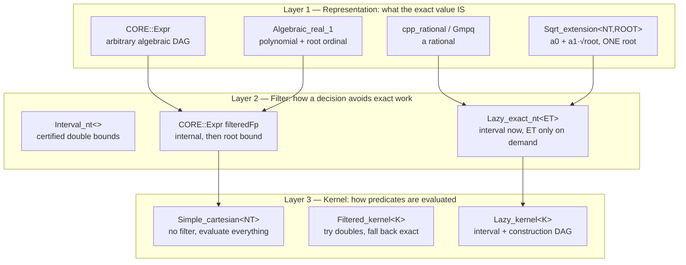
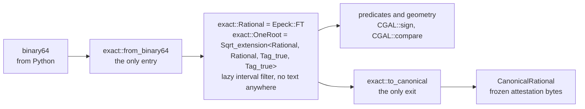

# Number Types: Choosing, Filtering, and Paying for Exactness

A CGAL kernel typedef is not a statement about *accuracy*. Every exact kernel
gives the same answers. A kernel typedef is a statement about **filter
architecture** — and the filter is where all of the performance lives.

This repository runs six number lanes. Three carry a CGAL-level interval
filter; three do not. Every measured 4–5 order-of-magnitude stall in this
codebase to date has been in an unfiltered lane — but *lack of a filter is not
by itself the mechanism*. Measured below, an unfiltered decision on a shallow
expression costs only 1.4× a filtered one; the explosions come from two
specific things the filter would otherwise have suppressed: **exact-zero
identity decisions**, and **coefficient growth through construction chains**.
The correct pattern is already in this repository — `exact::sign_mixed_radical`
in `src/exact/one_root.cpp` — so the outstanding work is propagating a proven
in-repo idiom, not acquiring CGAL literacy.

Read [Exact-Kernel Discipline](exactness.md) first: it governs *where* a
decision may be made. This page governs *what number type* makes it, and what
that choice costs.

## The six lanes

| # | Lane | Number type | Filter | Where |
|---|------|-------------|--------|-------|
| L1 | `Epick` | `double` | `Filtered_kernel` static/dynamic FP filter | `toolpath.cpp` |
| L2 | `Epeck` | `Lazy_exact_nt<cpp_rational>` | **lazy interval** (`Interval_nt_advanced`) | stock, coverage, arrangements |
| L3 | `Gps_circle_segment_traits_2<Epeck>` | `CoordNT = Sqrt_extension<FT, FT, Tag_true, Boolean_tag<Filter_>>` | **inherits L2's lazy filter** | 63 sites |
| L4 | `Epeck_with_sqrt` | `CORE::Expr` | none at kernel level; only CORE's internal `filteredFp` | 3 headers |
| L5 | `Algebraic_kernel_d_1/d_2` | `cpp_int` polynomials | bitstream-Descartes refinement, no NT-level filter | `exact_algebraic_1.cpp` |
| L6 | **bespoke** | bare `CORE::BigRat` (504 sites), `CORE::BigInt` (28) | **none** | `segment_site_*` |

!!! danger "L4 and L6 are the unfiltered lanes"

    `Exact_predicates_exact_constructions_kernel_with_sqrt` is, in CGAL 6.0.1,
    literally `Simple_cartesian<CORE::Expr>` — not a `Filtered_kernel`, not a
    `Lazy_kernel`. It has no CGAL filtering layer whatsoever. Its sibling
    `Exact_predicates_exact_constructions_kernel_with_root_of` resolves to the
    **same type**; the two typedefs differ only in name. There is no cheaper
    stock escape hatch, which is why the fast one-root path in this repository
    is hand-built over `Epeck`'s lazy `FT`.

## The cost model

These are measured on this repository, not quoted from the literature.

### What the filter is actually worth

The filter's value is **not** a constant factor. It scales with how deep the
expression is that produced the value. Measured first-party on this machine
(`tests/benchmarks/depth_bench.cpp`, clang -O3, vendored CGAL 6.0.1 and Boost,
`-DCGAL_DISABLE_GMP -DCGAL_USE_BOOST_MP`), chaining a rational construction
`x = (x·a + b)/(x + a)` to a given depth and then making **one** generic sign
decision on the result:

| chain depth | `Lazy_exact_nt<cpp_rational>` | bare `CORE::BigRat` | ratio |
|---|---|---|---|
| 1 | 0.42 µs | 0.59 µs | 1.39× |
| 2 | 0.80 µs | 2.50 µs | 3.13× |
| 4 | 1.62 µs | 8.94 µs | 5.52× |
| 8 | 3.41 µs | 27.27 µs | 8.01× |
| 12 | 4.96 µs | 57.61 µs | 11.60× |
| 16 | 6.74 µs | 96.27 µs | 14.27× |

Read the columns, not just the ratio. Across the sweep the unfiltered lane grows
**163×** while the lazy lane grows **16×**. The lazy layer is not merely skipping
exact work — it is holding coefficient growth in check, because a value that is
decided from its interval never has its exact representative built at all.

!!! warning "A shallow benchmark will tell you the filter does not matter"

    At depth 1 the difference is 1.39×, and a `Lazy_exact_nt` even carries
    visible overhead of its own (DAG node allocation). Any microbenchmark that
    converts doubles to rationals and immediately decides will conclude that
    filtering is not worth it. That conclusion is an artifact of the fixture.
    The lanes in this codebase that stall are the ones that build a fitted
    centre, project it, intersect it, and *then* decide.

### The rest of the cost model

| Operation | Cost | Ratio |
|---|---|---|
| CORE generic sign decided by `filteredFp` | ~40 ns | 1× |
| One-root `Sqrt_extension` over `Epeck::FT`, one query | 308 µs | — |
| Same query, unfiltered `cpp_rational` | 1.5 ms | ~5× |
| CORE **exact-zero identity** decision (root-bound refinement) | 1.5 ms – 2 s | **10⁵–10⁷×** |
| Figure 5 first query, before/after removing identity decisions | 337 s → 8 ms | 4×10⁴ |
| Monstera query, fitted centre kept as a DAG → materialised as a leaf | 3 s → 0.4–0.9 s | ~5× |
| …and with rational chord sampling | → ~10 ms | ~300× |
| Same topology, integer coordinates vs generic doubles | 0.000 s vs 19.6 s | ∞ |

The last row is the one that makes this hard to catch: on integer fixtures
every `sqrt` is a perfect square, CORE's approximation error is exactly zero,
and the refinement path is never entered. **A test suite built on `r = 1, 3, 5`
measures a proxy, not the thing.**

## How to read a CGAL number type

A CGAL number type is three independent layers, and mixing them up is what
produces the wrong choice.



Choosing a *representation* without choosing a *filter* is the defect this
codebase has 504 instances of. `CORE::BigRat` is a perfectly good Layer 1
type. It is not a Layer 2 type, and it was never meant to carry decisions on
its own.

### Concepts before types

Do not branch on which concrete number type you have. Ask CGAL's algebraic
foundations, which every conforming type models:

```cpp
// What algebraic structure is this? (IntegralDomain / Field / FieldWithSqrt ...)
using AST = CGAL::Algebraic_structure_traits<NT>;
typename AST::Algebraic_category category;

// Sign / comparison, exactly, at the number-type level.
CGAL::sign(x);                       // Real_embeddable_traits<NT>::Sgn
CGAL::compare(x, y);                 // returns SMALLER | EQUAL | LARGER

// Split a rational into numerator / denominator without knowing its backend.
using FractionTraits = CGAL::Fraction_traits<NT>;
typename FractionTraits::Numerator_type num;
typename FractionTraits::Denominator_type den;
typename FractionTraits::Decompose()(value, num, den);

// Certified double bounds, for reporting or for a hand-rolled filter.
const std::pair<double, double> bounds = CGAL::to_interval(x);
```

`CGAL::sign` and `CGAL::compare` are not stylistic preferences over `< 0` and
`<`. They dispatch through `Real_embeddable_traits`, which is where a lazy or
filtered type gets the chance to answer from its interval instead of forcing
exact evaluation.

## Rules

### R1 — Every deciding lane carries a filter

If a comparison changes control flow, the value it compares must be a type
that can answer cheaply when the answer is not close. In practice that means
`Lazy_exact_nt<ET>`, or a `Sqrt_extension` whose coefficient type is already
lazy, or a kernel that wraps one.

```cpp
// WRONG — unfiltered exact rational arithmetic to decide a degeneracy.
// src/segment_site_parameterization.cpp:999
const CORE::BigRat line_norm = segment.line_a * segment.line_a
                             + segment.line_b * segment.line_b;
if (line_norm == 0) { ... }
```

Two `cpp_rational` multiplications and an addition, each performing a GCD
normalisation, to decide something that is decidable on the leaves for free:
`a² + b² = 0` over the rationals holds exactly when `a == 0 && b == 0`.

```cpp
// RIGHT — decide on the leaves; no arithmetic at all.
if (CGAL::is_zero(segment.line_a) && CGAL::is_zero(segment.line_b)) { ... }
```

### R2 — Rationals are leaves, not carriers

This distinction is invisible in the source today and it is the reason the same
type reads as both the cure and the disease:

- **`CORE::BigRat` as a leaf** — materialising a constructed quantity (a fitted
  circle centre, a squared radius) as an exact rational *terminates* an
  expression DAG. Measured 2026-09-08: this cut a Monstera query from 3 s to
  0.4–0.9 s, because CORE's filter inherits `maxAbs / |divisor|` from every
  sub-expression, so a badly conditioned intermediate inflates every decision
  downstream of it.
- **`CORE::BigRat` as an arithmetic carrier** — building new values with `+ − × /`
  on bare `BigRat` and then deciding on them. Unfiltered, with unbounded
  coefficient growth. This is the defect.

Current split: **134** sites assign a `BigRat` from an arithmetic expression;
**16** take one as `const &`. The dominant use is the defect.

!!! tip "Make the roles type-distinct"

    A leaf and a carrier should not share a type name. If a value is a
    terminated exact leaf, say so in the type — the next engineer following the
    doctrine will otherwise reintroduce the carrier while believing they are
    applying the fix.

### R3 — Never re-decide an identity

An exact-zero test is the single most expensive thing you can ask an algebraic
number type to do. CORE proves a value is exactly zero only by refining to its
root-separation bound, which explodes with the number of distinct radical
nodes. Costs measured here: 1.5 ms to 2 s **per identity decision**, against
40 ns for a generic sign.

An identity that holds *by construction* must be recorded, never verified:

```cpp
// WRONG — construct the tangency foot, then confirm it is on the curve.
const Point foot = solve_tangency(source, candidate);
if (curve.has_on_boundary(foot)) { ... }          // identically true; costs seconds

// RIGHT — the derivation guarantees it. Record the provenance, decide only
// the genuinely generic question (which side, which interval, which winner).
const Point foot = solve_tangency(source, candidate);   // on-curve by construction
if (curve.is_interior_in_parameter_range(foot_parameter)) { ... }
```

Removing identity decisions from one query took it from **337 s to 8 ms**.

### R4 — Never normalise by a cancelling quantity inside CORE

CORE's floating filter tracks `maxAbs` and an index; a quotient inherits
`maxAbs / |divisor|`. Dividing by a quantity that is tiny relative to the
magnitudes it was built from inflates the filter bound for every decision
downstream, so the filter fails and each failure pays a root-bound evaluation.

```cpp
// WRONG — divides by a squared sum of ~84 mm coordinate differences worth ~6.
const Vector unit = middle * CGAL::sqrt(r2 / middle.squared_length());

// RIGHT — pick the representative with doubles, then land it exactly:
// choose a target angle in double, construct the second intersection exactly
// from the piece start, and verify membership with an exact predicate.
```

The endpoint-versus-midpoint discriminator that isolated this: `u = 0` cost
3–10 ms, `u = 0.5` cost 0.3–0.9 s, on the same query.

### R5 — Stay inside one root

`CGAL::Sqrt_extension<NT, ROOT>` represents `a0 + a1·√root`. Arithmetic
requires both operands to share a root — the documented precondition is
`a.root() == 0 || b.root() == 0 || a.root() == b.root()`. Cross-root
arithmetic is undefined behaviour. Cross-root *comparison* of arrangement
points is exact and supported.

When a decision genuinely spans two radicals, decompose it into supported
same-root calls rather than reaching for `CORE::Expr`. This repository already
does exactly that:

```cpp
// src/exact/one_root.cpp — sign of A + B·√α + C·√β + D·√(αβ), rational A..D.
// Degenerate radicands are folded away with rational compares FIRST; that is a
// soundness requirement, not a fast path (docs/exactness.md, the danger note
// under "One-root numbers"). Then group over the shared root α into
// u, w ∈ Q(√α), so the form is u + √β·w. Its sign follows from sign(u),
// sign(w), and compare(u², β·w²) — three supported exact calls, all same-root,
// and β enters as a rational.
switch (CGAL::compare(u * u, w * w * CoordNT(beta))) { ... }
```

Because `CoordNT`'s coefficient type is `Epeck::FT`, which is
`Lazy_exact_nt<cpp_rational>`, **this lane is filtered**. That is the whole
reason it costs 308 µs where the unfiltered form costs 1.5 ms and the
`CORE::Expr` form can cost seconds.

!!! note "Converged at stage 1"

    This predicate used to exist twice, in `src/engagement_2.cpp` and in
    `src/audit_exact_station_2.cpp` — two authoritative copies of one exact
    predicate, against the single-path rule in `CLAUDE.md`. Since `541b6ede`
    there is one definition, `exact::sign_mixed_radical`, and both sites call
    it. What the duplication was hiding, and the evidence that licensed the
    merge, are below:
    [Stage 1: one mixed-radical sign definition](#stage-1-one-mixed-radical-sign-definition-and-the-oracle-gap-it-closed).

### R6 — Compare squared quantities

Every `sqrt` you avoid is a radical node that never enters a root bound. Prefer
`CGAL::squared_distance`, `compare_squared_distance`,
`has_smaller_distance_to_point`, and squared radii throughout. The threshold
you compare against is a squared threshold, injected exactly at the API
boundary.

### R7 — `to_double`, `to_interval` and `.exact()` are boundary verbs

| Call | Meaning | Legitimate use |
|---|---|---|
| `CGAL::to_double(x)` | lossy projection | reporting only — never feeds a decision |
| `CGAL::to_interval(x)` | certified bounds | a hand-rolled filter, or an honest error bar |
| `x.exact()` | **forces** the lazy DAG | serialisation, canonical encoding, leaf materialisation |

`.exact()` is the one that surprises people: on a `Lazy_exact_nt` it discards
the entire benefit of the lazy layer for that value and every value derived
from it. Fourteen sites call it, and each should be a deliberate boundary
crossing — a canonical digest, a rational leaf — never a convenience.

## The arithmetic backend is a build-time decision

`CMakeLists.txt` pins:

```cmake
-DCGAL_DISABLE_GMP -DCGAL_USE_BOOST_MP
set(CMAKE_DISABLE_FIND_PACKAGE_GMP ON)
set(CMAKE_DISABLE_FIND_PACKAGE_MPFR ON)
```

Traced through `CGAL/Number_types/internal/Exact_type_selector.h`, this selects
`BOOST_BACKEND`, so:

```
Exact_rational = boost::multiprecision::cpp_rational
Epeck::FT      = Lazy_exact_nt<cpp_rational>
```

!!! note "The `Exact_type_selector.h` comment about slow `cpp_rational` is historical"

    A comment above that typedef reads *"cpp_rational is even slower than
    `Quotient<MP_Float>`"* — but **that sentence does not describe this build.**
    It sits above an `#if BOOST_VERSION <= 107800` guard, and the next sentence
    of the same comment says the newer `cpp_rational` (Boost multiprecision
    PR 366) *"is much better than `Quotient<cpp_int>` because it is using smart
    gcd"*. The vendored Boost here is **1.82.0**, so the `#else` branch applies
    and we get the smart-GCD implementation. `Default_exact_nt_backend` only
    selects `BOOST_BACKEND` at all when `BOOST_VERSION > 107900`, so the
    configuration that comment disparages is not reachable.

### Measured: the filter decides, not the bignum library

**Keep the pin.** On the filtered path — `Lazy_exact_nt`'s interval settling the
sign, which is what every deciding lane in this repository is built to do — a
GMP-backed exact rational buys between **1.00× and 1.09×**, median 1.03×. That
does not pay for adding a native `libgmp` + `libmpfr` dependency to a build that
is currently header-only and self-contained, with wheel delocation and
cross-platform CI downstream of it.

GMP's real advantage — a saturating **~2.1×** — appears only on deep
*unfiltered* rational chains, and below roughly 150 bits of operand it shows
**no advantage at all**: depth 1 is a near-tie at 0.89×, where `cpp_int`'s
small-value inline representation offsets `mpq`'s allocate-and-call overhead.
GMP has no edge below the crossover and a growing one above it. So the backend
question is conditional on the filtering question. It has an answer worth acting
on only where the filter is not working, which is the unfiltered lane that
stages 2–4 exist to remove. Revisit after stage 4, when the answer should be
worth even less.

Measured first-party on 2026-09-08 by building `tests/benchmarks/depth_bench.cpp`
twice from identical source — `-DCGAL_DISABLE_GMP -DCGAL_USE_BOOST_MP` against
`-DCGAL_USE_GMP -DCGAL_USE_BOOST_MP` — on Apple Silicon, clang -O3, with GMP
6.3.0 and MPFR 4.2.2 from Homebrew at `/opt/homebrew`, outside the pixi
environment. The two binaries were confirmed distinct rather than assumed:
`otool -L` shows the boost build linking **no** GMP libraries and the GMP build
linking **two**. These are steady-state figures, not single shots: the **first
run of each binary is discarded as warm-up** and the reported value is the
**minimum of the four consecutive runs** that follow. µs per sign decision;
ratio **> 1 means GMP is faster**.

| depth | 1 | 2 | 4 | 8 | 16 |
|---|---|---|---|---|---|
| filtered, `Lazy_exact_nt` — boost | 0.36 | 0.76 | 1.54 | 3.30 | 6.52 |
| filtered — GMP | 0.36 | 0.74 | 1.53 | 3.04 | 6.23 |
| **filtered ratio** | 1.00× | 1.03× | 1.01× | 1.09× | 1.05× |
| unfiltered, bare `CORE::BigRat` — boost | 0.57 | 2.31 | 8.21 | 27.62 | 92.60 |
| unfiltered — GMP | 0.64 | 1.33 | 3.84 | 12.32 | 43.23 |
| **unfiltered ratio** | 0.89× | 1.74× | 2.14× | 2.24× | 2.14× |

The mechanism is the whole point: when the interval decides, the exact
representative is **never built**, so the library underneath it never runs. The
residual few percent on the filtered row is not bignum speed at all — it is DAG
node size. `sizeof(Exact_rational)` is 64 bytes on boost against 32 on GMP, so
every lazy node the filtered path allocates is 32 bytes larger.

!!! note "Discard the warm-up run, or the shallow end lies to you"

    A single-shot version of this table read **0.32×** at depth 1 — GMP
    apparently three times slower — purely because the first run of each binary
    is warm-up. Measured across five consecutive runs, GMP's depth-1 unfiltered
    time goes 2.19, 0.72, 0.65, 0.64, 0.64 µs; the filtered lane does the same
    thing (boost depth-1 filtered: 0.93, then 0.38, 0.39, 0.39, 0.39). Steady
    state is a near-tie, and the apparent 3× was an artifact of run 1.

    This is also a separate paired run of the same harness that produced the
    table in *What the filter is actually worth* above, so its boost column sits
    a few percent below that one. Only the ratio measured *within* one paired
    run is load-bearing.

    Depth 12 is absent because the clean re-run sampled 1/2/4/8/16.

Operand width was measured rather than assumed: the chain grows ~53 bits per
level, putting depth 1 at 105 bits and depth 2 at 158, which brackets the
crossover.

### What a `-DCGAL_USE_GMP` flip actually selects

Not `CGAL::Gmpq`. `Installation/internal/enable_third_party_libraries.h:56`
defines `CGAL_USE_BOOST_MP` whenever `CGAL_DO_NOT_USE_BOOST_MP` is absent — it
is absent here — so dropping `-DCGAL_USE_BOOST_MP` from the compile line does
not remove it, and the selector's `CGAL_USE_GMP && CGAL_USE_BOOST_MP` branch
takes `BOOST_GMP_BACKEND`. The real A/B is therefore boost's `number<>` wrapper
over `cpp_int` versus the same wrapper over GMP's engine (`mpq_rational`), which
is the *cleaner* comparison anyway: the interface layer is identical on both
sides and only the bignum engine changes. Pure `GMP_BACKEND` would need
`CGAL_DO_NOT_USE_BOOST_MP` or `CMAKE_OVERRIDDEN_DEFAULT_ENT_BACKEND=0`; neither
was tested.

### The integer arm, and where the deep win comes from

The expensive real workload recorded in `docs/continuous_engagement_cost.md` is
CGAL's bivariate algebraic kernel — **integer** polynomial arithmetic, not
rational chains. Measured per operation across 64–2048 bits, GMP wins about 2×
on multiply and 1.6× on GCD above 256 bits, but **loses on comparison at every
size measured** (0.79×–0.90×). Comparison is the most common operation in
predicate code, so even on the integer side a swap is not a uniform win.

A `sample` profile of a depth-12 exact-path loop bounds the allocator story
tightly:

| | boost `cpp_rational` | GMP `mpq_rational` |
|---|---:|---:|
| arithmetic | 73.4% | 80.5% |
| allocator | 23.7% | 18.8% |
| allocations per decision | 268.7 | 85.7 |

Allocator work is 23.7% of boost's time, so eliminating boost's allocator
*entirely* caps the achievable win at `1/(1 − 0.237)` = **1.31×**. The measured
deep win is ~2.1×, which leaves a factor of ~1.6× the allocator cannot explain:
the majority of the win is genuinely GMP's `mpn` assembly and is not recoverable
by an allocator change.

### Canonical bytes do not move across backends

Because `canonical_encode_rational` hashes the numerator and denominator as
canonical integers of a *reduced, positive-denominator* fraction, the canonical
digest is a function of the mathematical **value**, not of the backend
representation. Hashing an approximation or an unreduced form would move replay
identity. That form is not validated at the encode site —
`src/canonical_encoding.cpp:154` encodes `CORE::numerator` and
`CORE::denominator` exactly as handed to it — it comes from `CORE::BigRat`'s own
normalisation. `CGAL::Fraction_traits` itself guarantees only `x == num/den`,
never reducedness, so the reduced form is the backend's doing and a backend swap
is exactly the thing that could move it.

It was checked, and it is clean. Two checks, both under both backends:

| Check | Result |
|---|---|
| `ft_equiv` harness, 6024 values, `Decompose` against IEEE-754 bit decomposition | 0 mismatches on boost, 0 on GMP |
| direct cross-backend dump of numerator and denominator decimal strings — the same 6024 values **plus 200 depth-12 chained constructions** with ~180-digit coefficients | 6224 lines, byte-for-byte identical, same SHA-256 |

The second is the stronger test: it compares the two backends' actual output
against each other rather than each against a local reference, and it
deliberately includes the deep-chain case where unreduced intermediates could
plausibly diverge. Both `cpp_rational` and `mpq_rational` normalise to lowest
terms with a positive denominator, and the reduced representation of a rational
is unique. Stored replay digests would survive this specific swap.

!!! warning "What this measurement does **not** establish"

    - **The real pipeline was never run under GMP.** Everything above is a
      microbenchmark plus a per-operation integer arm. Rebuilding the extension
      against GMP was out of scope, so "2.1× on a rational chain" maps to "X% on
      a pocket run" only by inference.
    - **The filter-failure rate of the real workload is unknown.** This is the
      single most important missing number: the filtered row is ~1.03× and the
      unfiltered row is 2.1×, so any end-to-end benefit is almost entirely
      determined by what fraction of decisions escape the interval.
    - **`Sqrt_extension` and `Gps_circle_segment_traits_2` were not benchmarked
      at all**, and byte identity was checked on doubles and rational chains
      only — not on one-root coordinates, algebraic-kernel root representations,
      or any polynomial canonicalisation path.
    - **Single machine, single compiler, arm64 only.** GMP's advantage is
      per-CPU assembly; x86-64 ratios will differ.

## The exact vocabulary and the two doors

One namespace, `compas_cgal::exact`, owns the project's exact-number vocabulary,
and it *defines* exactly two boundary crossings: `from_binary64` in and
`to_canonical` out. **As of stage 0 nothing is routed through either door** — the
vocabulary landed beside the existing carriers, not in front of them (status note
at the end of this section) — so what follows describes the shape the doors
impose where the vocabulary is adopted, never coverage that exists today.
Between those doors a value would be an `exact::Rational` or an `exact::OneRoot`,
carrying lane L2's lazy interval filter by construction rather than by review;
wherever that happens, R1 and R5 stop being advisory and become structural.

Rationale, staging and the counts behind the work:
[Number-Type Coherence: Design](superpowers/specs/2026-09-08-number-type-coherence-design.md).



### `exact::Rational` is `Epeck::FT`, deliberately

```cpp
/// The project's exact rational carrier. Lazy and interval-filtered.
using Rational = CGAL::Exact_predicates_exact_constructions_kernel::FT;

/// One-root algebraic numbers, a0 + a1*sqrt(root).
/// The four template arguments are load-bearing: CGAL spells CoordNT as
/// Sqrt_extension<NT, NT, Tag_true, Boolean_tag<Filter_>>, so a two-argument
/// alias is a DIFFERENT type and arrangement coordinates will not compile
/// against it. `exact_one_root_gate` static_asserts the identity.
using OneRoot =
    CGAL::Sqrt_extension<Rational, Rational, CGAL::Tag_true, CGAL::Tag_true>;
```

A fresh strong type would have been the reflexive choice and it would have been
the wrong one. `Epeck::FT` is *already* the coefficient type of
`Gps_circle_segment_traits_2<Epeck>::Point_2::CoordNT` — lane L3 above — so
`exact::OneRoot` **is** the traits' own `CoordNT`. Three consequences follow from
that identity, and none of them survives being wrapped:

| Because the alias is the kernel's own type | Consequence |
|---|---|
| `OneRoot` is `CoordNT`, not a sibling of it | arrangement interop is identity, never conversion |
| `Rational` is `Lazy_exact_nt<cpp_rational>` | the interval filter arrives with the type; nothing has to remember to add one |
| existing one-root code already spells these types | `sign_mixed_radical` and its callers compile unchanged |

!!! danger "A type-identity claim belongs in a `static_assert`, not in prose"

    The first draft of this alias had **two** template arguments. CGAL spells
    `CoordNT` with **four** — `Sqrt_extension<NT, NT, Tag_true,
    Boolean_tag<Filter_>>` (`Arr_geometry_traits/Circle_segment_2.h:46`) — so
    the two-argument form is a *different type*, and an arrangement coordinate
    would not have compiled as an argument. The whole "interop is identity"
    rationale above was false as written, and prose could not catch it.

    What catches it is `exact_one_root_gate`, which carries
    `static_assert(std::is_same_v<exact::OneRoot, GpsTraits::Point_2::CoordNT>)`.
    Any claim of type identity in this codebase should be bound the same way.

### The cross-root precondition lives in the call, not the type

!!! warning "`OneRoot` is a bare alias on purpose"

    A checking wrapper would enforce R5 at the type level and destroy the
    `CoordNT` identity above, reintroducing exactly the impedance boundary the
    alias removes. So the typedef stays bare and the precondition is enforced by
    free functions in `exact/one_root.h`:

    ```cpp
    [[nodiscard]] OneRoot same_root_add(const OneRoot& a, const OneRoot& b);
    [[nodiscard]] OneRoot same_root_multiply(const OneRoot& a, const OneRoot& b);
    ```

    Both check `is_extended()` **before** reading `root()`, because `a1()` and
    `root()` are defined only on an extended value — reading them unconditionally
    is undefined behaviour, not a wrong answer. A non-extended operand carries
    `a0()` alone, is compatible with any root, and short-circuits. Two operands
    that are *both* extended and whose roots differ raise
    `CrossRootExtensionError` — including an extended operand whose root is
    **zero**, which `Tag_true` admits and which is *not* exempt: the exemption is
    `!is_extended()`, never "the root is zero". `exact_one_root_gate` pins that
    distinction, because roots 2 and 3 alone cannot tell the two rules apart.

    Raw `Sqrt_extension` operators stay reachable and must not appear in our
    code; checklist item 5 is what catches that. Cross-root *comparison* is
    untouched — it remains exact and supported.

### The two doors

| Door | Signature | What it guarantees | Raises |
|---|---|---|---|
| in | `Rational from_binary64(double)` | exact and total on finite input: a binary64 **is** a dyadic rational, so there is no parsing, no tolerance and no snapping | `NonFiniteBinary64Error` |
| out | `CanonicalRational to_canonical(const Rational&)` | a **positive denominator**, which is the only condition it checks. Reducedness is what makes the bytes value-determined, but it arrives from the backend rational's auto-normalisation and is pinned by probes in `exact_canonical_gate` rather than re-checked per value | `UnreducedCanonicalRationalError` |

`CanonicalRational` is a derived **view**, never a carrier. It exposes
`numerator()`, `denominator()`, `text()` and `canonical_bytes()` as
`std::string`, and it is constructible only through `to_canonical`. Nothing
computes on it. That separation is the point: the attestation type and the
compute type serve different consumers and change at different rates, so they are
two types rather than one struct doing both jobs.

The direction is therefore inverted from what the string carriers do today. Text
is an output. A new `parse_rational`-shaped decoder is a defect, not a
convenience.

### Measured: the carrier does not move the bytes

The whole refactor rests on one claim that had to be checked before any code was
written — swapping the carrier must not move a single attestation byte. Measured
first-party on 2026-09-08 with a throwaway harness, which is the only thing that
ever ran this comparison: `Epeck::FT(double)` followed by
`Fraction_traits<FT>::Decompose` produces byte-identical numerator and
denominator strings to the IEEE-754 bit-decomposition path already in
`src/continuous_tea_2/segment_source.cpp:21`.

| Corpus | Detail |
|---|---|
| edge doubles | smallest subnormal, smallest normal, ±0, 0.5, 1.0, 0.1, 3.0, 2^52, 2^53, 2^53 + 2, 1e308 |
| random doubles | 3000, uniform in [-1e6, 1e6] |
| signs | every value checked in both signs |
| **total comparisons** | **6024** |
| **mismatches** | **0** |

The two paths reach the same bytes by different arithmetic: one decomposes the
IEEE-754 sign, exponent and fraction fields by hand into a `CORE::BigRat`, the
other hands the double to `Epeck::FT` and asks `Fraction_traits` to split it.
Agreement between them was measured, not inferred — which is what turns
*canonical attestation bytes are a function of the value, never of the carrier*
into a property with evidence behind it. It is the same argument the backend pin
rests on above, run across a second carrier rather than a second backend — the
backend arm of that argument is measured separately above.

!!! warning "That was a one-off, and no landed gate repeats it"

    `exact_canonical_gate::to_canonical_matches_existing_projection` looks like
    the standing form of the measurement above and is not.
    `exact::to_canonical` and `SegmentEventSource2::lift_exact`
    (`src/continuous_tea_2/segment_source.cpp:170-180`) are the **same
    algorithm** — `Fraction_traits::Decompose`, then
    `CORE::BigInt::convert_to<std::string>` — and `from_binary64` reaches the
    source through `lift_exact`, so that check compares the promotion against
    its own source. What it can catch is a promotion drifting from the code it
    was lifted out of. What it cannot see is the framing moving, because both
    sides share the one `encode_string_sequence`. The hand-decomposition path,
    `lift_binary64`, is on neither side of it.

    What anchors the format is the frozen byte literal in the same gate:
    `canonical_bytes_match_the_frozen_literal` compares
    `to_canonical(from_binary64(0.1))` against 91 absolute bytes. An absolute
    constant is the only reference that does not move with the code it checks.

### The error model

One named exception per failure mode, each deriving `std::runtime_error`. The
layer never throws `std::runtime_error` directly, so a caller catches the failure
mode instead of matching on a message.

| Error | Fires when | Where |
|---|---|---|
| `NonFiniteBinary64Error` | `from_binary64` is handed NaN or an infinity — the only inputs that denote no rational | `exact/errors.h` |
| `UnreducedCanonicalRationalError` | a value reaches `to_canonical` whose decomposed denominator is **not positive**, which would make the encoding ambiguous. The name also covers unreducedness; that half is not re-checked per value, because a bignum gcd on every attested value costs more than it can ever catch (`exact_canonical_gate` pins the backend's normalisation instead) | `exact/errors.h` |
| `CrossRootExtensionError` | `same_root_add` or `same_root_multiply` is called on two extended operands whose roots differ. An extended operand whose root is zero is *not* exempt; only a non-extended one is | `exact/errors.h` |
| `AttestationByteDriftError` | a projection produces bytes differing from the frozen contract | designed, not yet landed — it belongs to the projection site, which arrives with the inversion |

`AttestationByteDriftError` is **declared and nothing raises it** — its
declaration is its only occurrence in the tree. It is written now so the module's
error model is complete when the projection site arrives, and that site is
stage 2. The design intent it records is that it must not become a release-build
check on every projection, where the comparison would cost more than the
guarantee is worth. Until then the frozen byte literal in `exact_canonical_gate`
is what actually catches attestation-byte drift.

!!! note "Status after stage 1: one predicate adopted, no lane converted"

    Stage 0 landed `src/exact/` beside the existing carriers with **nothing**
    using it. Stage 1 changed that for exactly one thing:
    `exact::sign_mixed_radical` is now on the deciding path in both
    `src/engagement_2.cpp` and `src/audit_exact_station_2.cpp`, so
    `exact::Rational` and `exact::OneRoot` are shipped types rather than
    vocabulary.

    Everything else is unchanged. Neither door has a caller —
    `exact::from_binary64` and `exact::to_canonical` are still reached only from
    `exact_canonical_gate` — and neither do `same_root_add` and
    `same_root_multiply` outside `exact_one_root_gate`. **No carrier has been
    converted**: the 504 unfiltered `BigRat` sites, the six lanes above and
    every parse-back crossing are exactly as they were.

    Lane conversion begins at **stage 2**, smallest event source first, and the
    filtering payoff is predicted to land in stage 4 where the deep construction
    chains are. Until then, read the doors as vocabulary, not as coverage.

## Stage 1: one mixed-radical sign definition, and the oracle gap it closed

Since `541b6ede` the exact cap certificate (`src/engagement_2.cpp:77,:95`) and
the certified audit station (`src/audit_exact_station_2.cpp:62,:84,:315`) decide
through **one** definition of the mixed-radical sign,
`exact::sign_mixed_radical` in `src/exact/one_root.cpp`, built on
`exact::Rational` and `exact::OneRoot`. The merge was +114/−584 across six
files; the 470 net lines were duplication.

**The duplication was hiding a test-oracle gap, and that is the stronger reason
it had to go.** Before the merge the Python binding `_sign_mixed_radical`
reached copy B — `sign_mixed_radical_for_binding` →
`audit_sign_mixed_radical_exact` → `src/audit_exact_station_2.cpp` — while the
engagement geometry decided with copy A, a separate anonymous-namespace function
in `src/engagement_2.cpp`. Every Python-level test of that predicate therefore
exercised code the geometry never ran. The copies did turn out to be
semantically equivalent — proven below, not assumed — but nothing enforced it. A
divergence would have left `tests/test_stock.py` green while the shipped
certificate was wrong. One definition closes that structurally: the tests and
the geometry can no longer address different code.

### The evidence that licensed the change

Stage 1 touched a deciding predicate on a certificate path, so the merge was
licensed by measurement rather than by inspection (`e54caf77`). Both copies were
compiled into one binary — copy A has internal linkage, so the gate `#include`s
its translation unit and calls the **shipped** function; nothing was transcribed
— and compared against each other and against an independent oracle over:

| Arm | Inputs | What it forces |
|---|---:|---|
| Exhaustive sign structure | 2,025 | `a,b,c,d ∈ {−1,0,1}` × `α,β ∈ {0..4}` — every sign pattern, `α = 0`, `β = 0`, `α = β`, perfect-square roots |
| Widened magnitude grid | 60,025 | `a,b,c,d ∈ {−3,−1,−½,0,½,1,3}` — lets \|u\| and \|w·√β\| overtake each other, and lets `u` vanish over a perfect square |
| Magnitude-tie neighbourhood | 1,800 | sits exactly on the `compare(u², β·w²) == EQUAL` tie and straddles it from both sides |
| Randomised rationals, fixed seed | 20,000 | general `p/q` coefficients, roots occasionally forced to zero or to each other |
| **Total** | **83,850** | **0 copy disagreements, 0 oracle disagreements** |

Two properties make that number mean something.

- The gate **requires all ten branch labels to be hit** before the agreement
  result is allowed to count, so it cannot pass vacuously. The two branches copy
  B merged were reached 1,747 (`u == 0`) and 20,118 (like signs) times; the
  exact-tie branch 501 times.
- Both copies' distinctive branches were **defect-injected**, in scratch copies
  only. Forcing copy A's `α == β` branch to `ZERO` produced 12,352
  disagreements; forcing copy B's *merged* branch to `opposite(w_sign)` produced
  21,865. The second is the one that matters: it proves the gate bit on exactly
  the branch whose equivalence was in doubt.

!!! note "Maturity: `confirmed`, and empirical"

    This is agreement over 83,850 inputs with enforced full branch coverage and
    injected-defect evidence that the comparison bites. It is **not a symbolic
    proof** that the two forms are equal for all rationals. Read it as strong
    evidence, not as a theorem.

### The standing gate, and what it is not independent of

`tests/native/sign_mixed_radical_gate.cpp` (`3db64195`) is the surviving half of
that proof, kept as a **correctness** gate. With one definition the
copy-vs-copy arm became a function compared to itself, but the third arm never
was: the expression `u + √β·w` with `u, w ∈ Q(√α)` *is* the nested one-root
number `Sqrt_extension<CoordNT, FT>`, so asking CGAL for that value's sign runs
CGAL's implementation, not this repository's. That arm now runs against the
merged definition over the same 83,850-input corpus with the same ten-branch
requirement.

It is wired into `pixi run exact-gates`, and that detail is load-bearing:
the native gates are `EXCLUDE_FROM_ALL`, and **nothing in this repository runs a
`tests/native/*_gate` target automatically**. A proof nothing runs rots.

!!! warning "The oracle is independent in the logic, not in the arithmetic"

    The oracle shares CGAL's `Sqrt_extension` machinery with the predicate at
    the leaf level. It is independent in the decomposition and the magnitude
    comparison — the parts under test — and **not** independent in the
    underlying bignum arithmetic. A defect in the backend rational itself would
    move both sides together and this gate would not see it.

    Nor is the oracle fold-free: it folds degenerate roots for the same reason
    the predicate does, because an unfolded oracle measures CGAL's unsound
    `sign_()` path instead of the predicate (`docs/exactness.md`, the danger
    note under "One-root numbers"). That is what makes deleting a fold from the
    predicate show up as a disagreement — 347 of them, first witness
    `a=-1, b=-1, c=1, d=-1, α=0, β=1`, predicate `NEGATIVE`, oracle `ZERO` —
    rather than as both sides being wrong together.

## Stage 1: one traits owner per exact-region family

Since `df6fb020` an `ExactRegion2` holds the geometry-traits object its
arrangement reads, and `ExactRegion2::build` **refuses to construct a region
whose arrangement reads traits that nothing keeps alive** —
`ExactRegionTraitsUnownedError` (`src/exact_region_2.h:35`).
`ReachableMaterialPredicateStorage2` was repaired in the same commit under the
same shape, and `Stock2` was repaired earlier, differently, in `57482731`.
Maturity for all three: **`confirmed`**.

The underlying trap is CGAL's, and it is written down once, under
[Copying a `Gps` aliases its traits object](exactness.md#copying-a-gps-aliases-its-traits-object)
— a copied `General_polygon_set_2` allocates a traits object it never uses and
leaves its arrangement pointing at the traits of the set it was copied from,
which is freed when that set dies; `std::move` does not avoid it, because a
`Gps` has no move constructor. What belongs on this page is what the repairs
cost here, and the fact that **the same defect needed two different shapes,
decided by how many producers construct the object.**

### One defect, two shapes

|  | `Stock2` (`57482731`) | `ExactRegion2` (`df6fb020`) |
|---|---|---|
| Construction points | one | thirteen `build` call sites across five translation units |
| Can the object own the traits? | **Yes.** One construction point can root every set on one share | **No.** `build` adopts sets from producers that each root their own traits, so it cannot know which traits an incoming set reads |
| Shape | `std::shared_ptr<const GpsTraits> traits_` declared *before* `set_` (`src/stock_2.h:263-264`) so it is destroyed after the arrangement, propagated through `clone()`, the private constructor, `replace_set`, `swap` and the moves | The inverse: `build` takes `std::shared_ptr<const ReachSet>` instead of a by-value set — adopting, never copying — and **resolves the traits owner at construction** from a candidate list |
| What enforces the invariant | Convention: every construction site must root on `traits_` | The type: a set whose traits owner cannot be resolved is rejected with a named error |
| Side effect | — | One full arrangement copy per region removed; `clone()` is now two refcount bumps (`src/exact_region_2.cpp:208`) |

`ExactRegion2::build` (`src/exact_region_2.cpp:158`) asks the set which traits
its arrangement actually reads, then finds the owner among the candidates the
producer offered:

```cpp
const ReachTraits* borrowed = arrangement_traits_of(*set);
if (borrowed == &set->traits()) { /* a root: owning the set owns the traits */ }
for (std::shared_ptr<const ReachSet>& candidate : traits_owner_candidates) {
    if (candidate && borrowed == &candidate->traits()) { /* adopt that owner */ }
}
throw ExactRegionTraitsUnownedError(
    "exact region storage reads geometry traits that no offered set owns.");
```

That is the substantive difference between the two fixes. `Stock2`'s repair
answers *"did the author root every construction on `traits_`?"* with
diligence. `ExactRegion2`'s answers it with a machine-checked invariant: a
producer that hands over a set rooted on traits it did not offer gets a named
exception at the construction site, instead of a dangling pointer that surfaces
later inside a point locator. Producers pass `{}` when the set was built from
scratch and each source region's `traits_owner()` when the set was seeded by
copy — `src/reachable_domain_2.cpp:182-186` (residual seeded from design) and
`src/remaining_material_2.cpp:76-79` (target region, zero motions) are the two
plainest cases.

Two supporting changes fall out of adopting rather than copying.
`reach_join_parts_into` and `reach_full_circle_sweep_into`
(`src/exact_sweep_2.h:24,31`) let a producer build a sweep *inside* an already
heap-owned `ReachSet`, because assigning a by-value factory result into one
would reintroduce the copy; the by-value factories survive as one-line wrappers
over those definitions, so there is still a single construction path. And
`NativeBoundary2::design_region()` (`src/native_boundary_curve_2.cpp:116`) now
hands over the boundary's own `design_` share rather than copying it.

### The third aliasing route: joining onto an empty set

Two routes into the trap are obvious once it is known — copy-constructing a
set, and `std::move`-ing one. The third is not, and it is the one that caught
`Coverage2`. `Gps_on_surface_base_2::_join(const Self&)` short-circuits when
the *left* operand is empty
(`external/cgal/include/CGAL/Boolean_set_operations_2/Gps_on_surface_base_2.h:1609-1613`):

```cpp
if (this->is_empty())
{
  *(this->m_arr) = *(other.m_arr);
  return;
}
```

Arrangement assignment delegates to `assign`
(`Arrangement_on_surface_2_impl.h:145-150`), which propagates a borrowed traits
pointer verbatim at `:201`. So a set that owned its traits a moment ago reads
the **right operand's** traits after the join — and nothing at the call site
looks like a copy.

`Coverage2::apply_sweep` (`src/coverage_2.cpp:441`) is exactly that shape: the
first sweep after `Coverage2::from_uncut` joins onto an accumulated set that is
still empty, so the successor's arrangement reads the *sweep's* traits rather
than the accumulated family's. The fix does not try to predict which it is; it
offers both owners and lets `build` resolve it (`src/coverage_2.cpp:485`):

```cpp
{state_.accumulated_sweeps.traits_owner(), sweep}
```

!!! warning "A following boolean operation is not proof that a set was re-rooted"

    The comforting reading — *a `difference` or `join` rebuilds the
    arrangement, so any borrowed pointer heals* — is true only of the **local**:
    `_difference` and the general `_join` build their result arrangement from
    the object's own live `m_traits`. The empty-operand shortcut above does
    not, and even in the healing case the healed local is then copied into
    long-lived storage, where the copy borrows the local that is about to die.
    Do not reason about this from the call site. Assert it.

### A use-after-free test that depends on faulting is a test of your allocator

The `ExactRegion2` defect could not be made to fault. Guard Malloc, five runs
under `MallocScribble`/`MallocPreScribble` with the nano zone disabled,
deliberate reclamation of the freed 32-byte block with three fill patterns, and
130 region tests were all clean and byte-identical — while `lldb`
simultaneously showed `contains` reading traits bytes scribbled to
`0x55555555…`, and positive controls confirmed the instrumentation does catch a
plain read-after-free. Whether this defect faults is a property of the point
locator, not of the code that is wrong; the detail is in
[exactness.md](exactness.md#detection-is-structural-not-fault-based).

So the check is structural. `ExactRegion2::arrangement_traits_are_owned_for_audit()`
(`src/exact_region_2.cpp:249`) asserts the ownership invariant directly:

```cpp
return arrangement_traits_of(*set_) == &traits_owner_->traits()
    && arrangement_traits_of(*traits_owner_) == &traits_owner_->traits();
```

The second conjunct is what makes it a proof rather than a gesture: the chain
must **terminate** at a root this region holds, instead of pointing one link
further at an ancestor nobody keeps alive.

Bound to Python (`src/compas_cgal/_coverage_2.pyi:79`), it made a RED→GREEN
pair possible for a defect that never faults.
`tests/test_exact_region_traits_ownership.py` asserts it over seventeen regions
covering every producer — `from_polygon`, `clone`, the four `ReachableDomain2`
regions, precleared and swept coverage, `from_uncut` before and after a sweep,
remaining material with and without motions, and the native-boundary design
region — with the parent objects deliberately dropped first. The accessor was
`false` for **all seventeen** before the fix and the file went
`12 failed, 0 passed` → `12 passed` after it.

**The general rule: a use-after-free test that depends on faulting is a test of
your allocator, not of your code.** It reports green on broken code whenever
the allocator happens to be kind, which for this defect was every single time.
Assert the ownership invariant instead — it is deterministic, it fails on the
broken code under any allocator, and it keeps failing until the code is right.

### Evidence

| Measurement | Before | After |
|---|---|---|
| `tests/test_exact_region_traits_ownership.py` | 12 failed, 0 passed — accessor `false` for all 17 producers | **12 passed** |
| Canonical digest snapshot | `6cdb83dd2b94688c918798656b07011f`, 61 payload lines | **byte-identical**, same hash and line count |
| `pytest tests/adaptive tests/test_engagement_audit.py -q -n auto` | 4 failed, 783 passed | **4 failed, 783 passed** — the same four manifest-declared ids |
| Region and digest-bearing suites | — | **64 passed** |
| `pixi run exact-gates` | — | **four native gates OK** |
| `Stock2` (`57482731`, [detail](exactness.md#status-in-this-repository)) | reproducer 6/6 crash; the shipped intermittent test 5/8 crashing | **0/8** and **8/8 passing**; all digests byte-identical |

!!! note "The digest is what proves the change touched ownership only"

    `6cdb83dd…` hashes 61 asserted payload lines — region containment grids and
    component counts, `ReachableDomain2` certificate record digests, coverage
    sweep and residual-component records, the four `containment_2` structural
    records, and stock digests. It was stable across eleven pre-fix runs
    (plain, Guard Malloc, scribble) and is unchanged after the fix. That is a
    stronger statement than "the tests still pass": a byte that moved would
    have invalidated stored attestations. Hash a **filtered payload with an
    asserted line count**, never raw stdout — the first attempt at this check
    included the build tool's own preamble and reported a false move.

!!! warning "`ReachableMaterialPredicateStorage2` was safe only by accident"

    Before `df6fb020` it took its two `ReachSet`s **by value** and built two
    `Arr_trapezoid_ric_point_location` over their arrangements
    (`src/reachable_material_predicate_2.cpp:198`). That is the strategy whose
    constructor copy-constructs a `Td_traits` out of the traits object — the
    read that turned this same defect into a SIGSEGV in `Stock2::contains`. It
    did not crash only because member-initialiser order builds both locators
    while the by-value parameters are still alive. One member reorder, or one
    lazily constructed locator, and it would have been live. It now holds
    `std::shared_ptr<const ReachSet>` for both, with `design` declared first so
    it outlives the `center` set seeded by copy from it.

## Review checklist

Ask these of any diff that touches a number type.

1. Does every value that reaches a branch have a filter beneath it?
2. Is each `CORE::BigRat` a terminated leaf, or is it carrying arithmetic?
3. Does any comparison test a quantity that is identically zero by construction?
4. Does any construction divide by a quantity that cancels against its own inputs?
5. Is every `Sqrt_extension` operation same-root?
6. Could this comparison be made on squared quantities instead?
7. Is every `to_double` on a reporting path, and every `.exact()` a declared boundary?
8. Is the kernel the weakest one whose constructions actually feed later predicates?
9. Does the test that covers this use generic-double coordinates, with a time bound —
   or only integer fixtures where every square root happens to be exact?
