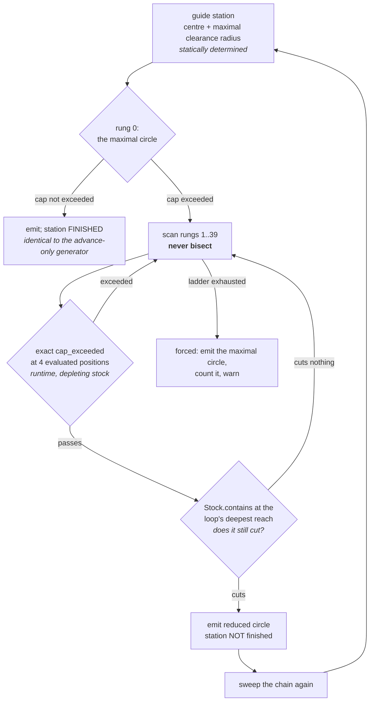

# Radius-Regulated Trochoidal Toolpath

`compas_cgal.engagement_radial_toolpath.radius_regulated_toolpath` adds a second regulated knob to
the advance regulation of [`engagement_controlled_toolpath`](engagement_controlled_toolpath.md): the
loop radius, chosen at each station by a **ladder search** over the same exact `cap_exceeded`
predicate. Measured on the 20x12 reference pocket with a 2 mm tool it **cuts the number of cut
motions demonstrated to exceed the cap by 1.9x to 3.0x** at every cap the advance regulation alone
cannot meet, at a **10% generation cost at a loose cap** and reproducing the advance-only
generator's operation stream byte-for-byte when the cap is loose enough that the ladder never leaves
its top rung.

It does **not** deliver the headline the knob was expected to buy. The worst loop engagement away
from the chain entries stays pinned at 125.0 deg for caps of 40 and 60 deg and 123.7 deg at 80 —
the same saturation the advance-only generator shows. The section
[below](#the-negative-result-the-worst-loop-does-not-track-the-cap) says exactly why, with the
decomposition that proves it, because that finding is worth more than the improvement.

!!! warning "What is guaranteed, and what is not"

    Engagement `<= tea_cap_deg`, decided by an exact predicate, **at each evaluated tool position**.

    That is the whole claim, and it is the same claim the advance-only generator makes — no more. It
    is **not** a continuous guarantee between evaluated positions. **No certificate is produced or
    returned**, and no `MotionWitness` / `CapRefutation` object exists on this path. The bridge cuts
    between machining circles are not regulated at all, by either generator. Chain-entry loops are a
    full slot by construction and are counted and warned about, never hidden.

## Engagement is not monotone in the loop radius

This is the finding that determines the algorithm. Measured at one mid-path station of the 20x12
pocket (centre 14.0, 6.0; 2 mm tool; stock depleted by three maximal loops one guide step apart
immediately behind it), the peak engagement over the loop as the radius shrinks:

| rung | 0 | 1 | 2 | ... | 7 | **8** | 9 | 10 | ... | 15 | ... | 23 |
| --- | ---: | ---: | ---: | ---: | ---: | ---: | ---: | ---: | ---: | ---: | ---: | ---: |
| radius | 4.998 | 4.948 | 4.898 | | 4.648 | **4.598** | 4.548 | 4.498 | | 4.248 | | 3.848 |
| peak TEA (deg) | 128.8 | 121.8 | 114.5 | | 69.2 | **59.3** | 67.8 | 75.5 | | 107.8 | | 150.9 |

Engagement falls to a minimum in the middle of the ladder and **rises again below it**. At a 60 deg
cap the admissible rungs are therefore a narrow band with refusals on both sides: the admissible set
is **not an up-set in the rung index**, and a bisection — which is correct only on an up-set —
reports no admissible rung at all, forcing the maximal circle at 128.8 deg where the scan finds one
at 59.3 deg.

!!! danger "Never bisect the radius ladder"

    `_largest_admissible_radius` **scans** from rung 0 downward and returns the first rung that
    passes. That is the largest admissible radius under *any* pass/fail pattern, where a bisection is
    correct only under one. `tests/test_engagement_radial_toolpath.py::test_engagement_is_not_monotone_in_the_loop_radius`
    runs a bisection beside the scan on this state and asserts they disagree, so the assumption
    cannot be reintroduced silently.

This is the **second** instance of the same structure in this repository. Spacing does not order
engagement either — see `benchmarks/figure6.py`, "Spacing does not order engagement", which is why
the constant-spacing baseline is a minimum over a brute-force sweep rather than a bisection.

## How a radius is chosen



A rung is admissible on **two** exact conditions, and both are load-bearing:

1. **no evaluated position exceeds the cap** — the same `_stock_2.engagement_at` verdict, at the same
   four positions, that the advance-only generator uses; and
2. **some evaluated position still reaches uncut stock** — `Stock.contains` at the loop's deepest
   reach, the tool centre pushed one tool radius outward along the ray from the station centre.

### Why condition 2 exists

Condition 1 alone is a trap, and it was found by measurement rather than by inspection. In the steady
trochoidal regime the material a loop meets is a crescent at its **outer** rim, so a loop drawn
inward is not a lighter cut — it is **no** cut: it spins inside the annulus its predecessors already
swept, engages nothing, and therefore exceeds nothing. A scan that takes the largest such loop never
moves the frontier, so the next station admits a still smaller loop, and the ladder walks itself to
the bottom one rung per station before falling back on the maximal circle in virgin stock.

Measured on a 10x6 pocket at a 40 deg cap, that produced this sequence — radius collapsing one rung
per station and then a 360 deg circle the advance-only generator never emits:

```text
op 77   CIRCLE r=0.0980 c=(4.900,3.000)
op 78   LINE   (4.900,3.098)->(4.950,3.048)
op 79   CIRCLE r=0.0480 c=(4.950,3.000)      <- ladder bottom
op 80   LINE   (4.950,3.048)->(5.000,4.998)  <- TEA 180.1
op 81   CIRCLE r=1.9980 c=(5.000,3.000)      <- TEA 360.0, forced maximal circle
```

`tests/test_engagement_radial_toolpath.py::test_no_machining_circle_away_from_a_chain_entry_is_a_full_slot`
pins the repair.

## The negative result: the worst loop does not track the cap

The hypothesis under test was that the worst loop engagement away from the chain entries would fall
towards the requested cap once the radius became a regulated variable. **It does not.** On the 20x12
reference pocket, 2 mm tool, engagement measured after each chain's virgin-stock entry cut:

| cap (deg) | max loop TEA, advance-only | max loop TEA, radius-regulated | exceeding cut motions, advance-only | exceeding cut motions, radius-regulated | length, advance-only | length, radius-regulated |
| ---: | ---: | ---: | ---: | ---: | ---: | ---: |
| 40 | 125.01 | 125.01 | 152 | **80** | 5768.1 | 5810.7 |
| 60 | 125.01 | 125.01 | 84 | **32** | 3106.0 | 3243.4 |
| 80 | 125.01 | 123.68 | 48 | **16** | 2155.7 | 2343.2 |
| 100 | 108.73 | 108.73 | 8 | 8 | 1294.5 | 1294.5 |
| 120 | 114.53 | 114.53 | 0 | 0 | 1077.3 | 1077.3 |

"Exceeding cut motions" is `benchmarks.exceedance` — motions where the exact predicate actually
fired, a sampled **lower bound**, never a certificate.

### Why it does not track — the decomposition

Grouping the same paths' loops by radius shows where the 125 deg lives. At a 60 deg cap:

| loop radius | count | max TEA (deg) | what this is |
| ---: | ---: | ---: | --- |
| 4.998 | 84 | 56.39 | central chain at full clearance — **already under the cap in both generators** |
| 2.139 | 4 | 87.43 | corner spoke, mid-clearance |
| 0.124 | 4 | 60.62 | corner spoke, near the apex |
| **0.057** | 4 | **125.01** | corner spoke **at the apex** — clearance barely exceeds the tool radius |

The pinned maximum is a corner-spoke station whose clearance-derived radius is 0.057 mm against a
1.0 mm tool radius. The loop is a near-point; the tool is wedged into the corner apex with material
on every side. Its ladder has **one rung** — rung 1 would be negative — so there is no radius to
choose. This is geometry, not a control failure: no loop radius exists there that engages less.

The same decomposition shows the improvement is real where a radius choice exists: the radial
generator emits 4.574, 3.198 and 1.822 on the corner spokes at an 80 deg cap where the advance-only
generator emits 3.833, 2.457 and 1.080, and the exceedance count drops 48 to 16.

### The residual over-cap circles are all forced ones

Every machining circle the audit measures over the cap sits at a station's **maximal** radius — never
at a reduced one the ladder chose. On a 6x4 pocket at a 40 deg cap the generator reports 34 forced
circles and the audit measures exactly 34 over the cap, all at radius 0.998. On 10x6 it reports 68
forced and the audit measures 72, all at radius 1.398 or 1.998; the four-circle gap is the audit's
twenty stations per circle finding what the generator's four did not, which is a property the
advance-only generator shares and which the radius knob cannot touch.
`test_tight_cap_regulates_the_radius_and_leaves_fewer_circles_over_the_cap` asserts that no *reduced*
circle is ever measured over the cap.

The consequence for anyone extending this: **the radius knob is spent.** The binding constraints are
now the guide's own clearance profile at corner apexes and the unregulated bridge cuts, whose worst
engagement (141.8 deg) is unchanged by anything in this module.

## Why more passes, and why the path gets longer

A loop smaller than its station's maximum sweeps a narrower annulus, leaving that station's outer
band uncut. The chain is therefore walked **repeatedly**, and a station is finished only once its
**maximal** circle has been emitted — which is exactly what the unregulated walk does on its first
and only pass. Tighter caps force smaller first loops, hence more passes, hence longer paths. On the
20x12 pocket that shows as 9 plunges over 5 chains at caps of 40 to 80 against 5 at 100 and 120, and
as the length column rising 1077 → 5811 as the cap tightens.

Termination is **structural, not budgeted**: `_radius_ladder` offers a station only radii strictly
above the largest it has already emitted, so each emission climbs at least one rung of a 40-rung
ladder, and a pass that emits nothing ends the chain. That argument bounds the passes by
`stations x rungs`, which is finite but useless as a guard, so `MAX_RADIAL_SWEEPS_PER_CHAIN` is an
empirical budget on top of it and it **raises** rather than truncating a chain, because a truncated
chain is unmachined material presented as a finished toolpath. Measured over 6x4, 10x6, 12x8 and
20x12 pockets at caps from 20 to 170 deg, **no chain ever needed more than two passes**; the budget
is 40.

Stations the advance search **jumped over** are marked finished too, on `MAX_ADVANCE_TOOL_DIAMETERS`'
own coverage argument: two maximal circles no more than a tool diameter apart sweep overlapping
annuli. That argument only holds behind a maximal circle, so after a **reduced** one the walk
advances a single station and marks nothing finished.

## Evidence table

| Claim | Value | Source |
| --- | --- | --- |
| Ladder spacing | `D/40 = r/20`, the advance grid's own step | `RADIUS_LADDER_STEP_TOOL_DIAMETERS` |
| Ladder span | one tool diameter (TEA saturates at `ae = 2r`) | `RADIUS_LADDER_SPAN_TOOL_DIAMETERS` |
| Rungs | 40 | `RADIUS_LADDER_RUNGS` |
| Non-monotone in radius | 128.8 → 59.3 → 150.9 deg down one ladder | `test_engagement_is_not_monotone_in_the_loop_radius` |
| Bisection is unsound here | returns no rung where the scan returns rung 8 | same test, `_bisect_rung` beside the scan |
| Loose cap reproduces the advance-only stream | byte-identical operation signature, 6x4 at 120 deg | `test_loose_cap_reproduces_the_advance_only_generator` |
| Exceeding cut motions, 20x12 | 152→80, 84→32, 48→16 at caps 40/60/80 | `benchmarks.exceedance.exceedance_positions` |
| Max loop TEA, 20x12 | unchanged at 125.01 deg for caps 40 and 60 | `audit_toolpath_engagement` at 20 stations per circle |
| Generation, 12x8, cap 120 | 77.9 ms against 70.6 ms (best of five) | `time.perf_counter` around each generator |
| Generation, 12x8, cap 40 | 691.6 ms against 414.2 ms | same |
| Coverage, 6x4 and 10x6, caps 40/60/120 | zero uncleared grid points, both generators | `Stock.contains` grid, wall distance > tool radius |

## Rejected alternatives

**Uniform-ring probing for reduced circles.** The `LOOP_PROBE_ANGLES_DEG` triple is derived for a
*maximal* circle in the steady regime, where material is a crescent about the advance direction; a
reduced circle sits inside its station's clearance disk where material can lie on any side, so the
derivation does not reach it. Deciding reduced rungs on a uniform 12-position ring instead was
implemented and measured: on 6x4 and 10x6 pockets at a 40 deg cap it changed **neither the emitted
path nor the audited over-cap count by a single circle**, while generation cost rose 7x (419 ms to
2924 ms on a 12x8 pocket at a 40 deg cap). Removed on that evidence. The derivation gap is real and
unclosed; what is measured is that on these pockets it does not bind, because every circle the audit
finds over the cap is one the generator already reports as forced.

**A flag on `engagement_controlled_toolpath`.** The two generators do not differ by a parameter: this
one emits several passes per skeleton chain and plunges and retracts once per pass. A boolean that
silently multiplied the number of passes in the returned operation stream would be a worse API than a
separate name. `engagement_controlled_toolpath` is untouched, and its emitted stream is byte-identical
before and after this work (verified by SHA-256 over the operation signature on four pocket/cap
combinations).

**Bisecting the radius ladder.** Rejected on the measurement at the top of this page, not on taste.

## Where the code lives

| Symbol | File | What it owns |
| --- | --- | --- |
| `radius_regulated_toolpath` | `src/compas_cgal/engagement_radial_toolpath.py` | The public entry point and its parameter contract |
| `_largest_admissible_radius` | same | The ladder **scan**, and the two admissibility conditions |
| `_loop_reaches_material` | same | "Does this loop still cut anything", by exact point location |
| `_radial_sweep` | same | One pass over a chain, and the FINISHED bookkeeping |
| `_machine_chain_radially` | same | The pass loop, the inter-pass `LINK`, and the budget |
| `_Regulation` | `src/compas_cgal/engagement_toolpath.py` | The validated parameter seam both generators share |
| Tests | `tests/test_engagement_radial_toolpath.py` | The non-monotonicity pin, the full-slot regression, coverage |
