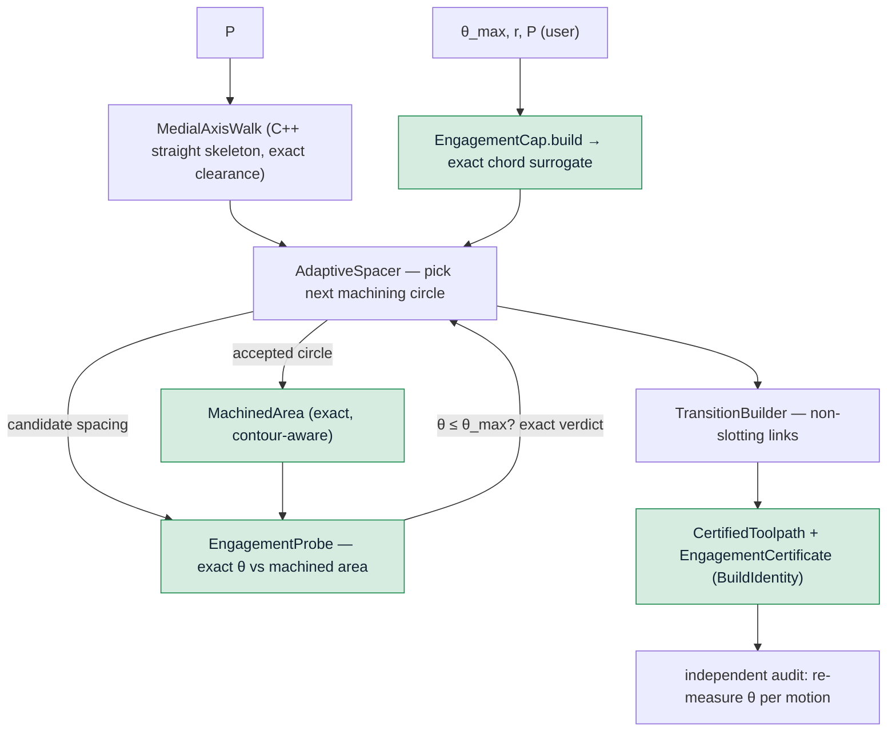

# Exact-certified adaptive trochoidal-MAT — design spec (Phase 1)

We re-derive Held & Pfeiffer's 2025 engagement-controlled trochoidal pocketing on an
**exact** kernel and attach a **certificate**. The user sets a maximum tool-engagement
angle θ_max; the generator spaces the medial-axis machining circles so that the exact
engagement angle never exceeds θ_max, and returns — alongside the path — a verifiable
proof that it holds on every cutting motion. Held *asserts* the bound (float bisection to
ε=0.001, a conservative reduction at necks); we *prove* it, and the exactness lets us pack
to the limit rather than short of it.

This is a strict improvement on both the state of the art (Held: same contract, stronger
guarantee) and our own generator (whose knob is `stepover`, a geometric proxy — this one's
knob is the physical quantity, engagement).

## Contract

- **Input:** a pocket `P` (outer boundary + holes, circle-segment general polygon), a tool
  radius `r`, a maximum engagement angle `θ_max ∈ (0, π]`.
- **Output:** a `CertifiedToolpath` = an ordered trochoidal-MAT toolpath **plus** an
  `EngagementCertificate` proving `θ(m) ≤ θ_max` for every cutting motion `m`, both stamped
  with a content-addressed `BuildIdentity`.
- **Guarantee (the product):** on the returned path, the exact tool-engagement angle — the
  angular measure of the tool/material contact arc, measured *contour-aware* against the
  area already machined — is `≤ θ_max` everywhere a cut occurs. Certified, not asserted.
- **Non-guarantee (honest):** θ_max is enforced against an exact **rational surrogate**
  `4·sin²(θ_max/2)` injected once at the API boundary (existing kernel contract,
  `docs/exactness.md`); the sub-ulp gap between the surrogate and the transcendental angle
  is documented API semantics, never an in-core correction.

## Non-goals (Phase 1)

Elliptic-arc returns (Phase 2 — reduces Held's ~50% air); climb milling; multi-tool
roughing/finishing; 3D/stepdown; feed scheduling. Deferred with reason, not forgotten.

## Architecture

A Python orchestrator over the exact CGAL kernel, decomposed so each unit has one
responsibility, a typed interface, and can be tested against its own oracle. Nothing
reaches into another unit's internals.

### Units carry meaning at the type level

No bare floats with "in mm" comments. A minimal typed vocabulary (all `NewType` /
frozen dataclass, validated by factories):

- `Millimetre = NewType("Millimetre", float)`, `Radian = NewType("Radian", float)`.
- `ToolRadius`, `Clearance`, `TrochoidRadius`, `Spacing` — each a frozen dataclass over
  `Millimetre` with a `.build(...)` factory that rejects ≤ 0 / NaN.
- `EngagementCap` — a frozen dataclass holding `theta: Radian` **and** its exact rational
  surrogate `chord_ratio` (the `4·sin²(θ/2)` the kernel consumes). `EngagementCap.build`
  validates `θ ∈ (0, π]` and computes the surrogate at that one boundary; downstream code
  never re-derives it.
- `MachiningCircle` — center (exact `Point_2` for decisions; `(x,y)` doubles for
  reporting), `TrochoidRadius`, orientation.

`mypy --strict` is the gate; the unit-typing claims are aspirational without it.

### Components

1. **`EngagementCap` (boundary):** the one place the user's angle becomes the exact
   surrogate. Owns the range invariant.
2. **`MedialAxisWalk` (new C++ binding, moderate):** exposes the existing
   `toolpath.cpp` straight-skeleton walk as an ordered stream of stations — center, **exact
   boundary clearance**, derived trochoid radius. One job: "give me the MAT walk with exact
   clearance." We reuse the skeleton + clearance we already compute; we only surface it.
3. **`MachinedArea` (exact, contour-aware):** the area cleared so far, as an exact
   representation the `EngagementProbe` can query. Two implementations behind one interface:
   - *Phase 1:* the existing `Stock2` general-polygon-set, depleted per accepted circle
     (correct, exact, reuses everything). Perf-bounded by boolean depletion.
   - *Phase 1.5:* an exact **sorted circular-arc contour** (Held §3.1: the boundary of a
     union of disks is a CCW-sorted arc sequence, updated in work linear in #circles),
     carrying one-root coordinates and our exact predicates. Removes the O(n²) depletion so
     it runs at Held's scale. Same interface — swappable, contract-tested identical.
4. **`EngagementProbe` (exact decision):** given a candidate `MachiningCircle` and the
   `MachinedArea`, returns the **exact** verdict `θ ≤ θ_max` (the tool's max contact-arc
   angle as it sweeps the circle, contour-aware). Reuses the exact predicate machinery from
   `engagement_2.cpp` (`sign_mixed_radical`, `run_exceeds_cap`) — Held's Eq-7 replaced by an
   exact one-root computation. This is the deciding half: exact, no float θ, no ε.
5. **`AdaptiveSpacer` (the core loop):** walk the stations; from the previous center, find
   the **largest** spacing whose candidate circle satisfies the exact `θ ≤ θ_max` verdict
   (monotone: θ grows with spacing → search on the exact boolean). Neck-aware: where the
   exact clearance field marks a bottleneck, lower the effective cap (Held §3.2, off the
   exact Voronoi/clearance, not a heuristic). Emits accepted `MachiningCircle`s + records
   each circle's certificate witness. Held's §2.4, exact.
6. **`TransitionBuilder`:** link consecutive circles over **already-cleared** material, not
   through fresh stock — kills the measured 259° slotting of naïve links. Raises rather than
   emits a gouging transition.
7. **`EngagementCertificate` (the moat):** the exact proof — per cutting motion, the
   certified `θ ≤ θ_max` witness — bound to a `BuildIdentity` = SHA of (pocket geometry, r,
   θ_max surrogate, generator version). Reproducibility is structural: same identity ⇒ same
   certified path.

### Deciding / reporting split (load-bearing)

- **DECISIONS (exact):** every spacing acceptance and every certificate entry is an exact
  predicate on exact one-root quantities via the `EngagementProbe`. No `to_double` feeds a
  decision. No epsilon, no ulp-nudge, no deflation in the spacing loop.
- **REPORTING (doubles):** station positions, chosen spacings, path length, the engagement
  *distribution* for the scorecard — `to_double`, never fed back into a decision.

The spacing *search* is a bisection over a `Spacing` (a double search parameter); the
`θ ≤ θ_max` verdict at each probed spacing is exact, so the accepted circle carries an
exact certificate at whatever spacing the search lands on. We are at least as tight as
Held (his θ itself is float), and exactly certified regardless of search resolution.

## Error model (one named exception per failure mode)

- `PocketNotMachinableError` — a feature narrower than the tool; the machinable-area
  transform (offset r±ε) leaves the region empty.
- `EngagementCapInfeasibleError` — even the minimum non-degenerate spacing exceeds θ_max
  somewhere it cannot be reduced; θ_max is physically too small for this tool/pocket.
- `NeckTooTightError(width, cap)` — a bottleneck where the reduced cap is still exceeded at
  minimal spacing; carries the neck width and the cap for a fixable message.
- `TransitionGougeError` — no non-slotting link exists between two circles; surfaces the
  pair.
- `DegenerateMedialAxisError` — the straight skeleton is degenerate for the input.

Never a bare `raise ValueError`.

## Acceptance — infrastructure is the deliverable

The generator's certificate is a *claim*; acceptance is an **independent** confirmation.

- **Differential certificate oracle:** generate at θ_max, then re-measure engagement per
  cutting motion with the *independent* auditor (`audit_toolpath_engagement`, contour-aware
  against a freshly depleted stock, Held's convention — cutting arcs only, entry excluded).
  Two paths through the kernel must agree: **no cutting motion exceeds θ_max.** A single
  violation fails the build.
- **Ablation (proves the mechanism):** adaptive spacing OFF (fixed stepover) reproduces the
  measured tail (~15% of cutting arcs > 120° at a 120° cap); ON drives it to **0%**. The
  ablation is a committed test, not a footnote.
- **Held-pocket target:** on the vector-exact Fig-5 pocket, θ_max = 80° ⇒ certified, and
  path length ≤ our fixed-stepover baseline at the same guaranteed angle (tight packing).
  Full-pocket run requires the Phase-1.5 contour (Phase-1 demonstrates on a tractable
  pocket; sim-only success is not success, so the Held-scale run is a named Phase-1.5 exit).
- **Scorecard regression:** the eleven Held metrics (`held-2025` memory) tracked as a
  committed report; WIN/MATCH/MOAT must not regress.

## Phasing (honest scope)

- **Phase 1 — correctness core.** `EngagementCap`, `MedialAxisWalk`, `MachinedArea(Stock2)`,
  `EngagementProbe`, `AdaptiveSpacer`, `TransitionBuilder`, `EngagementCertificate`, the
  differential oracle + ablation. Demonstrated on a tractable pocket: user sets θ_max ⇒
  certified path, tail eliminated. TDD, one certified circle at a time.
- **Phase 1.5 — Held-scale.** Swap `MachinedArea` to the exact sorted-arc contour (linear
  update) so it runs on Fig-5 at Held's tool ratio and speed. Same interface, contract-test
  identical to the `Stock2` implementation on small inputs before switching.
- **Phase 2 — elliptic returns.** Trim the ~50% air; certified cutting arc unchanged.

## Risks

- **Depletion cost** (Phase 1 `Stock2`) is the SP2 O(n²) bottleneck — bounds Phase-1 to
  tractable pockets; retired by the Phase-1.5 contour. Named, not hidden.
- **θ monotonicity in spacing** underpins the bisection; if a geometry violates it (a
  newborn contact mid-search), the search must fall back to a scan — a contract test forces
  the monotonic assumption to be checked, not assumed.
- **Transition routing** on branchy pockets is the least-specified unit; it gets its own
  oracle (no link crosses uncleared stock).

## What we reuse vs build

Reuse: the CGAL straight-skeleton medial axis + exact clearance (`toolpath.cpp`); the exact
one-root predicate machinery (`engagement_2.cpp`); the differential auditor
(`engagement.py`); the (now ~5× faster) zone engagement query. Build: the `MedialAxisWalk`
exposure, the exact `MachinedArea` contour, the `AdaptiveSpacer`, the `TransitionBuilder`,
the `EngagementCertificate` + `BuildIdentity`, and the typed vocabulary — as focused,
single-responsibility Python modules over the kernel.
