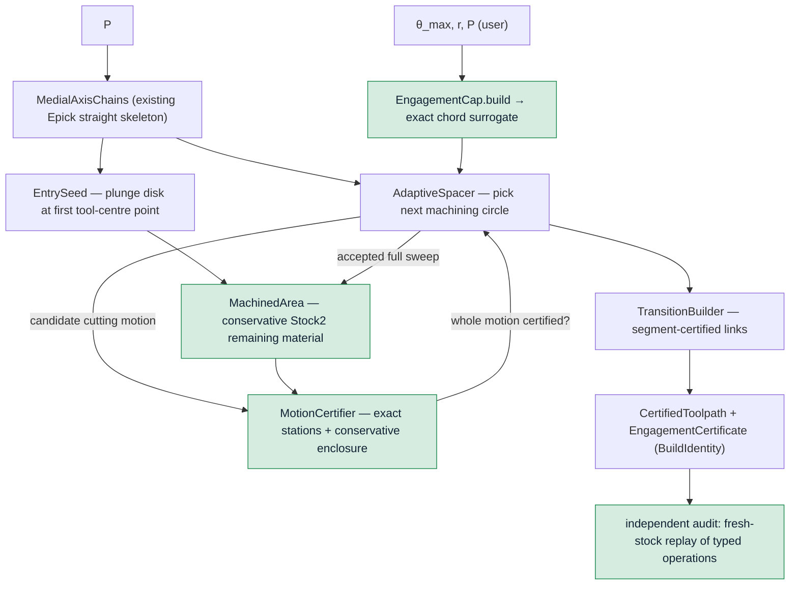

# Exact-certified adaptive trochoidal-MAT — design spec (Phase 1)

We re-derive Held & Pfeiffer's 2025 engagement-controlled trochoidal pocketing on the
repository's existing **exact engagement kernel** and attach a replay-verifiable
**certificate**. The user sets a maximum tool-engagement angle θ_max; the generator
spaces medial-axis machining circles so that every emitted cutting motion is certified
against θ_max before it changes the stock state.

CGAL supplies the geometric truth: `Stock2` maintains the conservative remaining-stock
set with Epeck and `Gps_circle_segment_traits_2`; `engagement_at` constructs and merges
contact runs on one-root points and decides the squared-chord cap exactly. The motion
certifiers extend those exact station predicates over a continuous line or arc with the
repository's proved growth and gap-closure guard. Python orchestrates those certified
operations; it does not reimplement the kernel.

## Contract

- **Input:** a pocket `P` (outer boundary + holes, circle-segment general polygon), a tool
  radius `r`, a maximum engagement angle `θ_max ∈ (0, π]`.
- **Output:** a `CertifiedToolpath` = an ordered `ToolpathResult` **plus** an
  `EngagementCertificate` with one `MotionWitness` per cutting motion. The path and
  certificate share a content-addressed `BuildIdentity`.
- **Guarantee (the product):** on the returned path, the exact tool-engagement angle — the
  angular measure of the tool/material contact arc, measured *contour-aware* against the
  area already machined — is `≤ θ_max` everywhere a cut occurs. Certified, not asserted.
- **Certificate semantics:** the exact statement is about the rationalised path coordinates
  and rational squared-chord cap received by the Epeck boundary. A continuous motion
  certifies only when exact station predicates plus the analytic enclosure prove the whole
  motion; an unclosable guard margin fails loudly.
- **Entry semantics:** a vertical plunge creates one tool-radius seed disk and is governed
  by plunge-load policy, not the lateral TEA cap, matching `audit_toolpath_engagement`.
  Every subsequent lateral circle, arc and cut-height link is certified against the stock
  state produced by that seed and all previously accepted motions.
- **Non-guarantee (honest):** θ_max is enforced against an exact **rational surrogate**
  `4·sin²(θ_max/2)` injected once at the API boundary (existing kernel contract,
  `docs/exactness.md`); the sub-ulp gap between the surrogate and the transcendental angle
  is documented API semantics, never an in-core correction.

## Non-goals (Phase 1)

An event-exact symbolic maximiser for engagement over the motion parameter; elliptic-arc
returns (Phase 2 — reduces Held's ~50% air); climb milling; multi-tool roughing/finishing;
3D/stepdown; feed scheduling. The conservative motion certificate proves the cap without
claiming to symbolically compute the continuous maximum angle.

## Architecture

A Python orchestrator over the exact CGAL kernel, decomposed so each unit has one
responsibility, a typed interface, and can be tested against its own oracle. Nothing
reaches into another unit's internals.

### Units carry meaning at the type level

No bare dimensional floats with "in mm" comments. A minimal typed vocabulary
(`NewType` plus frozen dataclasses validated by factories):

- `Millimetre = NewType("Millimetre", float)`, `Radian = NewType("Radian", float)`.
- `ToolRadius`, `Clearance`, `TrochoidRadius`, `Spacing` — each a frozen dataclass over
  `Millimetre` with a `.build(...)` factory that rejects ≤ 0 / NaN.
- `Point2[FrameT]` carries the coordinate frame at the type level; Phase 1 uses the
  zero-field marker `WorldXY`.
- `EngagementCap` — a frozen dataclass holding `theta: Radian` **and** its exact rational
  surrogate `chord_ratio` (the `4·sin²(θ/2)` the kernel consumes). `EngagementCap.build`
  validates `θ ∈ (0, π]` and computes the surrogate at that one boundary; downstream code
  never re-derives it.
- `MachiningCircle` — `Point2[WorldXY]`, `ToolRadius`, `TrochoidRadius`, orientation.
  Its binary-double coordinates are proposal/output values; the certifier injects those
  values exactly as rationals before any engagement decision.

`mypy --strict` is the gate; the unit-typing claims are aspirational without it.

### Components

1. **`EngagementCap` (boundary):** the one place the user's angle becomes the exact
   squared-chord surrogate. Owns the range invariant.
2. **`MedialAxisChains` (new C++ exposure, moderate):** exposes the existing
   `toolpath.cpp` straight-skeleton chains without flattening branch topology. Stations
   carry their Epick-computed center, reporting clearance and guide radius as proposal
   data, plus a discrete neck flag decided with the kernel's squared-distance comparison
   against the declared neck threshold. No certificate depends on calling reporting
   clearance "exact": the actual circle and link coordinates are exact-injected and
   certified downstream.
3. **`MachinedArea` (conservative, contour-aware):** the remaining material queried by
   the motion certifier. Two implementations live behind one interface:
   - *Phase 1:* existing `Stock2`, depleted with `subtract_arc_sweep` for a complete
     machining circle and `subtract_capsule` for a link. Each removal is a union of exact
     disks that **under-covers** the mathematical sweep, so the retained stock is a
     conservative superset of real remaining material. Certification against it can refuse
     a safe motion but cannot hide material or false-pass engagement.
   - *Phase 1.5:* an exact **sorted circular-arc contour** (Held §3.1: the boundary of a
     union of disks is a CCW-sorted arc sequence, updated in work linear in #circles),
     carrying one-root coordinates and our exact predicates. Removes the O(n²) depletion so
     it runs at Held's scale. Same interface and safety contract; it may certify motions
     that the Phase-1 conservative under-cover model refuses.
4. **`EntrySeed` (explicit initial condition):** emits one typed vertical `PLUNGE` at the
   canonical start point and depletes exactly one tool disk. The entry is recorded in the
   path identity and audit but is not represented as a zero-TEA lateral cut. If no
   machining circle can certify from that seed at the minimum guide radius, generation
   raises `EngagementCapInfeasibleError`.
5. **`MotionCertifier` (proof boundary):**
   - Lines call existing `_stock_2.certify_segment_tea`.
   - Arcs and circles call a public, typed refactor of the existing guarded
     `_certify_arc_engagement`. Exact `engagement_at(...).cap_exceeded` predicates decide
     every station. The analytic growth guard and gap-closure pessimism enclose the
     between-station motion; doubles only select a stricter threshold/refinement density.
   - Returns a `MotionWitness`, never a bare sampled-angle comparison.
6. **`AdaptiveSpacer` (core loop):** walks each medial-axis chain and considers a
   deterministic, finite refinement of candidate stations and guide radii bounded by the
   station's geometric radius. It evaluates every candidate pair in the current forward
   window and chooses the furthest, then largest-radius, pair whose whole machining circle
   certifies. This is the lexicographically tightest certified candidate at the declared
   spatial/radius resolution; it assumes neither monotonic engagement in spacing nor a
   feasible full station radius. The first circle must certify against the entry seed; each
   accepted full circle is then depleted from `MachinedArea`. At a kernel-classified neck,
   a named `NeckPolicy` lowers the effective cap by a fixed validated factor before
   regenerating its squared-chord surrogate. The effective cap can never exceed the user
   cap; an infeasible reduced cap raises `NeckTooTightError`.
7. **`TransitionBuilder`:** constructs the direct link between consecutive circle
   endpoints and calls the segment motion certifier against the current stock. An
   uncertified link raises `TransitionEngagementError`; it is never silently emitted or
   converted to an unverified alternate path. The accepted link is then depleted.
8. **`EngagementCertificate` (replay-verifiable artifact):** carries one immutable
   `MotionWitness` per cutting motion and a `BuildIdentity`. The identity hashes canonical
   IEEE-754 input bytes, the exact cap-surrogate bytes, the canonical typed-operation
   stream, candidate-resolution policy, generator version and certifier/stock component
   versions. No rounded geometry enters identity. Independent replay remains the acceptance
   authority. Each witness records the operation index and kind, cap-surrogate bytes,
   certifier strategy version, station count and exact-predicate verdict.

### Deciding / reporting split (load-bearing)

- **DECISIONS (exact):** every motion acceptance and every certificate verdict terminates
  in the exact one-root cap predicate. No reported `max_tea`, epsilon, ulp-nudge or
  deflation feeds acceptance.
- **REFINEMENT (conservative doubles):** the analytic growth lemma selects station density
  and a stricter guarded cap. Too much guard produces more refinement or an uncertified
  motion; it cannot manufacture a certificate.
- **PROPOSAL/REPORTING (doubles):** medial-axis stations, candidate spacing, path length and
  engagement distributions. Proposal values may influence which path is tried; only the
  exact motion certificate can admit that path.

The generator does not need the symbolic exact maximum of engagement over a motion. It
needs a sound proof that the exact maximum cannot cross the cap. Exact station predicates
plus the conservative enclosure provide precisely that statement, with refusal at the
refinement floor as the safe failure direction.

### Conservative-stock induction

Let `S_i` be real remaining material before motion `i`, `Ŝ_i` the modeled `Stock2`
material, `W_i` the real swept region and `U_i` the certified disk-chain
under-cover. Initially `S_0 = Ŝ_0`, and `U_i ⊆ W_i`. Therefore:

`S_(i+1) = S_i \ W_i ⊆ Ŝ_i \ U_i = Ŝ_(i+1)`.

By induction, modeled material contains all real material before every motion. On a fixed
cutter rim, adding material can only extend an engaged run or connect multiple runs; it
cannot shorten the largest connected run. Thus the exact cap predicate evaluated on `Ŝ_i`
is conservative for `S_i`. The implementation test suite must exercise both premises:
disk-chain under-coverage and cap-verdict monotonicity under stock inclusion.

## Error model (one named exception per failure mode)

- `PocketNotMachinableError` — the existing medial-axis/tool-fit construction produces no
  chain on which the cutter can be placed.
- `EntrySeedError` — the medial-axis chain supplies no valid canonical plunge point.
- `EngagementCapInfeasibleError` — even the minimum non-degenerate spacing exceeds θ_max
  somewhere it cannot be reduced; θ_max is physically too small for this tool/pocket.
- `NeckTooTightError(width, cap)` — a bottleneck where the reduced cap is still exceeded at
  minimal spacing; carries the neck width and the cap for a fixable message.
- `TransitionEngagementError` — the direct cutting link between two circles cannot be
  certified; carries both circle identities and the attempted cap.
- `DegenerateMedialAxisError` — the straight skeleton is degenerate for the input.
- `UnclosableMotionCertificateError` — refinement reaches its declared floor without
  proving a motion; distinct from a proved cap violation.

Never a bare `raise ValueError`.

## Acceptance — infrastructure is the deliverable

The generator's certificate is a *claim*; acceptance is an **independent** confirmation.

- **Differential certificate oracle:** generate at θ_max, convert the generated typed
  operations to `ToolpathResult`, then call `audit_toolpath_engagement` against fresh
  `Stock2`. Acceptance reads only each operation's `cap_certified` boolean; reported
  `max_tea` is diagnostic and never compared with an epsilon. Generator replay and auditor
  replay must agree that **every cutting motion certifies**.
- **Ablation (proves the mechanism):** adaptive spacing OFF (fixed stepover) reproduces the
  engagement tail while adaptive spacing drives it to **0 certified violations** on the
  same committed fixture. The test requires a nonzero fixed-stepover tail; the measured
  ~15% value belongs in the benchmark report rather than a brittle exact-count assertion.
  The fixed-stepover comparator is executed in the committed test; a comment is not an
  ablation.
- **Mutation guards:** removing the arc growth guard, the gap-closure surrogate, full-circle
  sweep depletion or fresh-stock replay makes a named test fail while benign preservation
  cases remain green.
- **Held-pocket target:** on the vector-exact Fig-5 pocket, θ_max = 80° ⇒ certified, and
  path length ≤ our fixed-stepover baseline at the same guaranteed angle (tight packing).
  Full-pocket run requires the Phase-1.5 contour (Phase-1 demonstrates on a tractable
  pocket; sim-only success is not success, so the Held-scale run is a named Phase-1.5 exit).
- **Scorecard regression:** the eleven Held metrics (`held-2025` memory) tracked as a
  committed report; WIN/MATCH/MOAT must not regress.

The differential oracle is independent at the generator-orchestration and stock-replay
levels: it reconstructs state from the emitted operation stream instead of trusting the
generator's witnesses. It intentionally shares the exact engagement kernel and motion
certifiers. Kernel/certifier defects are therefore outside the differential oracle's
independence boundary and are covered by their existing exact-reference, degeneracy,
gap-closure and mutation tests.

## Phasing (honest scope)

- **Phase 1 — correctness core.** `EngagementCap`, `MedialAxisChains`,
  `MachinedArea(Stock2)`, `MotionCertifier`, `AdaptiveSpacer`, `TransitionBuilder`,
  `EngagementCertificate`, the differential oracle + ablation. Demonstrated on a tractable
  pocket: user sets θ_max ⇒ every emitted cutting motion certifies and the fixed-stepover
  tail is eliminated. TDD, one certified motion at a time.
- **Phase 1.5 — Held-scale.** Swap `MachinedArea` to the exact sorted-arc contour (linear
  update) so it runs on Fig-5 at Held's tool ratio and speed. Same interface, contract-test
  identical to the `Stock2` implementation on small inputs before switching.
- **Phase 2 — elliptic returns.** Trim the ~50% air; certified cutting arc unchanged.

## Risks

- **Depletion cost** (Phase 1 `Stock2`) is the SP2 O(n²) bottleneck — bounds Phase-1 to
  tractable pockets; retired by the Phase-1.5 contour. Named, not hidden.
- **Candidate density:** Phase 1 exhaustively evaluates a finite refined candidate window;
  tighter spatial resolution costs more exact queries but never changes soundness.
- **Conservative depletion:** disk-chain under-coverage can overstate later engagement and
  reject feasible motions. That is a performance/completeness limit, not a false-pass risk.
- **Transition routing:** Phase 1 tries one direct, segment-certified cutting link and fails
  loudly if it cannot certify. Multi-route cleared-corridor planning is later work.

## What we reuse vs build

Reuse unchanged: the CGAL straight-skeleton generator (`toolpath.cpp`); `Stock2` and its
certified under-covering sweeps; exact one-root engagement predicates and
`certify_segment_tea` (`engagement_2.cpp`); the guarded circular-motion proof already in
`engagement.py`; the fresh-stock differential auditor. Build: chain/station exposure, a
public typed circular-motion certificate, the adaptive candidate orchestrator, certified
transitions, `EngagementCertificate` + `BuildIdentity`, and the frame/unit vocabulary.
