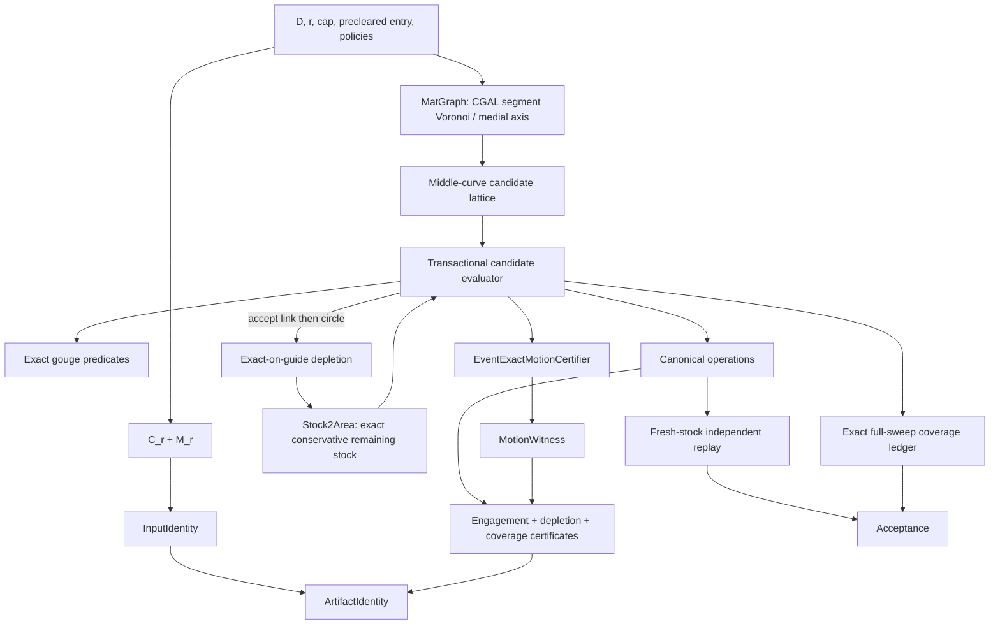

# Exact-certified adaptive trochoidal-MAT — design spec (Phase 1)

**Status:** approved architecture; implementation starts with proof gates
**Date:** 2026-07-24
**Primary lineage:** Held & Pfeiffer (2025), one-sided MATHSM

## Decision

Build a contour-aware adaptive trochoidal pocketing path whose engagement and
coverage claims are machine-checkable. CGAL remains the geometric authority, but
the contract distinguishes three different obligations that an “exact kernel”
does not collapse into one:

1. `Stock2` and `engagement_at` use Epeck and
   `Gps_circle_segment_traits_2` for exact regularized-set topology, exact
   one-root intersections, and an exact squared-chord cap verdict at one cutter
   position.
2. a continuous line or circle is accepted only by an event-exact motion oracle
   that covers every parameter cell and critical event; no finite station sample
   is promoted to a theorem;
3. modeled stock is conservative only through a new exact-on-guide depletion
   construction whose removed set is proved to be a subset of the declared
   cutter sweep.

The Python layer owns typed policy, deterministic proposal search, transactions,
artifact identity, and replay. It never replaces a CGAL decision with an epsilon
or a reported angle.

Phase 1 accepts a polygonal design pocket, including declared island loops.
Its tool-reachable material boundary contains exact circular arcs even though
the proposal guide is the true Euclidean segment-site Voronoi medial axis of
the polygon, not the existing straight skeleton. Arc-site Voronoi proposals
for an independently supplied circular-arc design boundary remain a named
Phase-1.5 extension.

This work is inspired by and re-derives the circle-placement logic of Held and
Pfeiffer. It does not claim paper parity until the committed Fig-5 reproduction,
coverage certificate, and scorecard gates pass. Phase-1 direct certified
transitions also differ from the paper’s offset-contour transition elements.

## Product contract

### Input

- a world-XY polygonal design pocket `D`: one outer ring and zero or more
  island rings;
- a positive tool radius `r`;
- a maximum lateral tool-engagement angle `theta_max` in `(0, pi]`;
- a `PreclearedEntry` disk contained in `D`, representing a predrill or a
  separately qualified entry cycle;
- a finite `CandidatePolicy`, `NeckPolicy`, `DepletionPolicy`, and traversal
  policy.

The precleared entry is a physical precondition, not an invisible stock edit. Its
center, radius, process provenance, and exact input bytes belong to
`InputIdentity`. The returned approach/plunge travels through that cleared disk
and is not counted as a lateral cut. Phase 1 does not pretend that one
tool-radius plunge can launch a capped lateral move: against frozen stock, every
nonzero displacement from that seed engages more than `pi`.

### Output

`CertifiedToolpath` contains:

- a canonical typed operation stream;
- a derived legacy `ToolpathResult` view for existing consumers;
- one `MotionWitness` for every lateral cutting operation;
- one `DepletionWitness` for every state-changing operation;
- a `CoverageCertificate`;
- `InputIdentity`, `BuildProvenance`, and `ArtifactIdentity`.

### Guarantees

For the exact rationalized motion artifact and regularized set semantics:

1. **Engagement:** every lateral cutting motion has maximum connected
   contour-aware engagement `<= theta_max`, or its lower neck cap.
2. **Gouge freedom:** every emitted cutter sweep is contained in `D`.
3. **Coverage:** an exact-with-sqrt full-sweep ledger proves
   `M_r \ union_i W_i` empty for exact tool-reachable material
   `M_r = (D ⊖ B_r) ⊕ B_r`. The necessarily unreachable corner residual
   `D \ M_r` is reported separately and is not called a coverage failure.
   Conservative engagement stock is deliberately not reused as a coverage
   oracle.
4. **Lineage:** canonical input, policies, exact motion stream, witnesses,
   source/native/toolchain provenance, and component versions are
   content-addressed.

No path is returned when any guarantee is unresolved. An empty, seed-only,
truncated, or partially traversed path is a failure, not a vacuously certified
success.

### Cap semantics

The ergonomic angle is converted once by the native boundary into the
binary64 rational surrogate:

`cap_chord_ratio = 4 * sin(theta_max / 2)^2`.

The exact statement is relative to that injected rational surrogate. The
sub-ulp difference from the transcendental angle is public API semantics.
Python never recomputes the surrogate. Every guarded or event-exact query binds
the native-produced full-cap bytes into its witness.

## Exact motion model

Phase 1 admits two lateral motion types.

### Exact segment

`ExactSegmentMotion` stores rationalized binary64 endpoints `a, b in Q^2`.
The mathematical cutter-center motion is the closed segment `[a,b]`.

### Exact full circle

`ExactCircleMotion` stores:

- rationalized binary64 center `c in Q^2`;
- a nonzero rationalized phase vector `v in Q^2`;
- orientation.

Its mathematical guide is:

`Gamma(c,v) = {c + Rv | R in SO(2)}`.

The squared guide radius is derived as `v dot v`; a separately trusted radius is
not part of the deciding representation. The phase point is `c + v`. The
legacy COMPAS `Circle.radius` is a reporting/view value derived from the same
motion and is contract-tested against it.

Partial circular transitions, splines, ramps, and 3D motion are outside Phase 1.
Unsupported geometry raises a named exception.

## Architecture

## Typed domain boundaries

The strict Python subpackage uses Python 3.12 and `mypy --strict`.

- `Millimetre` and `Radian` are `NewType`s.
- `ToolRadius`, `EntryRadius`, `Clearance`, `GuideRadius`, `Spacing`, and
  `ChordBound` are frozen value types. Their `build(...)` factories validate
  finiteness, sign, and cross-field invariants and raise named exceptions.
- `Point2[FrameT]` and `Vector2[FrameT]` carry frame identity; Phase 1 uses
  `WorldXY`.
- vector factories provide both scalar-positional and array-input overloads.
- `EngagementCap` owns the native-produced full-cap surrogate bytes.
- `ReachableDomain` owns exact `D`, admissible-center domain
  `C_r = D ⊖ B_r`, reachable material `M_r = C_r ⊕ B_r`, and unreachable
  residual `D \ M_r`.
- `ExactSegmentMotion` and `ExactCircleMotion` carry the exact input semantics
  above.
- `MatNode`, `MatEdge`, and `BoundaryFeatureRef` carry graph and feature
  identity. Reporting coordinates and clearances are explicitly proposal data.
- `CandidatePolicy` owns spatial resolution, radius resolution, finite forward
  window, minimum progress, exact depletion chord bound, branch ordering, and
  tie-break order.

Factories own invariant validation. Raw dataclass construction is kept minimal
and is not the public boundary. No type is introduced merely to wrap ordinary
success/failure control flow.

## True medial-axis proposal layer

The existing `toolpath.cpp` straight skeleton remains unchanged. It is not
relabelled as a medial axis: CGAL documents that the two coincide for convex
polygons but differ at reflex vertices.

Phase 1 adds a focused `_medial_axis_2` native unit based on
`CGAL::Segment_Delaunay_graph_2` with
`Exact_predicates_exact_constructions_kernel_with_sqrt`,
`Field_with_sqrt_tag`, and the degeneracy-removal Voronoi adaptor:

1. insert every design-pocket boundary segment as a site with stable ring/edge
   IDs;
2. obtain the Euclidean segment Voronoi dual;
3. intersect every line, ray, segment, and parabolic dual with the exact design
   pocket and emit every connected interior component, including bounded
   pieces clipped from an unbounded dual;
4. remove triangulation-only duals and normalize degenerate faces independent
   of insertion order;
5. retain the two defining boundary features and exact clipped-endpoint
   provenance for every MAT edge;
6. sample line and parabolic bisectors at the declared proposal resolution;
7. return CSR chains plus stable node IDs, edge IDs, conic kind, and incident
   feature IDs.

CGAL predicates decide diagram topology and feature incidence. Sampled
coordinates, clearances, and conic parameters are proposal/reporting doubles.
They may decide which candidate is tried; they never certify engagement,
containment, or coverage.

Stable feature provenance uses
`Segment_Delaunay_graph_storage_traits_with_info_2` with explicit
conversion/merge semantics, or a native-tested exact bijective post-map.
Default SDG storage is insufficient because it does not retain caller IDs.
Point-sites and open-segment sites have distinct canonical IDs.

For a sampled MAT point `m` with incident boundary footpoint `p` and reporting
clearance `d`, the one-sided MATHSM proposal is:

- `q`: the tool-center point at distance `r` from `p` toward `m`;
- `c = midpoint(m,q)`;
- `rho = distance(m,q) / 2`;
- phase vector `v = q - c`.

This yields the paper’s middle-curve circle proposal. The accepted rationalized
`c` and `v` are independently checked for gouge freedom and continuous
engagement, so proposal rounding cannot manufacture a certificate.

Holes are handled as additional boundary sites and explicit MAT graph cycles.
Traversal must cover every graph component intersecting `C_r`;
there is no implicit bridge inference from approximate endpoint equality.

## Exact conservative stock

### Exact reachable domain

A positive-radius disk cannot cover a polygon's convex corner while remaining
inside that polygon. Phase 1 therefore distinguishes:

- `D`, the exact polygonal design pocket;
- `C_r = D ⊖ B_r`, the exact admissible-center domain;
- `M_r = C_r ⊕ B_r`, the exact tool-reachable material;
- `D \ M_r`, the exact unreachable residual.

Here minus/plus denote exact morphological erosion/dilation by the closed tool
disk. A native arrangement of edge-offset lines and vertex-radius circles
constructs `C_r`; exact regularized circular-arc set operations construct
`M_r`. Cell membership is decided by exact disk-containment predicates, not
offset sampling. The construction certificate binds every arrangement curve,
selected cell, connected component, and residual digest. An unsupported
degeneracy raises `ReachableDomainConstructionError`.

`Stock2Area` begins with `D`. It conservatively retains the unreachable
residual throughout machining; this cannot change a certified cutter's
positive-length rim engagement because every contained cutter sweep is a
subset of `M_r` and therefore disjoint from the interior of `D \ M_r`. Keeping
event-oracle stock in the rational Epeck representation also avoids injecting
square-root reporting coordinates into its coefficient field. The separate
exact-with-sqrt coverage ledger owns `M_r`.

`Stock2Area` owns one mutable `Stock2`, supports an exact clone/fork, and exposes
only:

- exact read-only engagement/oracle access;
- `deplete(ExactSegmentMotion, ToolRadius)`;
- `deplete(ExactCircleMotion, ToolRadius)`;
- `deplete(PreclearedEntry)`;
- a deterministic state/depletion digest.

Candidate evaluation always occurs on a fork. The authoritative state changes
only after the complete joint candidate—transition followed by circle—certifies.

### Constructive exact under-cover

Every Phase-1 depletion is a finite union of exact rational disks.

For segment `[a,b]`, disk centers are Epeck barycenters
`(1-t_k)a + t_k b` with exact rational `t_k in [0,1]`.

For full circle `Gamma(c,v)`, disk centers are `c + R_k v`, where `R_k`
is an exact rational Pythagorean rotation. Four rational quarter-turn charts
cover the complete circle and its seam. Each rotation preserves `v dot v`
exactly.

Every removal radius is positive and no larger than the exact-injected tool
radius. Therefore every removal disk is contained in a disk of the declared
mathematical sweep, and their union `U_i` satisfies:

`U_i subseteq W_i`.

No `sin`, `cos`, `atan2`, `hypot`, `to_double`, or rounded interpolation enters
the center construction or its incidence decisions. An exact maximum-chord
policy controls retained excess stock; it affects efficiency and completeness,
not the subset proof. Incidence, parameter, radius, or seam failure raises
`ExactDepletionConstructionError` before mutation.

The current `subtract_capsule` and `subtract_arc_sweep` use rounded centers and
are not evidence for this theorem. The new path is built and validated
alongside them; existing callers remain unchanged.

### Exact full-sweep coverage ledger

Under-cover stock is the correct conservative state for engagement but the
wrong completion oracle. A finite disk chain tangent to a pocket wall can leave
positive-area modeled slivers between centers even when the mathematical cutter
sweep covers the wall continuously.

`CoverageLedger` therefore accumulates each declared mathematical sweep `W_i`
in a separate exact-with-sqrt regularized set:

- a segment sweep is its exact capsule;
- a full-circle sweep is its exact annulus, or disk when the guide radius does
  not exceed the tool radius;
- the declared precleared entry is an exact disk.

The required line offsets and circle radii live in the square-root extension of
the rationalized motion inputs. A compilation spike must validate
`Gps_circle_segment_traits_2` over the selected exact-with-sqrt kernel before
the coverage claim is implemented. If the traits contract cannot represent a
required sweep, coverage is blocked; it is not approximated.

`CoverageCertificate` proves the regularized difference
`M_r \ union_i W_i` is empty and separately binds the exact digest of
`D \ M_r`. Sweep identity and ordering are shared with the canonical operation
stream, but the coverage ledger never supplies engagement state.

### Conservative-stock induction

Let:

- `S_i` be real remaining stock before motion `i`;
- `S_hat_i` be modeled stock;
- `W_i` be the full physical cutter sweep;
- `U_i` be the exact-on-guide under-cover.

Initially, after applying the declared precleared entry,
`S_0 = S_hat_0`. If `S_i subseteq S_hat_i` and `U_i subseteq W_i`, then:

`S_(i+1) = S_i \ W_i subseteq S_hat_i \ U_i = S_hat_(i+1)`.

On a fixed cutter rim, adding material cannot reduce the largest connected
engaged run. Exact cap-verdict monotonicity under stock inclusion is a separate
metamorphic test obligation. The depletion witness records the exact center
sequence digest, removal radius, density policy, and strategy version.

## Event-exact continuous engagement

`engagement_at` remains the exact station primitive. It does not, by itself,
prove a continuous move.

The existing center-distance-only growth lemma is not a Phase-1 certificate:
equal-radius circle coincidence is reachable after a tool disk is removed, and
intersection endpoints can rotate by a fixed angle while center travel tends to
zero. The current overlap visitor also drops positive-length coincident arcs.
Those facts invalidate a universal endpoint-drift bridge.

### Exact event contract

For a frozen `Stock2` contour and an exact segment or full-circle center path,
`EventExactMotionCertifier`:

1. extracts the trimmed material boundary halfedges with their supporting
   line/circle identity, exact trim-domain predicate, stable feature identity,
   and material side;
2. rationally parameterizes the center motion and cutter rim with projective
   half-angle charts;
3. pulls every intersection condition back to algebraic curves in
   `(motion_parameter, rim_parameter)`;
4. partitions motion parameter space at every tangency, contour vertex,
   supporting-curve coincidence, cyclic-order change, run merge/split, chart
   seam, and cap-equality root;
5. isolates cap crossings between moving endpoint branches by eliminating the
   two branch equations with the exact squared-chord cap relation, filters
   extraneous roots against the original equations and trim predicates, and
   explicitly represents identically-equal intervals;
6. exactly labels every positive-width open cell and supported
   zero-dimensional event fibre;
7. returns `CERTIFIED`, `CAP_EXCEEDED`, or `UNRESOLVED_DEGENERACY`.

`UNRESOLVED_DEGENERACY` is a hard failure. Positive-length overlap is handled
explicitly or remains unresolved; it is never silently treated as empty.

The deciding implementation uses CGAL algebraic arrangements and exact
real-root isolation. Reporting maxima and isolating intervals may be emitted
for diagnostics, but only exact signs and topology determine the verdict.

The coefficient field is the compiled exact rational type. Each projective
chart yields primitive square-free polynomials over that field. Segment motion
has bidegree bounds `(1,2)` for line supports and `(2,4)` for circle supports;
full-circle motion has bounds `(2,2)` and `(4,4)` respectively. Generated
degrees above those bounds are a construction error.

The completeness table is part of the native contract:

| Event | Projection certificate | Degeneracy disposition |
|---|---|---|
| tangency | resultant of `F` and `partial_u F` | repeated factor isolated once |
| trimmed vertex | exact univariate vertex-on-rim equation | trim endpoint retained |
| overlap/coincidence | all primitive coefficients zero | explicit overlap interval |
| endpoint order/merge | resultant of two active branch equations | original equations and trims rechecked |
| cap crossing | two branch equations plus exact squared-chord relation | extraneous roots filtered; identical interval explicit |
| chart seam | exact finite/infinite chart boundary evaluation | one canonical seam owner |

Every native `EventPartitionCertificate` records normalized polynomial bytes,
degree bounds, square-free factors, all isolated real roots and intervals,
chart/seam coverage, sign-invariant open cells, zero-dimensional fibres,
trim/feature/branch identities, and each degeneracy disposition. Reconstructing
that certificate and verifying every factor/root/cell is the completeness
check; a cell count alone has no evidentiary role.

The existing guarded segment/circular certifiers remain compatibility and
performance experiments. They may become a fast prefilter only after the
event-exact differential suite proves zero false positives on the committed
corpus. They are never the sole Phase-1 acceptance authority.

### Witness

`MotionWitness` records:

- canonical operation index and exact motion kind;
- semantic operation kind;
- user and effective cap surrogate bytes, with exact proof that
  `effective <= user`;
- `event-exact` strategy/source/native component identity;
- exact verdict;
- canonical event-trace digest binding chart/root identity, exact isolating
  interval, event kind, trimmed feature and branch IDs, effective-cap bytes,
  verdict, and strategy version;
- event-cell count;
- unresolved count, necessarily zero for returned paths;
- stock-state digest before the motion.

A proved cap exceedance rejects an ordinary candidate. An unresolved event
raises `UnresolvedMotionEventError`; it is never relabelled as physical
infeasibility.

## Gouge freedom

Engagement safety and containment are independent gates.

- A full circle is gouge-free only when the exact outer disk centered at `c`
  with squared radius corresponding to `|v| + r` is contained in the original
  machinable pocket. The implementation uses exact regularized Boolean
  containment, not reported clearance.
- A segment transition is gouge-free only when exact segment-to-every-boundary
  squared-distance predicates establish clearance `>= r`, including endpoint
  containment and island boundaries.
- Equality is allowed by the regular-closed contact contract.

An otherwise engagement-safe candidate that fails containment is rejected
without stock mutation.

## Entry model

`PreclearedEntry.build(...)` proves that its exact disk is contained in the
pocket and large enough for the first declared phase point and tool disk. It is
applied to both generator and fresh-audit initial stock.

The returned path includes a clearance approach and vertical plunge through the
precleared bore. Neither removes new material. The first lateral circle must
still certify against the stock after the declared entry disk is removed.

Generated helical entry and entry-load qualification are separate work. Phase 1
never labels an uncertified first lateral move “entry” to evade the cap.

## Adaptive propose / certify / commit

`CandidatePolicy.build(...)` defines a deterministic finite lattice:

- ordered MAT component, edge, and branch traversal;
- current cursor and finite forward station window;
- spatial refinement levels;
- guide-radius refinement levels from a named positive floor through the
  MATHSM proposal radius;
- finite phase choices tied to boundary-feature provenance;
- minimum exact progress;
- exact lexicographic tie order.

No monotonic relation between spacing and engagement is assumed.

For each current cursor:

1. enumerate the complete finite candidate lattice;
2. fork current stock;
3. construct and containment-check the direct phase-to-phase segment;
4. event-exact certify the segment against forked pre-link stock;
5. exact-deplete the accepted segment on the fork;
6. construct and containment-check the full circle;
7. event-exact certify the circle against forked post-link stock;
8. exact-deplete the circle;
9. retain the candidate and both witnesses only if every gate succeeds;
10. choose furthest progress, then largest radius, then canonical identity.

Only the winning fork becomes authoritative. A rejected or unresolved candidate
cannot leak material removal. If all exact verdicts are cap violations, raise
`EngagementCapInfeasibleError` or `NeckTooTightError`. If any candidate reaches
an unsupported event required for progress, fail with
`UnresolvedMotionEventError`; do not silently search around a proof defect.

## Neck policy

Neck classification is an exact discrete MAT/boundary predicate, not a
comparison of reported clearance. A neck candidate is an exact local minimum
of the site-distance function on a clipped MAT component. Its two site IDs,
critical algebraic parameter, exact squared-width comparison, and separating
graph cut form `NeckEvidence`.

`NeckPolicy.build(...)` owns rationalized squared-width class boundaries and a
finite mapping from `(neck_class, passage_state)` to a native-produced
effective cap no larger than the user cap. `DepletionPolicy.build(...)` owns
the exact rational chord bound and exact center-count limit.
`TraversalPolicy.build(...)` owns component/branch order and the finite forward
window. All factories validate canonical ordering and hash their exact bytes.

Each oriented neck edge carries one of `UNVISITED`, `FIRST_PASS_COMPLETE`,
`SECOND_PASS_COMPLETE`, or `TERMINAL`. The accepted operation records the
before/after state and effective-cap identity. No “already machined other side”
decision is inferred from a sampled angle.

## Traversal and coverage

Every MAT edge/component has a well-founded cursor and terminal state. Accepted
operations advance exactly one cursor; rejected candidates do not. Branch
junctions use stable graph IDs. `max_passes` truncation is forbidden.

Before return:

- at least one non-degenerate lateral cut exists;
- every required MAT component is terminal;
- operation grammar and phase continuity validate;
- every lateral cut has exactly one matching motion witness;
- every stock mutation has exactly one matching depletion witness;
- fresh exact full-sweep replay proves `M_r \ union_i W_i` empty.

`CoverageCertificate` binds the fresh initial-state digest, ordered exact-sweep
witnesses, terminal traversal digest, and exact residual-empty verdict.
Generation raises `IncompletePocketCoverageError` for any residual component;
it never claims that dense sampling “looks covered.”

## Artifact identity

Identity is a directed acyclic structure, not one ambiguous hash.

1. `InputIdentity`: canonical ring bytes and order, frame, tool and entry
   geometry, native cap bytes, all policies, and schema versions.
2. `BuildProvenance`: source revision plus dirty-tree digest, native extension
   binary digest, `pixi.lock` digest, compiler/standard-library identity, CGAL
   version, and component source digests.
3. `ArtifactIdentity`: schema version, the first two identities, canonical exact
   operation stream, motion/depletion witnesses, traversal terminal state, and
   coverage certificate.

Canonical binary serialization is big-endian and versioned. Signed zero is
normalized; NaN and infinity are rejected. Polygon ring start/orientation and
hole order are canonicalized. The artifact never hashes its own digest.

JSON export must round-trip through `json.loads` and a committed JSON Schema.
Replay recomputes every digest and rejects one-bit changes.

## Error model

- `InvalidAdaptiveInputError`
- `InvalidEngagementCapError`
- `InvalidCandidatePolicyError`
- `InvalidPreclearedEntryError`
- `PocketNotMachinableError`
- `ReachableDomainConstructionError`
- `DegenerateMedialAxisError`
- `ExactDepletionConstructionError`
- `GougeContainmentError`
- `EngagementCapExceededError`
- `EngagementCapInfeasibleError`
- `NeckTooTightError`
- `TransitionEngagementError`
- `UnresolvedMotionEventError`
- `IncompletePocketCoverageError`
- `CertificateBindingError`
- `ArtifactIdentityError`

Each exception owns one failure mode and carries the smallest typed diagnostic
needed to reproduce it. Native exceptions are translated at one adapter
boundary. There is no fallback behavior.

## Proof-first gates

Implementation order is load-bearing.

### G0 — reproducible toolchain

Add a Python-3.12 Pixi workspace and lock with native build, Ruff,
`mypy --strict`, affected-test, full-test, schema, and mutation tasks. Native
adapters receive narrow `.pyi` contracts so strict typing does not terminate in
`Any`.

Every CMake-downloaded native archive has a verified `URL_HASH`; an existing
`external/` source tree is accepted only after its content digest matches the
locked manifest. `BuildProvenance` binds archive hashes and actual native
source-tree digests, so `pixi.lock` is not misrepresented as locking CMake
dependencies.

Before any dependent implementation, record the repository's GPL/commercial
CGAL position for every newly instantiated package, including 2D Arrangements,
2D Boolean Set Operations, 2D Minkowski Sums or the selected morphology
alternative, Segment Delaunay Graphs, 2D Voronoi Diagram Adaptor, and the
Apollonius Graph parabola component. A release may not silently add a
GPL/commercial package to an LGPL distribution without a compatible project
license decision or commercial CGAL entitlement. A failed license gate blocks
every task using that package, including the continuous event oracle.

### G1 — exact depletion

Build exact segment barycenters and Pythagorean full-circle centers alongside
the rounded APIs, and compile-spike the exact-with-sqrt full-sweep coverage
traits. Required evidence:

- exact collinearity/between and exact circle-incidence checks for every center;
- exact radius and seam invariants;
- exact representable-set tests of `U \ W == empty`;
- exact capsule/annulus construction and residual-set tests for the coverage
  ledger;
- exact `D`, `C_r`, `M_r`, and `D \ M_r` construction and containment tests;
- stock-inclusion induction fixtures;
- exact cap-verdict monotonicity under stock inclusion;
- mutations for rounded interpolation/rotation, off-guide centers, inflated
  disks, omitted seam, and identity drift.

### G2 — continuous event oracle

Before generator code:

- commit coincidence, tangency, near-coincidence, run merge/split, contour
  vertex, cap-root, and full-circle seam fixtures;
- prove the present growth-only certifier is not the authority;
- compile the actual CGAL algebraic traits/root-isolation stack under the locked
  build;
- implement exact line-motion cells first, then full circles;
- require zero unresolved events on the committed reachable-stock corpus;
- mutation-kill omitted coincidence, tangency, merge, vertex, cap-root, and seam
  handling.

Failure to support a required algebraic event blocks Phase 1. It does not
authorize sampling, cap inflation, or silent exclusion.

### G3 — true MAT and proposal contracts

Validate segment-site Voronoi topology, exact clipping of all dual primitive
kinds into every connected interior component, clipped-endpoint provenance,
conic sampling, incident feature provenance, branch IDs, holes, deterministic
normalization, and MATHSM middle-curve proposal formulas. Existing
straight-skeleton output must remain unchanged.

### G4 — transactional generator and coverage

Implement precleared entry, finite joint candidate enumeration, containment,
event-exact link/circle certification, exact depletion, branch traversal, and
the exact empty-stock terminal gate.

### G5 — artifact and independent acceptance

Fresh replay rebuilds stock from canonical input and consumes the canonical
operation stream. It creates pristine stock and coverage ledgers, applies the
declared `PreclearedEntry`, then derives each effective cap from the canonical
policy record, certifies against frozen pre-depletion stock, and only then
depletes both ledgers. It never trusts generator verdicts or stock snapshots.
It shares the exact kernel and event oracle intentionally; independence is in
state lineage and orchestration. Kernel/oracle defects are covered by their
exact reference and mutation suites.

## Acceptance matrix

- **Non-vacuity:** entry plus at least one lateral circle and one certified
  transition on the smallest fixture.
- **Engagement:** every replayed lateral motion is event-exact certified at its
  effective cap; no epsilon comparison of reported angles.
- **Coverage:** fresh exact full-sweep replay has an empty regularized residual
  and all traversal cursors are terminal.
- **Binding:** exact operation-to-motion-witness and mutation-to-depletion-
  witness bijections.
- **Ablation:** execute a fixed-policy comparator that emits the same Phase-1
  segment/full-circle primitive grammar on the same committed fixture and
  require a nonzero certified-violation tail; the adaptive result has zero
  violations. This is not presented as replay of the legacy generator's
  unsupported partial arcs.
- **Mutation kills:** empty path, seed-only path, dropped final branch,
  relabelled cut, stale witness, certify-after-deplete, rounded depletion,
  omitted sweep seam, non-fresh replay, and each event class all fail named
  tests.
- **Regression:** existing toolpath, stock, exact engagement, gap, and audit
  tests remain green.
- **Held target:** committed vector input and parameter provenance for Fig. 5;
  `theta_max = 80 degrees`, exact engagement and coverage certificates, and a
  reproducible metric report. No WIN/MATCH/MOAT label precedes this evidence.

## Phasing

- **Phase 1:** polygonal true-MAT proposal, exact reachable-material domain,
  precleared-entry condition,
  event-exact segment/full-circle certificates, conservative exact-on-guide
  stock, complete small-pocket path, coverage, identity, fresh replay, and
  ablation.
- **Phase 1.5:** arc-site Voronoi input, generated/qualified helical entry, and
  Held’s sorted circular-arc machined contour for scale.
- **Phase 2:** paper-style offset-contour transitions and elliptic returns.

## Risks and hard boundaries

- Algebraic event enumeration is a substantial exact component. Its compilation
  and degeneracy coverage are gates, not assumed implementation details.
- Exact disk-chain under-coverage may retain excess engagement stock and reject
  a physically safe candidate. It is not used to decide coverage and is never a
  reason to over-remove.
- Exact-with-sqrt coverage traits are a compilation gate. No approximate
  residual metric substitutes for an unsupported exact sweep.
- Segment-site Voronoi construction supplies the correct polygonal MAT lineage;
  it does not cover circular-arc sites.
- A precleared entry is required in Phase 1. A generated entry may not be
  smuggled in by exempting arbitrary lateral cutting motion.
- Existing straight-skeleton generators, rounded stock-depletion APIs, and audit
  compatibility surfaces stay intact until separately validated replacement is
  explicitly approved.
