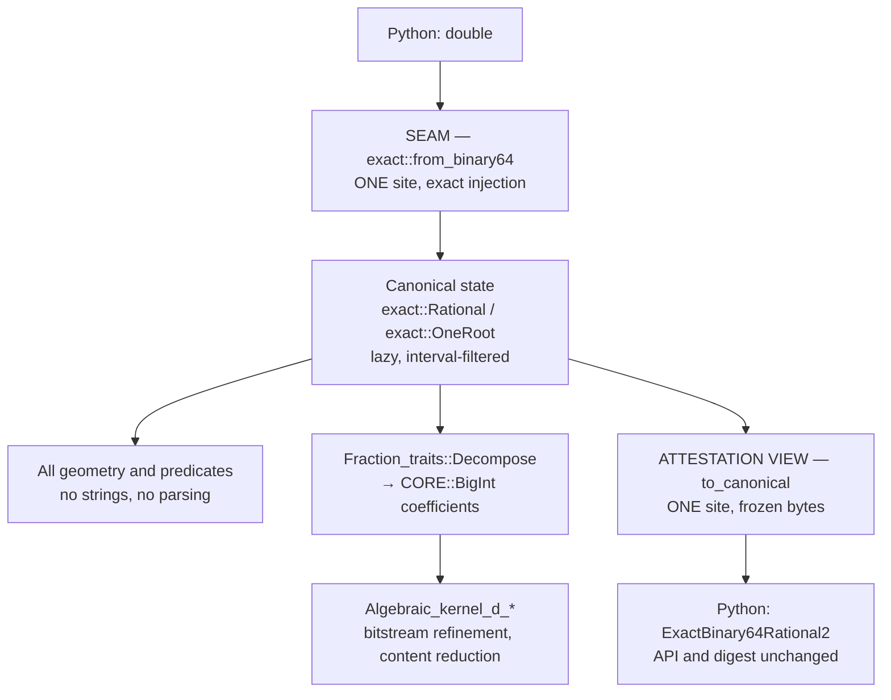

# Number-Type Coherence: Design

**One sentence: invert the canonical direction.** Today the event sources *store
decimal text* and every consumer *parses a number back out*; after this change the
sources *store the exact number* and *project the text*. That single inversion
removes all 156 inbound text crossings and every duplicate `parse_rational`
definition — not by editing 156 call sites, but by changing what is canonical.

Everything else in this document is the machinery that makes the inversion safe:
one exact-number vocabulary, two doors, a frozen-byte contract, and a staged
conversion whose every step is independently revertible.

## Status

| Field | Value |
|---|---|
| Maturity | design approved, not implemented |
| Approved | 2026-09-08, approach A plus the geometric/coefficient split |
| Supersedes | nothing; this is the first number-type architecture document |
| Companion pages | [Exact-Kernel Discipline](../../exactness.md), [Number Types and Filtering](../../number_types.md) |

## The problem, measured

This codebase carries **one quantity in three representations**, and they never
merged into a system.

| Carrier | Where | Filter | Count |
|---|---|---|---|
| `Epeck::FT` = `Lazy_exact_nt<cpp_rational>` | `engagement_2.cpp`, Gps traits lanes | lazy interval | correct lane |
| bare `CORE::BigRat` | `segment_site_*` | **none** | 504 sites, 134 of them arithmetic carriers |
| `ExactRational2` / `ExactBinary64Rational2`, numerator and denominator as `std::string` | `continuous_tea_2` | **none** | 156 parse-back crossings |

Supporting counts, measured 2026-09-08. `parse_rational` is *declared once* for
sharing in `continuous_tea_2/event_partition_internal.h:19` — and then
**re-implemented privately in 13 further `.cpp` files**, each inside an anonymous
namespace. The copies are ODR-safe but semantically independent: if any one
diverges on separator handling, sign convention or error behaviour, two lanes
decode the same text differently. That is a correctness risk, not untidiness.
`sign_mixed_radical` is defined twice (`engagement_2.cpp:43`, and as
`sign_mixed_radical_impl` in `audit_exact_station_2.cpp:22`);
`canonical_encode_integer` is spread across 6 files. `Lazy_exact_nt`,
`Interval_nt` and `Protect_FPU_rounding` appear **zero** times in `src/`.

!!! note "The string carrier is not a mistake — its *role* is"

    `ExactBinary64Rational2` exists for a good reason: it is the Python-visible
    attestation type behind `SegmentEventSource2.from_binary64(double, ...)`.
    Doubles enter once, are injected exactly as dyadic rationals, and are held in
    a canonical text form so the replay digest is representation-independent.
    That is correct design.

    The defect is that the same struct is *also* the compute carrier, so internal
    code parses back out of it. One struct, two consumers, different lifetimes —
    the failure mode `CLAUDE.md` names as "if a struct has fields that change at
    different rates or serve different consumers, it's two structs."

### What the codebase already gets right

`src/engagement_2.cpp:43` `sign_mixed_radical` reduces the sign of
`A + B√α + C√β + D√(αβ)` to `sign(u)`, `sign(w)` and `compare(u², βw²)` over
`CoordNT`, respecting the cross-root precondition. Because `CoordNT`'s coefficient
type is `Epeck::FT`, **that lane is filtered**. `MatToolRadiusMm2` already uses the
`static build(double)` factory with a private constructor and a validated
invariant. The idioms are present; they are simply not the ones the two defective
lanes were built on. This design propagates what exists rather than inventing
anything.

## Decision

**Approach A — a typed seam, then strangle lane by lane.**

Rejected alternatives, with reasons:

- **Big-bang header plus a mechanical sweep.** Converts ~50 files in one pass.
  Rejected: no bisectable regression path, and it violates the add-and-validate
  rule in `CLAUDE.md`. The depth measurement below shows the performance effect is
  lane-specific, so a single sweep would also obscure which lane actually improved.
- **Deduplicate `parse_rational` and stop.** Rejected: collapses the 13 private decoders to one
  but leaves the unfiltered carrier and all 156 crossings intact. The central
  objection — a claimed CGAL-idiomatic exact pipeline containing zero
  `Lazy_exact_nt` — survives it verbatim.

## Architecture

### New module `src/exact/`, one responsibility per file

| File | Sole job |
|---|---|
| `exact/rational.h` `.cpp` | the `exact::Rational` vocabulary and `from_binary64` — the only double→exact door |
| `exact/one_root.h` `.cpp` | `exact::OneRoot`, `same_root_add`, `sign_mixed_radical` — the single definition |
| `exact/canonical.h` `.cpp` | `exact::CanonicalRational` and `to_canonical` — the only exact→frozen-bytes door |
| `exact/errors.h` | the named error model for this layer |

Per-source attestation structs (`SegmentAttestation2`, `StationAttestation2`) stay
with their source in `continuous_tea_2/`, not in `exact/`. `exact/` owns the number
vocabulary and the two doors; it must not grow knowledge of any particular event
source.

```cpp
namespace compas_cgal::exact {

/// The project's exact rational carrier. Lazy and interval-filtered.
using Rational = CGAL::Exact_predicates_exact_constructions_kernel::FT;

/// One-root algebraic numbers, a0 + a1*sqrt(root).
/// The four template arguments are load-bearing: CGAL spells CoordNT as
/// Sqrt_extension<NT, NT, Tag_true, Boolean_tag<Filter_>>, so a two-argument
/// alias is a DIFFERENT type and arrangement coordinates will not compile
/// against it. `exact_one_root_gate` static_asserts the identity.
using OneRoot =
    CGAL::Sqrt_extension<Rational, Rational, CGAL::Tag_true, CGAL::Tag_true>;

}  // namespace compas_cgal::exact
```

`exact::Rational` is `Epeck::FT` deliberately, not a fresh type. `Epeck::FT` is
already the coefficient type of `Gps_circle_segment_traits_2<Epeck>::Point_2::CoordNT`,
so `exact::OneRoot` **is** the traits' own `CoordNT` — provided the alias is
spelled with all four of CGAL's template arguments. Interop with the arrangement
package is exact rather than approximate, existing one-root code compiles
unchanged, and the lazy filter arrives because it is the kernel's own field type.

!!! danger "Corrected 2026-09-08 during stage 0"

    This section originally specified `Sqrt_extension<Rational, Rational>`. That
    is a **different type** from `CoordNT`, which CGAL spells with four arguments
    (`Circle_segment_2.h:46`), so the identity claim was false and arrangement
    coordinates would not have compiled against it. The alias now carries all
    four arguments and the identity is enforced by a `static_assert` in
    `exact_one_root_gate` rather than asserted in prose.

!!! warning "Why `OneRoot` is a bare typedef and not a checking wrapper"

    A wrapper would enforce the cross-root precondition but would break the
    `CoordNT` identity above, reintroducing an impedance boundary. Instead the
    typedef stays bare and the precondition lives in free functions in
    `exact/one_root.h`, which check `is_extended()` on both operands BEFORE
    reading `root()` on either, and raise `CrossRootExtensionError`. Note that
    with `ACDE_TAG = Tag_true` a value can be extended while its root is zero,
    so "rational operand" means `!is_extended()`, not "denotes a rational" —
    this is CGAL's `check_roots` precondition verbatim. Interop comes from the typedef, safety from the
    call. Raw `Sqrt_extension` operators remain reachable but must not appear in
    our code; the review checklist covers this.

### The two doors

```cpp
/// The ONLY double -> exact entry point in the codebase.
///
/// A binary64 IS a dyadic rational, so this conversion is exact and total on
/// finite input. No parsing, no tolerance, no snapping.
///
/// Args:
///     value: a finite binary64.
///
/// Returns:
///     The exact rational denoted by `value`.
///
/// Raises:
///     NonFiniteBinary64Error: if `value` is NaN or infinite.
[[nodiscard]] Rational from_binary64(double value);

/// The ONLY exact -> canonical attestation bytes exit point.
///
/// Raises:
///     UnreducedCanonicalRationalError: if the decomposed denominator is not
///         positive. Reducedness is NOT re-checked per value.
[[nodiscard]] CanonicalRational to_canonical(const Rational& value);
```

As landed (`afa6999b` narrowed this deliberately), `to_canonical` checks the sign
of the decomposed denominator and nothing else. Reducedness is a property of the
backend rational's auto-normalisation, pinned by probes in
`exact_canonical_gate`, not an invariant this function establishes — a per-value
bignum gcd would cost more than it can ever catch, so do not implement one.

### The inversion

```cpp
class SegmentEventSource2 {
public:
    static SegmentEventSource2 from_binary64(double x0, double y0, /* ... */);

    /// CANONICAL STATE. Every consumer computes on this. No parsing anywhere.
    const exact::Rational& x0() const noexcept;

    /// DERIVED VIEW. The single projection site and the only caller of
    /// to_canonical(). Holds the six ExactBinary64Rational2 fields plus the
    /// frozen canonical bytes and digest.
    SegmentAttestation2 attestation() const;
};
```

The Python surface is preserved **in the nanobind binding layer**: `.x0` maps to
`attestation().x0`, so `_continuous_tea_2.pyi` and `canonical_bytes` are untouched.
The C++ return-type change is the mechanism that forces all 18 consuming files off
`parse_rational` — that is intended, not incidental.

Grouping all six projections behind one `attestation()` call gives the
byte-stability contract test exactly one target instead of six scattered ones.

### Why the frozen bytes cannot move

Every rational that reaches the encoder is in *reduced, positive-denominator*
form, and under that constraint the canonical form is a function of the
mathematical **value**, not of the carrier. That form is **not** established by
the encoder: `canonical_encode_rational` (`canonical_encoding.cpp:154-158`)
encodes `CORE::numerator` and `CORE::denominator` exactly as handed to it and
validates nothing. It comes from `CORE::BigRat`'s own normalisation on
construction, and it is re-checked on the way back in —
`canonical_decode_rational` rejects a non-positive denominator or
`gcd != 1` at `canonical_encoding.cpp:180`. So the encode path inherits the
invariant and the decode path enforces it; neither the range `:154-184` nor the
encoder alone should be cited as validating it.

A binary64 is exactly a dyadic rational, so `exact::from_binary64(d)` and today's
`CORE::BigRat(d)` denote the same rational and therefore encode to the same
bytes. That is the conclusion this design rests on, and it is measured rather
than assumed: the carrier comparison recorded in
[Number types](../../number_types.md) — `Epeck::FT` + `Fraction_traits::Decompose`
against the IEEE-754 bit-decomposition path, 6024 comparisons over edge doubles
and 3000 random doubles in both signs — found **0 mismatches**. The backend
question was spiked separately (identical canonical bytes and SHA-256 under boost
and GMP, 6024 values plus 200 depth-12 chains); that spike has no write-up in the
tree yet, so treat it as a claim owed a record rather than as a citation.

### Data flow



### The geometric / coefficient split

Not everything becomes lazy, and this is the line that keeps the work from being a
find-and-replace:

- **Geometric carriers** — coordinates, radii, parameters that feed predicates —
  become `exact::Rational` / `exact::OneRoot`. They are compared far more often
  than they are built, so the interval filter pays.
- **Algebraic coefficient rings** — polynomials handed to `Algebraic_kernel_d_*` —
  stay exact integers. Wrapping coefficients in `Lazy_exact_nt` is a
  pessimisation: one DAG node per coefficient, and the algebraic kernel performs
  its own refinement regardless. What these lanes need instead is content and
  primitive-part reduction, because coefficient growth rather than the algorithm
  is what makes exact polynomial computation explode.

## Error model

One named exception per failure mode, matching the repository's existing
`<Domain><Condition>Error` convention.

| Error | Raised when |
|---|---|
| `NonFiniteBinary64Error` | `from_binary64` receives NaN or infinity |
| `UnreducedCanonicalRationalError` | `to_canonical` decomposes a rational into a non-positive denominator (reducedness is not re-checked per value — see above) |
| `CrossRootExtensionError` | one-root arithmetic attempted on two operands that are **both extended** and whose roots differ (`Tag_true` admits an extended value with `root() == 0`; only a non-extended operand is exempt) |
| `AttestationByteDriftError` | a projection produced bytes differing from the frozen contract |

**Stage-2 intent, not current behaviour** (as of stage 0 the type is declared and
nothing raises it): `AttestationByteDriftError` is to be raised at the projection
site in debug builds and in the contract test, once that site exists. It is not
to be checked on every release-build projection, where the comparison would cost
more than the guarantee is worth at that point.

## Contract tests — the gate, not a follow-up

1. **Byte stability.** Hypothesis over
   `floats(allow_nan=False, allow_infinity=False)`, plus targeted denormals, ±0,
   exact powers of two, and values straddling 2^53: new-carrier bytes are
   identical to legacy string-carrier bytes for the same input. Runs against the
   existing implementation *before* anything is removed.
2. **Replay-corpus identity.** Every stored attestation in the audit corpus
   recomputes to a bit-identical digest. Non-synthetic and the strongest single
   piece of evidence available.
3. **Per-lane behavioural equivalence.** A converted lane's topology and
   certificates are identical before and after — identical, not close, because
   both sides are exact.
4. **Generic-double witness with a hard time bound.** Every converted lane carries
   one test on generic double coordinates, never integer fixtures such as
   `r = 1, 3, 5`, with a wall-clock ceiling. Integer fixtures make every square
   root a perfect square, so CORE's approximation error is exactly zero and the
   refinement path is never entered; such a suite measures a proxy.
5. **Decoder ratchet.** A repository-invariant test asserting that the count of
   `parse_rational` definitions equals the current stage's expected value,
   decreasing monotonically to zero. Mechanically prevents reintroduction.

## Staging

Each stage is independently valuable and independently revertible.

| Stage | Work | Evidence required to pass |
|---|---|---|
| 0 | Create `src/exact/`; land the vocabulary and both doors. No behaviour change. | Byte-stability property test green; replay corpus identical |
| 1 | Move `sign_mixed_radical` into `exact/one_root.*`; converge both call sites | Engagement and station suites unchanged |
| 2 | Invert `StationEventSource2` (smallest surface); convert its consumers | Byte identity, lane equivalence, generic-double witness |
| 3 | Invert `SegmentEventSource2` and `FullCircleEventSource2` (18-file surface) | Byte identity, lane equivalence, generic-double witness |
| 4 | Convert `segment_site_*` bare `CORE::BigRat` carriers to `exact::Rational` | MAT certificates identical; depth-sensitive lanes measured before and after |
| 5 | Coefficient-ring discipline in the `Algebraic_kernel_d_*` lanes | Coefficient bit-length measured before and after on a real pocket |
| 6 | Removal, on explicit instruction only: delete the 13 private decoders and dead string paths | Decoder ratchet reaches zero |

!!! warning "Stages 0-3 buy coherence, not speed"

    Measured on this machine (`tests/benchmarks/depth_bench.cpp`), the filter is
    worth 1.39x on a depth-1 decision and 14.27x at depth 16; across that sweep
    the unfiltered lane grows 163x while the lazy lane grows 16x. The deep
    construction chains — fitted centres, projections, intersections — live in
    `segment_site_*`, so the performance payoff concentrates in **stage 4**. If
    stage 3 lands and the clock barely moves, the design is behaving as predicted.

## Invariants this design establishes

1. Exactly one double→exact conversion site exists in the codebase.
2. Exactly one exact→attestation-bytes projection site exists.
3. No consumer parses a number from text. Text is an output, never an input.
4. Every value that reaches a branch has an interval filter beneath it.
5. Every exact predicate has exactly one definition.
6. Canonical attestation bytes are a function of the value, never of the carrier.

## Risks

- **Stage 3 is the largest single step** (18 files). Mitigation: stage 2 exercises
  the identical pattern on the smallest source first, so stage 3 is repetition
  rather than discovery.
- **`Lazy_exact_nt` carries its own overhead** — DAG node allocation — which
  dominates at depth 1. A lane that only ever makes shallow decisions could get
  marginally slower. Mitigation: the per-lane generic-double witness has a time
  bound, so a regression fails loudly and is attributable to one lane.
- **Coefficient-ring changes in stage 5 are the least specified** here, because the
  right reduction depends on measured bit-length growth that has not been taken
  yet. Stage 5 should be re-designed against that measurement rather than
  implemented from this document.
