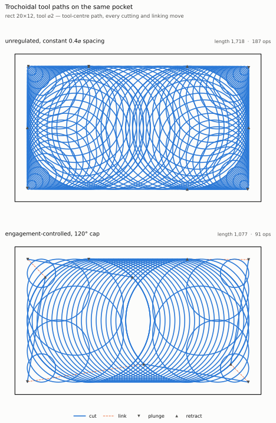
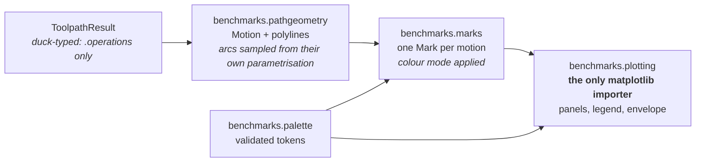

# Drawing Tool Paths

Every published drawing of a generated tool path now comes from one tested API,
`benchmarks.plotting`, on a palette whose every colour set was accepted by the data-viz
validator in both light and dark. Two things that a first draft would have done are provably
wrong here and are not done: **arcs are never read off the tessellated `polyline`** a generator
emits, and **traversal identity is never eight cycled hues** — that palette fails the
colour-vision and normal-vision floors on the pairlist a plan view actually needs.

{ width="100%" }

The figure above is the output of `python -m benchmarks.cli figures`, and every number under a
panel is measured from the path drawn in it at the moment it is drawn — a caption here cannot go
stale, because there is no caption to forget to update.

## Running it

```bash
pixi run figures                                          # redraw every published figure
pixi run python -m benchmarks.cli figures --theme dark    # the dark variant, from the dark steps
```

`benchmarks.figures.regenerate_all` is the single entry point behind that task, and it walks a
registry: a drawing is published by adding its writer to `_PUBLISHED_FIGURES` and nowhere else, so
a figure cannot end up in the docs without being regenerable. The dark variant writes
`fig6_toolpaths_dark.svg` rather than landing on the published light file.

```python
from benchmarks.plotting import ColourBy, draw_comparison, draw_toolpath

drawing = draw_toolpath(
    result,                       # anything with .operations
    boundary=spec.polygon,
    holes=list(spec.holes),
    colour_by=ColourBy.ENGAGEMENT,
    engagement_deg=measured,      # one entry per operation, None where unmeasured
    tool_diameter=spec.tool_diameter,
    show_tool_envelope=True,
    annotate_traversals=True,
    title="pocket",
)
drawing.figure.savefig("path.svg")
```

## The four modules, and why they are four



`pathgeometry` and `marks` import no matplotlib, and nothing in the drawing path imports the
kernel — so a figure can be drawn from a replayed, deserialised or hand-built path, and
`ColourBy.ENGAGEMENT` draws measurements the **caller** supplies rather than measurements the
figure takes for itself. A figure therefore cannot disagree with the audit that produced its
numbers.

## The colour modes

| Mode | Encoding | What carries exact identity |
| --- | --- | --- |
| `OPERATION` | categorical, 3 hues + 2 mark shapes | the legend; stroke style per class |
| `TRAVERSAL` | ordinal, 5-step blue ramp, folds past 5 | `annotate_traversals=True` labels every chain |
| `SEQUENCE` | sequential, same ramp, banded by arc length along the whole path | banded legend labels |
| `ENGAGEMENT` | sequential, same ramp, banded over the supplied range | banded legend labels in degrees |

In the three ramp modes the ramp is spent on **cutting** motions only; links and rapids go
muted, because the ramp encodes a property of cutting and a rapid has none.

## Why the palette looks like this

Run, not reasoned about. Every row below is `dataviz/scripts/validate_palette.js` output on the
set named, and a plan view of a tool path is a **map** — any two marks can end up side by side —
so the pairlist is `--pairs all`, which is the strictly harder one.

| Set | Mode | Verdict | Worst pair |
| --- | --- | --- | --- |
| 3 slots — cut, link, lead | light, all-pairs | **PASS** | CVD ΔE 9.2 · normal-vision ΔE 24.0 |
| 3 slots — cut, link, lead | dark, all-pairs | **PASS** | CVD ΔE 9.4 · normal-vision ΔE 20.9 |
| 5-step blue ramp | light, `--ordinal` | **PASS** | every adjacent ΔL ≥ 0.06 · light end 2.06:1 |
| 5-step blue ramp | dark, `--ordinal` | **PASS** | every adjacent ΔL ≥ 0.06 · dark end 2.15:1 |
| 4 slots | light, all-pairs | **FAIL** — rejected | yellow ↔ orange normal-vision ΔE **13.7** (floor 15) |
| 8 slots | light, all-pairs | **FAIL** — rejected | CVD ΔE **3.2** · normal-vision ΔE **7.1** |
| 10-step blue ramp | light, `--ordinal` | **FAIL** — rejected | every adjacent ΔL 0.047 (floor 0.06) |

Three consequences follow, and each is a design decision the code carries:

1. **Plunge and retract take a mark shape, not a fourth hue.** No four-hue categorical set
   passes, and the shape is the honest encoding anyway: in plan view a plunge is a pure Z move
   with no extent, so it is an event at a point, and spending an identity hue on a zero-length
   mark buys nothing. Plunge is ▼, retract is ▲, both in secondary ink.
2. **Traversal identity is an ordinal ramp with direct labels.** No ordering of eight hues
   passes all-pairs, and the traversal index is *ordered* — it is the machining order, so
   swapping two chains changes what the figure says — which by the skill's own
   categorical-versus-ordinal test makes it a one-hue ramp. Exact identity comes from
   `annotate_traversals`.
3. **The ramp folds at five and says so.** Five is the measured capacity, not a preference: a
   ten-step ramp over the same window fails the adjacent-lightness gate at every pair. Chains
   past the fifth go to one muted bucket the legend names — `other (7 chains)` — because two
   chains sharing a cycled hue is a claim the reader cannot check, while a fold is visible.

!!! warning "One contrast WARN is shipped, with its relief"
    On the light surface the lead colour `#1baf7a` sits at 2.74:1, below the 3:1 mark floor.
    The validator calls that a WARN, legal only with a relief channel, and the relief is
    shipped: a legend on every figure, plus a stroke style per operation class, so colour is
    never the only carrier. Lead moves are also the rarest class — the current generators emit
    none at all.

## What is drawn as what

| Thing | Mark | Note |
| --- | --- | --- |
| cut | slot 1, solid, 1.6 pt | the figure |
| link | slot 2, dashed, 0.9 pt | scaffolding, lighter on purpose |
| lead in / lead out | slot 3, dotted / dash-dot | not emitted by the current generators |
| plunge / retract | ▼ / ▲ in secondary ink | zero extent in the cutting plane |
| a zero-length link | ● in secondary ink, labelled `(no extent)` | drawn as what it is, never dropped |
| pocket boundary and islands | primary ink, closed | ink, never a series colour |
| swept tool envelope | grid hairline colour, **width in data units** | under everything |

The envelope is a width in the geometry's own units, not a stroke weight, so it is recomputed
from the axes transform on every draw and survives a resize or an export at another size. The
aspect is applied eagerly for the same reason — an equal aspect on a fixed box works by widening
the data limits, and until that has happened the transform the envelope is sized from is wrong.

## Limits

- The legend's column count is **estimated** from the widest label rather than measured, because
  the figure must be sized before there is a canvas to measure text on. The same estimate sizes
  the reserved strip and lays out the drawn legend, so the two always agree, but a pathological
  label can still wrap tighter than the estimate expects.
- `ColourBy.SEQUENCE` and `ColourBy.ENGAGEMENT` **band** a continuous quantity into the ramp's
  five steps rather than interpolating. That is deliberate — interpolation would invent hexes
  the palette does not document — but it means a reader gets five levels, not a gradient.
- Panels stack vertically only. Side by side would halve the pocket's width on the page, which
  for these paths is the dimension that carries the detail.
